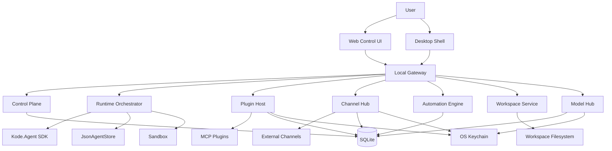

# KodaClaw 技术架构

## 1. 架构目标

KodaClaw 的架构要解决三个层面的问题：

1. 复用现有 SDK 的 runtime 能力，而不把产品层和 runtime 层耦死
2. 支撑桌面产品需要的 Gateway、插件、渠道、自动化与控制面
3. 保证本地单机部署下的可恢复性、可审计性与可扩展性

## 2. 分层架构总览



核心设计原则：

- UI 不直接操纵 SDK
- 所有产品状态都通过 Gateway 暴露
- SDK 只负责 Agent runtime、tool execution、event stream、store、sandbox
- 插件与渠道都尽量抽象为可管理的外部运行单元

## 3. 核心模块

| 模块 | 责任 | 主要依赖 | 说明 |
| --- | --- | --- | --- |
| `KodaClaw.Contracts` | API DTO、领域枚举、manifest 契约 | 无 | 保证服务边界清晰 |
| `KodaClaw.Storage` | SQLite 访问、仓储接口、迁移 | SQLite | 产品层状态存储 |
| `KodaClaw.Workspace` | `~/.kodaclaw` 初始化、文件协议、读写策略 | 文件系统 | 把人格与记忆从 prompt 外置 |
| `KodaClaw.ModelHub` | provider 管理、endpoint 注册、路由与 fallback | SDK provider | 为产品层提供模型控制面 |
| `KodaClaw.Runtime` | Agent 工厂、模板、session 策略、hooks、SSE 适配 | SDK | 产品与 SDK 的组合层 |
| `KodaClaw.PluginHost` | 插件发现、安装、启停、权限、健康检查 | MCP | 采用 MCP-first 插件模型 |
| `KodaClaw.ChannelHub` | 渠道绑定、消息路由、session 映射 | PluginHost / Storage | 外部聊天面入口 |
| `KodaClaw.Automation` | heartbeat、cron、后台任务、Inbox 投递 | Runtime / Storage | 赋予 Koda 主动性 |
| `KodaClaw.ControlPlane` | approvals、inbox、settings、diagnostics | Storage | 产品控制面服务 |
| `KodaClaw.Gateway` | loopback API、SSE、认证、模块编排 | 上述全部 | 本地常驻进程 |
| `kodaclaw-web` | 共享主控制台 | Gateway API | 当前统一承载 Chat、Inbox、Sessions、Models、Automations、Channels、Plugins、Canvas 等 desk |
| `kodaclaw-desktop` | 桌面壳、托盘、通知、launch target | Gateway API | 当前已落地的 Electron 壳，复用同一套 Web shell 并补齐桌面桥接 |

## 4. 代码组织建议

```text
products/KodaClaw/
  src/
    KodaClaw.Contracts/
    KodaClaw.Storage/
    KodaClaw.Workspace/
    KodaClaw.ModelHub/
    KodaClaw.Runtime/
    KodaClaw.PluginHost/
    KodaClaw.ChannelHub/
    KodaClaw.Automation/
    KodaClaw.ControlPlane/
    KodaClaw.Gateway/
  apps/
    kodaclaw-web/
    kodaclaw-desktop/
  docs/
```

设计要求：

- 这些项目要与现有 `/examples` 平行存在
- 不复用 example 的业务命名空间
- 如果要复用 example 里的实现细节，应抽到新模块中，而不是直接依赖 example 项目

## 5. Gateway 设计

`KodaClaw.Gateway` 是整个产品的大脑，不只是一个 Web API：

- 只监听 loopback 地址
- 启动时读取本地配置、初始化 token、连接 Workspace
- 暴露 HTTP API 与 SSE
- 统一调度 Runtime、PluginHost、Automation、ChannelHub
- 启动/关闭本地后台任务
- 为桌面壳与 Web UI 提供统一 API

推荐 API 领域：

- `/api/chat/*`
- `/api/sessions/*`
- `/api/approvals/*`
- `/api/inbox/*`
- `/api/workspace/*`
- `/api/models/*`
- `/api/plugins/*`
- `/api/channels/*`
- `/api/automations/*`
- `/api/canvas/*`
- `/api/system/*`

### 5.1 Gateway 组合根现状（Wave 4 已完成）

当前 Gateway 已不再把 HTTP surface、helper 与启动装配堆在同一个入口文件里：

- `/Users/vanzheng/projects/ai-agent/kode-sdk-csharp/products/KodaClaw/src/KodaClaw.Gateway/Program.cs` 仅保留 build/run、配置 bootstrap 与 composition hook
- `Composition/` 负责 service registration、middleware 与顶层 endpoint registration
- `Endpoints/` 以领域拆分 `/api/system`、`/api/chat`、`/api/diagnostics`、`/api/models`、`/api/settings`、`/api/automations`、`/api/plugins`、`/api/canvas`、`/api/approvals`、`/api/sessions`、`/api/inbox`、`/api/channels`
- `Validation/`、`Mapping/`、`Infrastructure/` 分别承接 request 标准化、HTTP 映射以及 auth/cors/correlation/diagnostics/session/canvas 等横切 helper

这套分层的直接价值是：Gateway 继续扩展时可以维持 composition root 清晰、路由边界稳定，以及更低风险的定向回归。

## 6. Runtime 组合层

`KodaClaw.Runtime` 不应直接暴露 SDK 的所有原始能力，而是做产品语义封装。

这一层负责：

- 创建不同 `SessionKind` 的 Agent
- 根据 session 类型加载不同的 Workspace 文件
- 把 SDK event stream 转换成产品层 timeline
- 统一审批、tool visibility、context policy
- 将结果写入 Inbox、Tasks、Memory 或 Canvas

这里会直接复用现有 SDK 的关键能力：

- `AgentConfig`
- `EventBus`
- `JsonAgentStore`
- `SkillsManager`
- `TaskRunTool` / sub-agent
- `McpToolProvider`
- `Scheduler` / `TimeBridge`

## 7. Session 模型

KodaClaw 至少需要以下会话类型：

| Session 类型 | 入口 | 典型用途 | 记忆策略 |
| --- | --- | --- | --- |
| `main` | 主控制台 | 用户与 Koda 的核心长期对话 | 最完整 |
| `channel_dm` | Telegram / QQ 私聊 | 外部个人对话 | 有限制 |
| `channel_group` | 群聊 | 低信任共享场景 | 最保守 |
| `automation` | 定时任务 / heartbeat | 后台运行 | 按任务最小加载 |
| `plugin` | 插件内部触发 | 系统服务或集成任务 | 受插件权限控制 |

Session 的重要原则：

- 每个 session 都有独立 store、审批队列和事件日志
- Workspace 可以共享，但 session state 必须隔离
- 主会话可读取长期记忆，群聊默认不可读取

## 8. 存储策略

KodaClaw 不能只靠一种存储机制，需要混合存储：

### 8.1 文件系统

用于：

- Workspace 协议文件
- 用户知识与记忆
- Canvas 产物
- 插件本地资源

### 8.2 `JsonAgentStore`

用于：

- Agent runtime messages
- tool calls
- progress / control / monitor events
- session 恢复

### 8.3 SQLite

用于产品控制面数据：

- approvals
- inbox
- plugin state
- channel bindings
- automation definitions
- model registry
- UI preferences

### 8.4 OS Keychain

用于 secrets：

- gateway token
- model API keys
- channel bot token
- plugin secrets

关键规则：不把敏感密钥明文写进 Workspace。

## 9. 插件与渠道架构

KodaClaw 初期采用 `MCP-first` 方案：

- 插件通过 stdio / HTTP / websocket / webhook 等方式与 Gateway 通信
- Gateway 把插件工具统一注册为 namespaced MCP tools
- 渠道接入本质上是一类特殊插件，它带来外部消息源和 outbound handler

这种设计的优点：

- 直接复用 SDK 已有的 MCP 集成能力
- 插件边界更清楚，降低宿主进程耦合
- 未来更容易做安装、停用、权限和隔离

## 10. Automation 架构

SDK 自带 `Scheduler` 和 `TimeBridge`，但 KodaClaw 的产品层自动化还需要以下能力：

- durable job 定义
- last run / next run / failure state
- retry policy
- 执行结果写入 Inbox
- 通知投递与 quiet hours
- 针对不同 session kind 的上下文模板

所以 `KodaClaw.Automation` 应作为独立模块存在，底层再调用 SDK 的调度能力。

## 11. 安全模型

KodaClaw 的安全不是“绝对安全”，而是“分层边界 + 可见控制”：

- Gateway 只监听 loopback
- UI 与 Gateway 通过 token 认证
- 每个 session 有独立状态目录
- 插件需要单独授权
- 外部动作默认进入审批
- secrets 存 OS Keychain
- sandbox 继续利用 SDK 的 Local / Docker 能力，但不夸大其隔离级别

需要明确告知的事实：

- Docker sandbox 能降低 blast radius，但挂载路径仍可写
- Local sandbox 的危险命令拦截只是 best-effort guardrail

## 12. UI 架构

当前形态：

- `kodaclaw-web` 是共享主交互界面，也是 desktop renderer 的唯一 UI 基线
- `kodaclaw-desktop` 已用 Electron 承载 `kodaclaw-web`，并在主进程侧补齐 Gateway lifecycle、tray、通知、deep-link 与 launch target bridge

Web UI 主要页面：

- Chat
- Inbox
- Sessions
- Workspace
- Models
- Plugins
- Channels
- Automations
- Canvas
- Diagnostics

## 13. 关键技术决策

1. 不在现有 example 里继续演化产品
2. 不先做桌面壳，先做 Gateway + Web UI
3. 不先做 CLR 动态插件，先做 MCP-first 插件
4. 不把 secrets 放进 `~/.kodaclaw/workspace`
5. 不让外部渠道默认继承主会话长期记忆

## 14. 结论

KodaClaw 的架构核心是：

- 用现有 SDK 做内核
- 用新的产品层模块做大脑和骨架
- 用 Workspace 协议、插件体系、渠道体系和自动化体系补齐 PoorClaw 级产品形态
