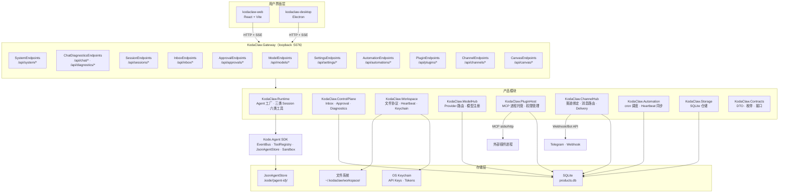
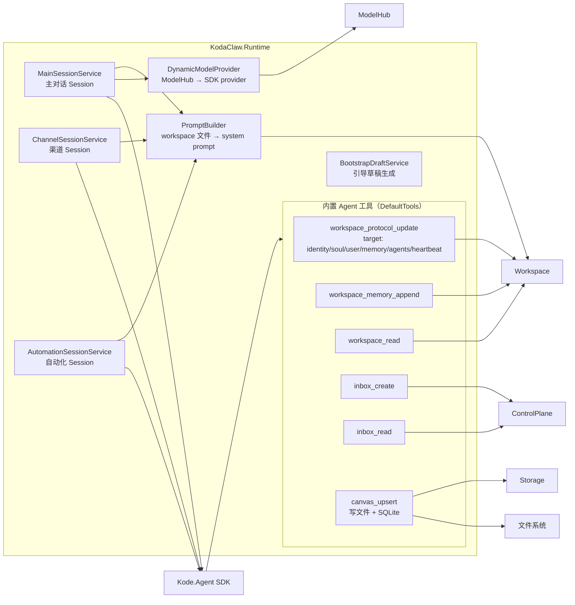
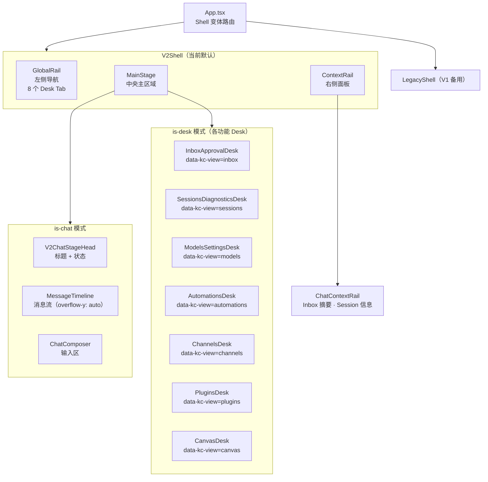
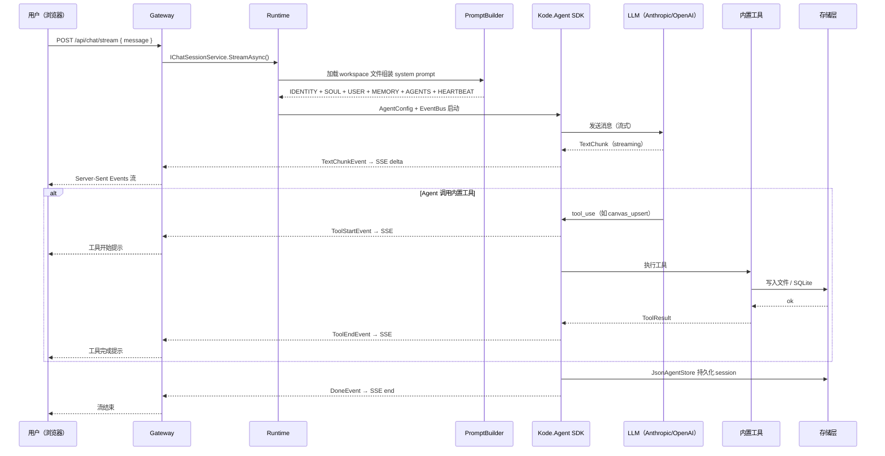
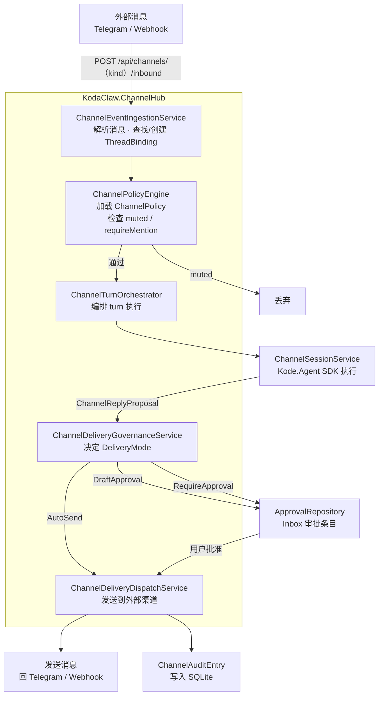
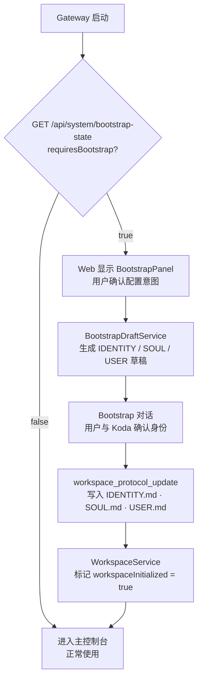
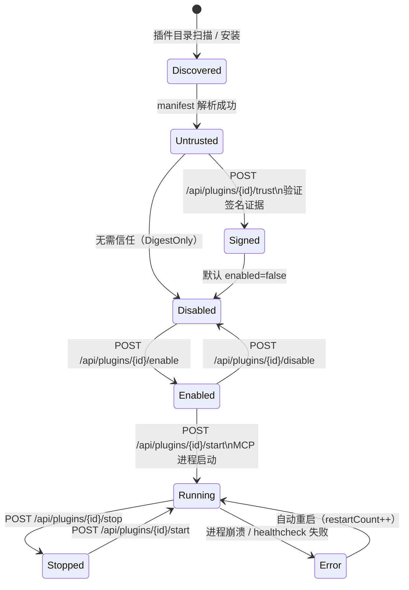
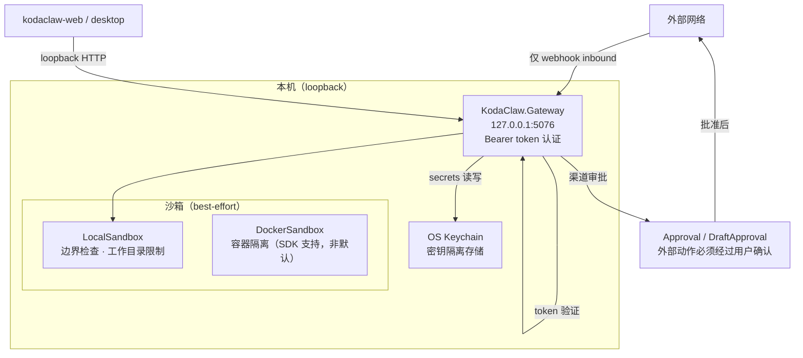

# KodaClaw 架构图（Mermaid）

> 文档版本：Iteration 16（2026-03-21）

---

## 1. 系统总览

---

## 2. Runtime 内部结构

---

## 3. Web 前端 Shell 架构

---

## 4. 主对话数据流

---

## 5. 渠道消息流

---

## 6. HEARTBEAT.md 自动化热同步

```mermaid
flowchart LR
    USER["用户 / Agent\n修改 HEARTBEAT.md"] -->|workspace_protocol_update\ntarget=heartbeat| FILE

    subgraph WS["KodaClaw.Workspace"]
        FILE["HEARTBEAT.md\n~/.kodaclaw/workspace/"]
        WATCH["HeartbeatFileWatcherHostedService\nFileSystemWatcher"]
        SYNC["HeartbeatSyncService"]
        COMP["HeartbeatAutomationCompiler\nYAML section → AutomationDefinition"]
    end

    subgraph AU["KodaClaw.Automation"]
        REPO["SqliteAutomationDefinitionRepository\nUpsert 定义"]
        SCHED["AutomationSchedulerHostedService\ncron 循环检查"]
        RUNREPO["SqliteAutomationRunRepository\n记录运行结果"]
    end

    RT["AutomationSessionService\nKode.Agent SDK 执行任务"]
    INBOX["InboxCreateTool\n写入 Inbox 通知用户"]

    FILE --> WATCH
    WATCH -->|文件变化| SYNC
    SYNC --> COMP
    COMP --> REPO
    REPO --> SCHED
    SCHED -->|cron 触发| RT
    RT --> INBOX
    RT --> RUNREPO
```

---

## 7. Bootstrap 引导流

---

## 8. 插件生命周期

---

## 9. 存储架构

```mermaid
graph TB
    subgraph FS["文件系统（~/.kodaclaw/）"]
        WS_FILES["workspace/\nIDENTITY.md · SOUL.md · USER.md\nMEMORY.md · AGENTS.md · HEARTBEAT.md\nmcp.json"]
        CANVAS_FILES["workspace/canvas/{id}/\nindex.md 或 index.html"]
        PLUGIN_FILES["workspace/plugins/{id}/\n插件本地资源"]
        CONFIG_FILES["config/\nmodels.json · plugins.json\ngateway.json · update-state.json"]
    end

    subgraph JSTORE["JsonAgentStore（.kode/{agent-id}/）"]
        MSG["messages.json\nAgent 消息历史"]
        EVT["events.json\nSDK 事件流"]
        SNAP["snapshots/\n断点快照"]
    end

    subgraph SQLITE["SQLite（products.db）"]
        T_INBOX["inbox_items"]
        T_APPR["approvals"]
        T_AUTO_DEF["automation_definitions"]
        T_AUTO_RUN["automation_runs"]
        T_CANVAS["canvas_artifacts"]
        T_MODEL["model_endpoints"]
        T_PLUGIN["plugin_records"]
        T_CHAN_ACC["channel_accounts"]
        T_CHAN_TH["channel_thread_bindings"]
    end

    subgraph KEYCHAIN["OS Keychain"]
        K_GW["gateway auth token"]
        K_MODEL["model API keys"]
        K_CHAN["channel bot token"]
        K_PLUG["plugin secrets"]
    end

    WS["KodaClaw.Workspace"] --> FS
    WS --> KEYCHAIN
    SDK["Kode.Agent SDK"] --> JSTORE
    CP["KodaClaw.ControlPlane"] --> T_INBOX
    CP --> T_APPR
    AU["KodaClaw.Automation"] --> T_AUTO_DEF
    AU --> T_AUTO_RUN
    CANVAS_RT["Runtime（canvas_upsert）"] --> CANVAS_FILES
    CANVAS_RT --> T_CANVAS
    MH["KodaClaw.ModelHub"] --> T_MODEL
    PH["KodaClaw.PluginHost"] --> T_PLUGIN
    CH["KodaClaw.ChannelHub"] --> T_CHAN_ACC
    CH --> T_CHAN_TH
```

---

## 10. 安全边界

