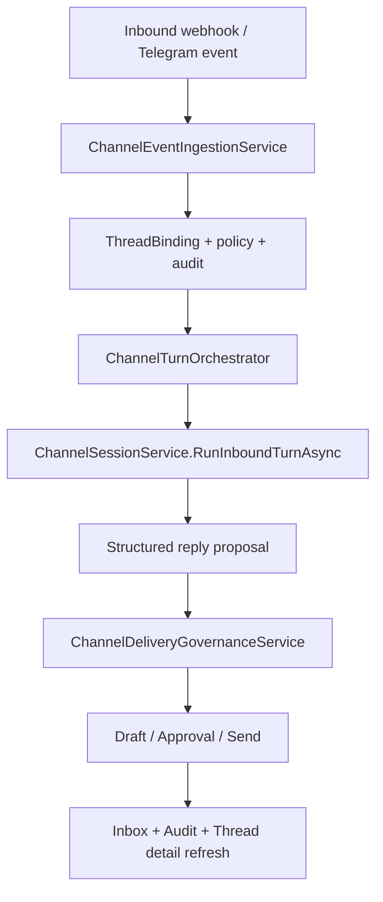

# Channels + Bootstrap Execution Plan (2026-03-20)

Last updated: 2026-03-20
Scope:
- close the missing channel conversation loop
- upgrade bootstrap from manual markdown editing to natural-language onboarding
- keep all changes aligned with `docs/PRODUCT.md`

## 1. Why This Plan Exists

The current codebase already has strong primitives for:

- session persistence
- approval and inbox linkage
- diagnostics
- channel thread isolation
- runtime chat execution

What is missing is the product loop that turns these primitives into the experience described in `docs/PRODUCT.md`.

This plan focuses on the two most important missing loops:

1. external message -> Koda processes it -> draft/approval/reply
2. bootstrap conversation -> Koda synthesizes durable workspace protocol files

## 2. Current State Summary

### 2.1 Channels: what already exists

Already implemented:

- channel accounts and thread bindings
- Generic Webhook and Telegram connector surfaces
- channel policy and delivery-rule defaults
- channel audit storage
- channel approval dispatch for outbound delivery
- channel session creation / resume with DM vs group context boundaries

Verified in source:

- webhook ingress: `src/KodaClaw.Gateway/Endpoints/GatewayApp.ChannelEndpoints.cs`
- channel ingestion: `src/KodaClaw.ChannelHub/ChannelEventIngestionService.cs`
- channel session composition: `src/KodaClaw.Runtime/ChannelSessionService.cs`
- outbound approval dispatch: `src/KodaClaw.ChannelHub/ChannelDeliveryApprovalService.cs`
- delivery governance: `src/KodaClaw.ChannelHub/ChannelDeliveryGovernanceService.cs`

### 2.2 Channels: what is still missing

After inbound webhook acceptance, the runtime currently stops too early.

The system does this today:

1. parse inbound event
2. create or reuse `ThreadBinding`
3. ensure a `channel-dm-*` or `channel-group-*` session exists
4. return thread detail and audit evidence

The system does **not** yet do this:

5. append inbound content into the channel session conversation
6. execute one agent turn
7. extract a reply candidate
8. route the reply through `AutoSend` / `DraftApproval` / `RequireApproval`
9. persist resulting approval, draft, or sent-delivery evidence

That missing portion is why channels currently feel like a control-plane feature, not a real session entry.

### 2.3 Bootstrap: what already exists

Already implemented:

- workspace initialization
- `BOOTSTRAP.md` seed file
- `GET /api/system/bootstrap-state`
- `POST /api/system/bootstrap-complete`
- bootstrap web panel
- bootstrap/main shell mode switching

Verified in source:

- bootstrap completion service: `src/KodaClaw.Workspace/BootstrapService.cs`
- default bootstrap template: `src/KodaClaw.Workspace/DefaultWorkspaceTemplates.cs`
- bootstrap endpoint: `src/KodaClaw.Gateway/Endpoints/GatewayApp.SystemEndpoints.cs`
- bootstrap UI: `apps/kodaclaw-web/src/components/BootstrapPanel.tsx`

### 2.4 Bootstrap: what is still missing

The current bootstrap is still primarily a form-driven commit step:

- users edit markdown textareas directly
- commit only writes `IDENTITY.md` and `USER.md`
- `SOUL.md` is still outside the completion contract
- no natural-language extraction layer exists between chat and protocol files

This does not yet match the product intent that onboarding should feel like a conversation with Koda.

## 3. Channels Execution Plan

## 3.1 Product outcome

For any inbound channel message, KodaClaw should end the turn in one of four product states:

1. `NoAction`
   - Koda decides no outward response is needed
   - audit shows the message was processed
2. `DraftCreated`
   - a reply draft is generated and surfaced in Inbox/Channels
3. `ApprovalRequested`
   - a delivery approval is created and linked to the thread
4. `Delivered`
   - a safe reply is sent directly when delivery mode allows it

## 3.2 Proposed architecture

Add a dedicated orchestration layer, for example:

- `ChannelTurnOrchestrator`
- `ChannelTurnExecutionResult`
- `ChannelReplyProposal`
- `ChannelTurnOutcome`

Suggested responsibility split:

### A. `ChannelEventIngestionService`

Keep responsibility narrow:

- normalize inbound event
- create or reuse binding
- update audit and thread metadata
- return a `ChannelInboundProcessingResult`

### B. `ChannelSessionService`

Expand responsibility with a new runtime-facing method, for example:

- `RunInboundTurnAsync(ThreadBinding binding, ChannelPolicy policy, ChannelEventEnvelope envelope, CancellationToken)`

That method should:

1. ensure or resume the channel session
2. append the inbound event as a user-visible message into the session store
3. execute one agent turn using the existing runtime stack
4. return structured output instead of raw UI-only text

### C. `ChannelTurnOrchestrator`

New product-layer orchestration service should:

1. call ingestion
2. call channel session execution
3. classify model output
4. build `ChannelOutboundDraft` when needed
5. call `ChannelDeliveryGovernanceService`
6. persist resulting draft/approval/send evidence
7. return a channel-thread result object for Gateway/UI

### D. `ChannelOutputClassifier`

The channel turn needs a stable contract between free-form model output and delivery policy.

Do not rely on plain natural language parsing in the endpoint.

Use one of these strategies:

- structured JSON tool-free schema in assistant output
- or a small explicit reply envelope in text with machine-readable markers

Recommended first version:

```json
{
  "action": "no_reply | propose_reply",
  "replyText": "...",
  "reason": "...",
  "confidence": 0.0
}
```

This keeps the channel pipeline deterministic enough for governance and testing.

## 3.3 Minimal implementation shape

### New runtime/product contracts

Potential new records:

- `ChannelTurnExecutionRequest`
- `ChannelTurnExecutionResult`
- `ChannelReplyProposal`
- `ChannelTurnOutcome`

Potential new enums:

- `ChannelTurnOutcomeKind`
  - `NoAction`
  - `DraftCreated`
  - `ApprovalRequested`
  - `Delivered`
  - `Failed`

### Suggested flow



## 3.4 API and UI implications

### Gateway API

The current webhook endpoint can continue returning thread detail, but should also expose turn outcome:

Progress update on 2026-03-20:

- the webhook/Gateway path now executes a real inbound turn through `ChannelTurnOrchestrator`
- thread detail and thread list now expose the latest structured `ChannelTurnOutcome`
- Telegram polling inbound now routes through the same orchestration service instead of only ensuring session existence
- connected Telegram accounts are now restored on Gateway startup through a hosted connector bootstrap path
- channel outcomes now include lightweight diagnostics for why a turn was blocked or rejected, not only that it happened
- Channels desk now surfaces those diagnostics directly in the operator detail pane
- Inbox / Approval desk now surfaces channel delivery payload context so approval decisions can be made without opening raw payload JSON
- Gateway thread detail now exposes contract-backed `policyEvidence` tokens so Channels desk can render operator evidence without re-deriving policy state in the browser
- Inbox / Approval desk now exposes direct thread-detail and thread-audit API paths for channel delivery drill-down

- `turnOutcome.kind`
- `turnOutcome.summary`
- `turnOutcome.replyPreview`
- `turnOutcome.approvalId`
- `turnOutcome.inboxItemId`

### Channels desk

Add visible per-thread state:

- last inbound processed status
- last proposed reply preview
- pending draft / pending approval badge
- last auto-send evidence

### Inbox desk

Reuse current surfaces for:

- delivery approval
- generated draft requiring user review

No new approval center should be introduced.

## 3.5 Testing plan for channels

### Unit tests

Add focused tests for:

- reply classification
- delivery-mode routing
- no-reply path
- malformed structured output fallback

### Integration tests

Add or expand tests for:

1. webhook inbound -> no reply -> audit only
2. DM inbound -> draft approval created
3. group inbound -> require approval created
4. approval approve -> outbound sent + audit evidence
5. approval reject -> no send + audit evidence
6. resumed channel session continues same binding and context boundary

### Acceptance / live tests

Add a smoke pack that proves:

- a single inbound channel message produces a visible Koda outcome
- the outcome is inspectable in Channels + Inbox
- approval decisions actually change outbound state

## 3.6 Recommended implementation order

1. add structured channel-turn output contract
2. add `ChannelSessionService.RunInboundTurnAsync(...)`
3. add `ChannelTurnOrchestrator`
4. wire webhook endpoint through the orchestrator
5. wire Telegram inbound through the same path
6. update thread-detail DTOs and desk rendering
7. add acceptance tests and dogfood pack

Progress update on 2026-03-20:

- steps 1 through 6 are now implemented for the webhook path and Telegram polling path
- targeted contract + integration coverage now includes Telegram account auto-start and polling-triggered draft creation
- the next useful scope is acceptance/dogfood hardening plus rendering those new diagnostics in control-plane surfaces

## 4. Bootstrap Natural-Language Enhancement Plan

## 4.1 Product outcome

Bootstrap should feel like this:

1. the user talks naturally about who they are and how they want Koda to work
2. Koda asks clarifying questions only where needed
3. Koda generates a proposed onboarding contract
4. the user reviews, edits, or confirms
5. Koda writes the final workspace protocol files

Not like this:

- paste markdown into textareas from scratch

## 4.2 Contract changes required

Current completion contract is too narrow.

It should be expanded from:

- `IdentityMarkdown`
- `UserMarkdown`

to at least:

- `IdentityMarkdown`
- `UserMarkdown`
- `SoulMarkdown`
- optional onboarding notes / summary
- optional bootstrap transcript archive metadata

Recommended contract evolution:

- extend `BootstrapCompletionRequest`
- extend `BootstrapCompletionResult`
- update `BootstrapService` to write `SOUL.md`

## 4.3 Proposed bootstrap architecture

Add a dedicated onboarding synthesis layer, for example:

- `BootstrapDraftService`
- `BootstrapDraft`
- `BootstrapExtractionResult`
- `BootstrapQuestionPlanner`

### Stage A. Natural-language intake

The existing bootstrap chat lane remains the front door.

But instead of treating the chat as separate from the form, it becomes the source of truth for onboarding facts.

### Stage B. Draft synthesis

Koda generates a structured onboarding draft from the conversation:

- identity
- soul
- user profile
- boundaries
- success signals
- open questions

### Stage C. Confirmation and editing

The UI shows:

- generated markdown preview
- unresolved assumptions
- missing fields
- confirm / regenerate / edit actions

### Stage D. Commit

Commit writes:

- `IDENTITY.md`
- `USER.md`
- `SOUL.md`
- optional archived `BOOTSTRAP.md` or bootstrap transcript summary

## 4.4 Bootstrap UX changes

### Current UX

- two textareas
- one archive checkbox
- manual submit

### Proposed UX

Left side:

- bootstrap conversation timeline
- suggested next question

Right side:

- generated onboarding draft cards
- identity preview
- soul preview
- user profile preview
- unresolved assumptions list
- confirm/edit controls

### Minimal MVP UX

If a bigger redesign is deferred, ship an MVP with:

1. "Generate from conversation" button
2. preview of `IDENTITY.md`, `SOUL.md`, `USER.md`
3. missing-info checklist
4. final confirm button

That alone would already move bootstrap into the natural-language product layer.

## 4.5 Bootstrap extraction model

Use a structured intermediate object before markdown generation.

Example:

```json
{
  "identity": {
    "name": "Koda",
    "role": "local-first AI collaborator",
    "tone": ["calm", "practical", "direct"]
  },
  "soul": {
    "principles": [
      "protect trust",
      "prefer reversible actions",
      "ask before high-risk external actions"
    ]
  },
  "user": {
    "workingStyle": "...",
    "communicationStyle": "...",
    "boundaries": ["..."],
    "successSignals": ["..."]
  },
  "missingQuestions": [
    "What should Koda never do without asking first?"
  ]
}
```

Then generate markdown from this object with deterministic templates.

This keeps bootstrap:

- conversational at the UX level
- stable at the persistence level
- testable at the contract level

## 4.6 Suggested new APIs

Two possible shapes:

### Option A: Explicit draft endpoint

- `POST /api/system/bootstrap-draft`
- input: conversation transcript or current bootstrap chat state
- output: structured onboarding draft + markdown previews + open questions

### Option B: Bootstrap chat as the draft source

- keep chat lane as-is
- add `POST /api/system/bootstrap-summarize`
- output: same structured draft object

Recommended first step:

- use explicit summarize/draft endpoint
- keep final commit separate as `POST /api/system/bootstrap-complete`

This preserves a clean draft -> confirm -> commit lifecycle.

## 4.7 Testing plan for bootstrap enhancement

### Contract tests

- draft response serializes/deserializes correctly
- completion request writes all required files

### Integration tests

- bootstrap conversation summary -> draft generation
- draft confirmation writes `IDENTITY.md`, `SOUL.md`, `USER.md`
- bootstrap completion flips workspace into `Normal`
- archived bootstrap artifacts remain inspectable

### Web tests

- user can talk naturally, generate draft, tweak, and commit
- shell switches from bootstrap mode to main mode without reload regressions

## 4.8 Recommended implementation order

1. extend bootstrap completion contract to include `SOUL.md`
2. add structured onboarding draft object
3. add draft-generation endpoint/service
4. update bootstrap UI to support generate/preview/confirm
5. archive bootstrap transcript or summary for traceability
6. add bootstrap acceptance tests and dogfood scenario

## 5. Cross-Cutting Design Rules

Both channels and bootstrap should follow the same product rules:

1. natural language is the user input layer
2. structured contracts are the persistence and control layer
3. markdown files are the durable workspace layer
4. inbox/approval stay unified instead of branching into feature-specific subsystems
5. diagnostics must explain every important transition

## 6. Suggested Work Breakdown

### Wave A: Bootstrap contract correction

- write `SOUL.md` on completion
- introduce structured bootstrap draft
- add preview/confirm workflow

### Wave B: Channel turn execution

- execute agent turn after inbound event
- classify reply proposal
- route through delivery governance

### Wave C: Product shell uplift

- expose draft/approval/outcome state in Channels desk
- make bootstrap fully conversation-first
- add onboarding CTA into channel connect / automation create / plugin activation

## 7. Success Criteria

This plan is complete when all of the following are true:

### Channels

- inbound channel messages result in a visible Koda decision
- that decision can become draft / approval / send with audit evidence
- DM/group privacy boundaries remain intact

### Bootstrap

- a user can describe themselves in natural language
- Koda produces structured onboarding drafts
- confirm writes `IDENTITY.md`, `SOUL.md`, and `USER.md`
- bootstrap feels like meeting the agent, not filling a form

### Product fit

- the implementation reduces the gap between current control-plane strength and PRODUCT's Agent OS vision
