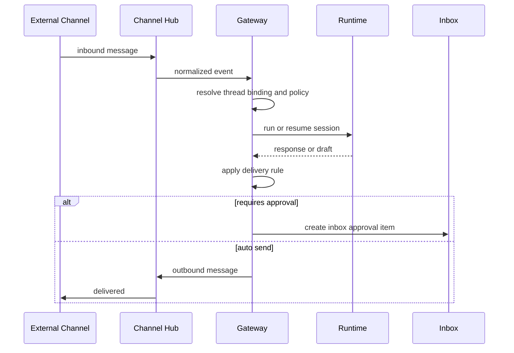

# KodaClaw 渠道规范

## 1. 设计目标

KodaClaw 的渠道系统不是简单的“通知发送器”，而是完整的外部会话入口层。它需要解决：

- 外部消息接入
- 账号与线程绑定
- session 隔离
- 隐私与记忆边界
- 回复审批
- 主动消息策略

## 2. 渠道优先级

推荐的实施顺序：

1. `telegram`：最适合作为第一条外部渠道
2. `generic-webhook`：方便做统一接入测试
3. `qq` / `whatsapp`：通过插件化方式接入
4. `wecom` / `dingtalk`：偏工作流集成，可后置

## 3. 领域对象

| 对象 | 说明 |
| --- | --- |
| `ChannelConnector` | 一类渠道能力，例如 Telegram |
| `ChannelAccount` | 某个已绑定的具体账号 |
| `ChannelIdentity` | 外部用户或群组身份 |
| `ThreadBinding` | 外部会话与内部 session/thread 的映射 |
| `DeliveryRule` | 何时允许主动发送、是否需要审批、是否静默 |
| `ChannelPolicy` | 记忆加载、回复限制、群聊边界等策略 |

## 4. 会话模型

渠道消息进来后，Gateway 需要决定复用哪个 session：

- 私聊：一般映射到 `channel_dm`
- 群聊：一般映射到 `channel_group`
- 特定自动化来源：可映射到专用 `automation` session

每个 `ThreadBinding` 至少包含：

- `connectorId`
- `accountId`
- `externalThreadId`
- `sessionId`
- `sessionKind`
- `policyId`
- `lastSeenAt`

## 5. 渠道安全策略

### 5.1 记忆边界

- 私聊默认不读取主会话完整长期记忆
- 群聊默认不读取 `MEMORY.md`
- 群聊仅能读取群专属配置与最小必要上下文

### 5.2 外发策略

- 直接对外回复默认可配置为：自动发送 / 草稿待批 / 全部待批
- 群聊与陌生私聊建议默认草稿待批
- 主动外发必须经过 `DeliveryRule`

### 5.3 静默时段

产品层应支持：

- quiet hours
- workspace-level mute
- connector-level mute
- thread-level mute

## 6. 处理流程

## 7. 规范化事件模型

Channel Hub 对不同渠道的输入需要统一为内部事件：

- `message.received`
- `message.edited`
- `message.deleted`
- `reaction.received`
- `account.connected`
- `account.disconnected`
- `delivery.failed`

这样 Runtime 与 Control Plane 不需要知道外部渠道的原生细节。

## 8. 配置与凭据

渠道连接配置分成两部分：

- 非敏感配置：SQLite / config files
- 敏感凭据：OS Keychain

例如 Telegram：

- bot token -> Keychain
- default parse mode / allowed chat types -> SQLite
- 已绑定聊天会话 -> SQLite

## 9. 第一版范围

第一版建议做到：

- Telegram connector
- 通用 webhook connector
- 私聊 / 群聊 session 区分
- DeliveryRule
- 回复审批
- Inbox 投递

暂不做：

- 多账号复杂路由
- 消息富媒体编辑
- 大规模 webhook fan-out
- 多租户连接管理

## 10. 与插件系统的关系

除了少量内置渠道，绝大多数渠道都应该被实现为插件。这样做有两个好处：

- 外部渠道生态可以独立迭代
- 主产品不用被某个渠道的 SDK 或协议深度绑死

因此，`Channel Hub` 的职责更像是：

- 管理 connector 生命周期
- 标准化 inbound / outbound 事件
- 维护 thread binding 和 policy
- 为 Runtime 创建正确的 session 上下文

## 11. 结论

渠道是 KodaClaw 走向“完整产品形态”的关键层。只有把渠道当成受控会话入口，而不是简单通知通道，KodaClaw 才能真正达到 PoorClaw 的产品级体验。
