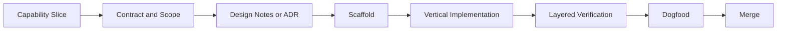

# KodaClaw 开发实现验证范式

这份文档定义 KodaClaw 的统一工程范式：一个功能从立项、设计、实现到验证，必须经过哪些环节，产出哪些证据，达到什么标准才算“完成”。

目标不是把流程做重，而是让 KodaClaw 这种多层产品在持续开发中不失控：

- 不把产品逻辑埋进 example 风格代码里
- 不做“功能写完了但不可观察、不可恢复、不可验证”的交付
- 不让高风险模块只靠人工拍脑袋验证
- 不让前端、Gateway、Runtime、插件、渠道各自形成一套标准

## 1. 总原则

### 1.1 以能力切片为单位交付

KodaClaw 不按“前端先写完”“后端先写完”“插件系统先写完”这种纯分层方式推进，而按可验证的能力切片推进。

一个能力切片必须同时回答 4 个问题：

1. 用户能做什么
2. 系统内部怎么流转
3. 出问题时怎么观察
4. 我们怎么验证它真的工作

例子：

- “主会话首次启动并完成 bootstrap”
- “一个高风险外发动作进入审批并在用户确认后执行”
- “Telegram 私聊进入独立 session 且不读取主会话长期记忆”

### 1.2 先定义契约，再写实现

凡是跨模块的改动，都先定义契约，再写业务实现。这里的契约包括：

- API contract
- 领域对象
- session policy
- workspace file contract
- plugin manifest
- event/timeline shape

如果契约不清晰，后续的测试、UI、恢复、诊断都会变得脆弱。

### 1.3 可观察性和功能一起交付

每个新能力都必须同步考虑：

- diagnostics 里能不能看到
- event stream 里有没有关键节点
- 日志是否带足上下文
- 失败时能不能定位到模块边界

KodaClaw 不是“功能先有，观测后补”的项目。

### 1.4 默认按最小风险上线

所有高风险能力都应该先以“草稿 / 审批 / 只读 / 模拟”模式落地，再逐步开放自动执行。

适用场景：

- 对外消息发送
- 渠道自动回复
- 自动化主动执行
- 插件写文件 / 发网络请求

### 1.5 文档和代码同版本演进

只要改了下面这些内容，对应文档必须一起改：

- workspace 协议
- API contract
- plugin manifest
- channel policy
- automation 行为
- 安全边界

## 2. 工作单元：Capability Slice

KodaClaw 的最小工作单元不是“任务条目”，而是 `Capability Slice`。

每个切片必须包含以下字段：

- `Problem`：解决什么问题
- `User Outcome`：用户最终能做什么
- `Scope`：本次包含什么
- `Non-goals`：明确不做什么
- `Modules`：涉及哪些模块
- `Contracts`：新增或修改哪些契约
- `Risk`：涉及哪些安全/恢复/兼容性风险
- `Verification`：准备怎么验证
- `Exit Criteria`：做到什么程度算完成

建议每个切片都控制在一个可以独立合并、独立回归、独立 demo 的范围。

## 3. 实施流程

一个切片从开始到完成，按下面顺序推进：

### 3.1 Contract and Scope

先明确：

- 用户路径
- 模块边界
- 数据边界
- 风险边界

如果涉及跨模块协议，先写文档或 ADR，再进入代码。

### 3.2 Design Notes / ADR

以下场景必须写 ADR 或至少设计说明：

- 新增持久化模型
- 新增 session kind
- 修改 workspace 加载规则
- 新增 plugin lifecycle 或 permissions
- 新增 channel policy
- 引入新基础设施依赖

### 3.3 Scaffold

先搭结构，再填实现。典型做法：

- 定义 interface / contract / DTO
- 创建空实现或 fake 实现
- 把编译链路先打通
- 让上下游模块先能对接

### 3.4 Vertical Implementation

从用户入口一路打通到核心逻辑和可观察性，不允许只写中间层。

例如做“审批流”时，至少要一次性打通：

- UI 触发
- Gateway API
- Runtime/ControlPlane 状态变化
- Store 持久化
- diagnostics / inbox 可见

### 3.5 Layered Verification

实现完后，不是“本地跑通一次就算完成”，而是进入分层验证。

### 3.6 Dogfood

只要是下面这些能力，就必须至少过一次 dogfood：

- session 恢复
- workspace 加载策略
- approvals
- plugin lifecycle
- channels
- automations
- canvas

## 4. 验证分层

KodaClaw 的验证分层采用 `L0-L5` 模型。

### L0：静态与可构建性验证

目标：保证改动最基础地可进入仓库。

包括：

- .NET 编译通过
- TypeScript/前端构建通过
- 基础 lint / formatting / typecheck
- 配置文件 schema 可解析

### L1：单元测试

目标：验证纯逻辑和小边界。

适合：

- 路由决策
- policy 判断
- manifest 校验
- session 加载规则
- workspace 路径解析
- model fallback 选择
- automation schedule 计算

当前仓库测试栈已经是：

- `xUnit`
- `FluentAssertions`
- `Moq`

KodaClaw 后端建议延续这套风格。

### L2：组件/集成测试

目标：验证一个模块内部多个对象协同工作。

适合：

- Gateway + Storage
- Runtime + JsonAgentStore
- PluginHost + MCP fixture
- ChannelHub + thread binding store
- Automation + fake clock

这一层允许依赖真实文件系统、真实 SQLite、fake provider、fixture plugin，但不要求完整 UI。

### L3：契约测试 / Golden Tests / Replay Tests

目标：冻结那些“形状很重要”的边界。

适合：

- API response schema
- SSE event 序列
- plugin manifest 解析结果
- workspace 初始化目录结构
- 渠道 inbound payload 正规化结果
- diagnostics timeline shape

这一层对 KodaClaw 很关键，因为它的产品复杂度很大一部分来自“协议”而不是算法。

### L4：端到端场景测试

目标：从用户入口验证整条路径。

适合：

- 首次启动 bootstrap
- 主对话发起并流式返回
- 审批创建 -> 用户确认 -> 外发执行
- 插件安装 -> 启用 -> 工具可见
- automation 触发 -> inbox 投递
- Telegram 消息 -> session 恢复 -> 回复草稿

前端建议采用：

- 组件层：React Testing Library / Vitest
- 浏览器层：Playwright

### L5：Dogfood / 人工验收

目标：验证“产品体验”和“连续性”。

必须检查：

- 文案是否合理
- 状态是否解释得清楚
- 暂停/恢复是否自然
- 记忆加载是否越界
- diagnostics 是否真的能帮助排错

## 5. 各模块的默认验证要求

| 模块 | 最低验证要求 |
| --- | --- |
| `Workspace` | L1 路径与加载规则 + L3 golden file 初始化测试 + L5 手工检查 |
| `Gateway` | L0 可构建 + L2 API 集成测试 + L3 SSE/response contract |
| `Runtime` | L1 policy/adapter 逻辑 + L2 session 恢复/审批协同 + L3 timeline replay |
| `ModelHub` | L1 决策表测试 + L2 fake provider 路由测试 |
| `PluginHost` | L1 manifest 校验 + L2 fixture plugin 启停测试 + L3 permission contract |
| `ChannelHub` | L1 policy 判断 + L2 replay inbound payload + L4 端到端消息流 |
| `Automation` | L1 schedule 计算 + L2 fake clock + L4 inbox 投递场景 |
| `ControlPlane` | L2 persistence/API + L3 response contract |
| `kodaclaw-web` | L0 typecheck/build + L1 component tests + L4 Playwright 关键流程 |
| `kodaclaw-desktop` | L0 打包 smoke + L3 shell bridge contract + L5 手工验证 |

## 6. Definition of Done

KodaClaw 中一个切片要进入完成状态，至少满足下面条件：

1. 用户路径被打通，不是只有后端逻辑
2. 关键 contract 已定稿并写入文档或测试
3. 对应层级的测试已经补齐
4. diagnostics / logging / event 可观察
5. 恢复、审批、权限、隔离中至少相关项已被检查
6. 文档与实现一致
7. 有明确的演示或复现步骤

如果某个点不能满足，PR 里必须显式写清楚“这次故意没做什么”和“风险留在哪里”。

## 7. PR 与变更边界

### 7.1 PR 尺寸原则

优先小而完整，不要大而半成品。

一个 PR 最好满足：

- 只完成一个 capability slice
- 只引入一个主要概念
- 尽量只跨必要模块
- 自带验证证据

### 7.2 PR 描述模板建议

- `Problem`
- `User-visible change`
- `Modules touched`
- `Contracts changed`
- `Verification performed`
- `Risks / follow-ups`

### 7.3 禁止事项

- 只改 UI 不补 contract
- 只改后端不补可观察性
- 只写 happy path 不补失败路径
- 把产品规则偷偷塞进 prompt 而不落文档/协议

## 8. 环境与数据范式

建议至少维护三套运行上下文：

- `dev`：开发环境，快速本地调试
- `test`：自动化测试环境，数据可重建
- `dogfood`：真实产品流程验证环境，例如 `~/.kodaclaw-dev`

关键要求：

- 自动化测试不要依赖开发者真实主目录
- 渠道与模型凭据在测试中必须可替换
- Workspace 测试尽量使用 fixture 目录与 golden files

## 9. 时间与异步能力的验证方法

KodaClaw 有大量“持续运行”的能力，所以验证范式必须偏向可重放、可控时钟、可录制事件。

建议：

- `Automation` 使用 fake clock / controllable timer
- `ChannelHub` 使用 recorded payload replay
- `Runtime` 使用 event replay / bookmark replay
- `Workspace` 使用 golden snapshot
- `Gateway SSE` 使用 event sequence assertion

这能避免大量 flaky 测试。

## 10. 安全与隐私的验证清单

凡是涉及下面任一项，验证里必须有安全检查条目：

- secret 写入
- 外部渠道消息
- 自动外发
- 插件权限
- 文件写入边界
- 主会话长期记忆加载

至少检查：

1. 是否读取了不该读取的记忆
2. 是否把 secret 打到日志
3. 是否绕过审批
4. 是否能在 diagnostics 中定位动作来源
5. 失败时是否留下危险中间状态

## 11. 文档驱动的交付要求

KodaClaw 是产品型工程，不是单纯代码型工程。以下改动需要同步文档：

- 新页面或新产品入口 -> 更新 `PRODUCT.md`
- 新模块或架构边界 -> 更新 `ARCHITECTURE.md`
- 新 workspace 文件或加载规则 -> 更新 `WORKSPACE_SPEC.md`
- 新 plugin 能力或 manifest 字段 -> 更新 `PLUGIN_SPEC.md`
- 新 channel policy 或 connector -> 更新 `CHANNEL_SPEC.md`
- 新阶段目标 -> 更新 `ITERATION_PLAN.md`

## 12. 推荐的首批执行范式

在迭代 1 中，建议所有功能都遵循下面模板：

1. 先写切片卡片
2. 先写 contract / 设计说明
3. 先搭骨架和 fake
4. 再打通 vertical slice
5. 补 L0-L3 自动验证
6. 用 `~/.kodaclaw-dev` 做一次 dogfood
7. 更新对应文档

## 13. 一句话标准

KodaClaw 的“完成”不是“代码跑了”，而是：

`用户路径打通 + 契约清楚 + 状态可见 + 风险可控 + 验证留痕`
