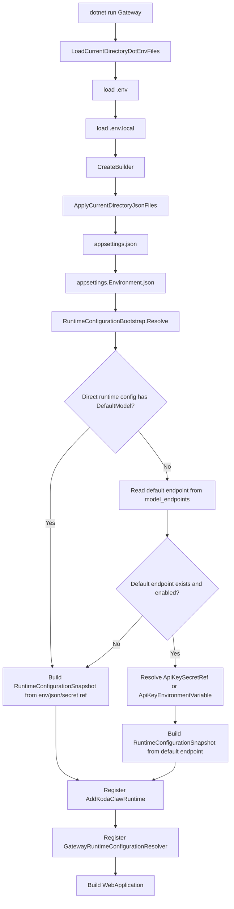
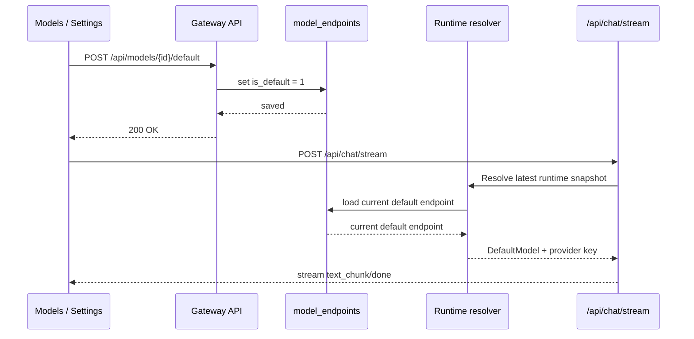
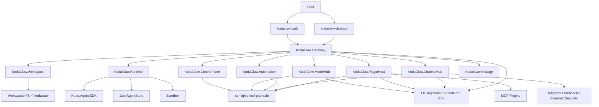
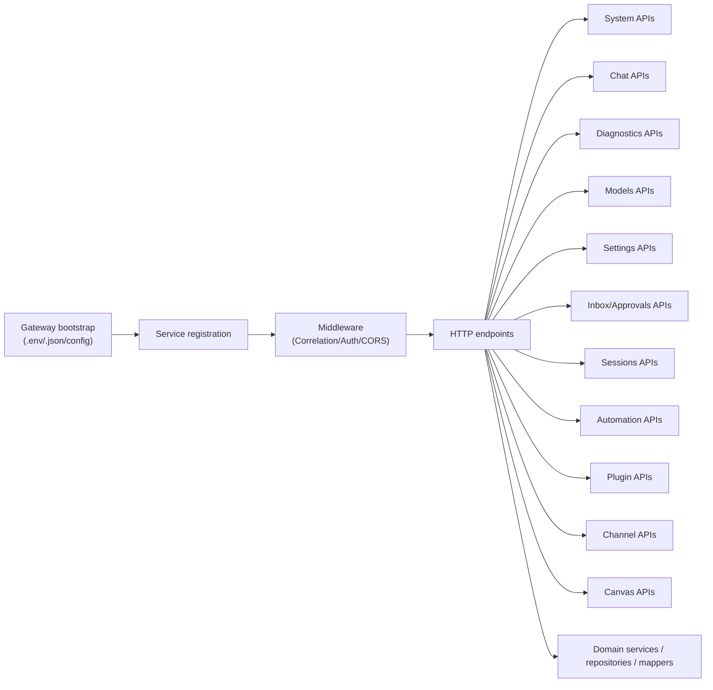

# Gateway Runtime Flow And Refactor Plan

Last updated: 2026-03-20
Status: Wave 4 Completed

## 1. 目的

这份文档解决三个问题：

1. 梳理 KodaClaw Gateway 到 Runtime 的真实配置链路
2. 用流程图和整体架构图解释为什么会出现不同的 `KodaClaw chat is not configured...` 错误
3. 给出 `Program.cs` 的可执行重构方案

相关代码入口：

- `/Users/vanzheng/projects/ai-agent/kode-sdk-csharp/products/KodaClaw/src/KodaClaw.Gateway/Program.cs`
- `/Users/vanzheng/projects/ai-agent/kode-sdk-csharp/products/KodaClaw/src/KodaClaw.Gateway/RuntimeConfigurationBootstrap.cs`
- `/Users/vanzheng/projects/ai-agent/kode-sdk-csharp/products/KodaClaw/src/KodaClaw.Gateway/GatewayConfigurationBootstrap.cs`
- `/Users/vanzheng/projects/ai-agent/kode-sdk-csharp/products/KodaClaw/src/KodaClaw.Gateway/GatewayRuntimeConfigurationResolver.cs`
- `/Users/vanzheng/projects/ai-agent/kode-sdk-csharp/products/KodaClaw/src/KodaClaw.Runtime/DynamicModelProvider.cs`
- `/Users/vanzheng/projects/ai-agent/kode-sdk-csharp/products/KodaClaw/src/KodaClaw.Runtime/RuntimeProviderSelection.cs`

## 2. 先看两个常见报错分别意味着什么

### 2.1 报错 A

`KodaClaw chat is not configured. Set KODACLAW_DEFAULT_MODEL and one provider API key.`

含义：

- Runtime snapshot 里没有拿到 `DefaultModel`
- 或者压根没有形成可用的 runtime snapshot
- 典型原因是：
  - 没有直接配置 `KODACLAW_DEFAULT_MODEL` / `Runtime:DefaultModel`
  - 也没有可用的 Model Registry default endpoint
  - 或 default endpoint 未启用 / 不存在

### 2.2 报错 B

`KodaClaw chat is not configured. Set OPENAI_API_KEY or ANTHROPIC_API_KEY.`

含义：

- `DefaultModel` 已经有了
- 但 provider key 没有成功解析出来
- 典型原因是：
  - default endpoint 已设为默认，但 `ApiKeyEnvironmentVariable` 指向的环境变量名不存在
  - `OPENAI_API_KEY_SECRET_REF` / `ANTHROPIC_API_KEY_SECRET_REF` 配了，但 secret store 没解析到值
  - `.env` / `.env.local` 虽然写了 key，但 Gateway 不是从正确的当前目录启动

### 2.3 报错 C

`KODACLAW_DEFAULT_MODEL looks like an Anthropic model, but only OPENAI_API_KEY is configured.`

或对应的 OpenAI/Anthropic 反向报错。

含义：

- model id 和 provider key 类型不一致
- 例如 `DefaultModel = claude-...`，但当前只解析出了 `OPENAI_API_KEY`

## 3. Gateway 启动配置链路

### 3.1 启动阶段流程图



### 3.2 配置优先级

当前优先级从低到高：

1. `appsettings.json`
2. `appsettings.{Environment}.json`
3. `.env`
4. `.env.local`
5. 真实 shell environment
6. command line arguments

补充：

- `.env` / `.env.local` 是在 Gateway 启动时灌入进程环境变量
- 所以如果你改了这两个文件，需要重启 Gateway
- Runtime Control 改 default endpoint 则不需要重启，因为那条链路现在是动态解析的

## 4. Chat 请求链路

### 4.1 Chat 流程图

```mermaid
flowchart TD
    A[Web/Desktop Chat request] --> B[/api/chat/stream]
    B --> C[MainSessionService.EnsureMainSessionAsync]
    C --> D[ResolveConfiguredModel]
    D --> E[RuntimeProviderSelector.ResolveModelOrThrow]
    E --> F[IRuntimeConfigurationResolver.Resolve]
    F --> G[RuntimeConfigurationBootstrap.Resolve]
    G --> H{DefaultModel present?}
    H -- No --> X[Throw error A]
    H -- Yes --> I{OpenAI or Anthropic key present?}
    I -- No --> Y[Throw error B]
    I -- Yes --> J[DynamicModelProvider.CreateProvider]
    J --> K[Create OpenAI/Anthropic provider]
    K --> L[SDK Agent stream]
    L --> M[SSE text_chunk / done / error]
```

### 4.2 关键点

- `MainSessionService`、`AutomationSessionService`、`ChannelSessionService` 在建会话时都会走 `ResolveModelOrThrow(...)`
- `DynamicModelProvider` 在真正发模型请求时也会再次按最新 snapshot 解析 provider
- 所以“会话层”和“provider 层”都已经不再是只在 Gateway 启动时冻结一次

## 5. Runtime Control 改默认模型的链路



结论：

- 现在 default endpoint 的切换对新的 chat/new session 是即时生效的
- 但如果 provider key 本身不存在，仍会落到报错 B

## 6. 整体架构图

### 6.1 产品运行架构



### 6.2 Gateway 内部职责图



## 7. 为什么 `Program.cs` 必须重构，以及现在到了哪一步

在开始维护性重构前，`/Users/vanzheng/projects/ai-agent/kode-sdk-csharp/products/KodaClaw/src/KodaClaw.Gateway/Program.cs` 约 5471 行，同时承担了：

- 启动配置 bootstrap
- DI 注册
- 中间件装配
- 全部 API endpoint 定义
- DTO/request 校验
- 错误映射
- 诊断记录
- Canvas 文件服务
- CORS 解析
- Approval / Channel / Session 等领域 helper

这会直接带来几个工程问题：

1. 组合根和业务逻辑混在一起，任何一个领域改动都要打开同一个巨型文件
2. helper 与 handler 高耦合，复用、测试和 review 都困难
3. 新增 API 时很容易把跨领域逻辑继续堆回顶层入口
4. 一旦 Runtime / Channel / Approval 联动出问题，很难快速定位应该修哪一层

Wave 4 完成后的状态已经变成：

- `Program.cs` 现仅 45 行，只保留 `Build` / `Run`、配置 bootstrap 与 composition hook
- 服务注册、middleware 装配、endpoint 注册全部由 `GatewayApp` partial 组合层接管
- 主要 API 领域都已迁入独立 endpoint partial，顶层改为 `MapGatewayEndpoints(app)` 统一装配
- request 校验、HTTP 映射、横切基础设施 helper 也都迁入各自分层文件，不再回堆到入口文件

## 8. Wave 4 完成后的目标结构

### 8.1 顶层目标

当前 `Program.cs` 已真正退化为 composition root，只做四件事：

1. `builder` 初始化
2. `.env` / `appsettings` bootstrap
3. service registration
4. endpoint module registration

### 8.2 实际落地目录

```text
src/KodaClaw.Gateway/
  Program.cs
  GatewayConfigurationBootstrap.cs
  RuntimeConfigurationBootstrap.cs
  GatewayRuntimeConfigurationResolver.cs
  Composition/
    GatewayApp.Constants.cs
    GatewayApp.Composition.cs
  Endpoints/
    GatewayApp.RootEndpoint.cs
    GatewayApp.SystemEndpoints.cs
    GatewayApp.ChatDiagnosticsEndpoints.cs
    GatewayApp.ModelEndpoints.cs
    GatewayApp.SettingsEndpoints.cs
    GatewayApp.AutomationEndpoints.cs
    GatewayApp.PluginEndpoints.cs
    GatewayApp.CanvasEndpoints.cs
    GatewayApp.ApprovalEndpoints.cs
    GatewayApp.SessionEndpoints.cs
    GatewayApp.InboxEndpoints.cs
    GatewayApp.ChannelEndpoints.cs
  Validation/
    GatewayApp.ModelValidation.cs
    GatewayApp.ChannelValidation.cs
  Mapping/
    GatewayApp.ApprovalMappings.cs
    GatewayApp.ChannelMappings.cs
  Infrastructure/
    GatewayApp.Infrastructure.cs
    GatewayApp.Querying.cs
    GatewayApp.SessionInfrastructure.cs
    GatewayApp.CanvasFiles.cs
```

### 8.3 每层职责

| 层 | 当前文件 | 责任 | 不该做什么 |
| --- | --- | --- | --- |
| `Program.cs` | `Program.cs` | 启动入口，串起 bootstrap 与 build/run | 不写业务 handler |
| `Composition/*` | `GatewayApp.Composition.cs`、`GatewayApp.Constants.cs` | 注册服务、middleware、顶层路由装配 | 不写领域规则 |
| `Endpoints/*` | 各领域 endpoint partial | 只保留 HTTP 语义：入参、鉴权、调服务、返回结果 | 不写复杂业务计算 |
| `Validation/*` | `GatewayApp.ModelValidation.cs`、`GatewayApp.ChannelValidation.cs` | request 校验与标准化 | 不依赖 `HttpContext` |
| `Mapping/*` | `GatewayApp.ApprovalMappings.cs`、`GatewayApp.ChannelMappings.cs` | 领域结果 -> HTTP 结果 / 错误体 | 不访问仓储 |
| `Infrastructure/*` | `GatewayApp.Infrastructure.cs`、`GatewayApp.Querying.cs`、`GatewayApp.SessionInfrastructure.cs`、`GatewayApp.CanvasFiles.cs` | auth、cors、correlation、diagnostics、query parsing、session/canvas helper | 不承载新的领域编排 |

## 9. Wave 0 ~ Wave 4 落地状态

### Wave 0：止血整理

`Completed`

- `ConfigureGatewayServices(...)` 与 `ConfigureGatewayMiddleware(...)` 已迁入 `/Users/vanzheng/projects/ai-agent/kode-sdk-csharp/products/KodaClaw/src/KodaClaw.Gateway/Composition/GatewayApp.Composition.cs`
- `Program.cs` 只保留启动、配置 bootstrap 与 `MapGatewayEndpoints(app)` 装配入口

### Wave 1：按 API 领域拆 endpoint 文件

`Completed`

- `/api/system/*`、`/api/chat/stream`、`/api/diagnostics/*`
- `/api/models/*`、`/api/settings/*`、`/api/automations/*`
- `/api/plugins/*`、`/api/canvas/*`、`/api/approvals/*`
- `/api/sessions/*`、`/api/inbox/*`、`/api/channels/*` 与 root endpoint

### Wave 2：把 helper 按领域迁出

`Completed`

- model 校验与标准化迁入 `/Users/vanzheng/projects/ai-agent/kode-sdk-csharp/products/KodaClaw/src/KodaClaw.Gateway/Validation/GatewayApp.ModelValidation.cs`
- channel 校验与 delivery rule helper 迁入 `/Users/vanzheng/projects/ai-agent/kode-sdk-csharp/products/KodaClaw/src/KodaClaw.Gateway/Validation/GatewayApp.ChannelValidation.cs`
- approval / channel HTTP 映射迁入 `/Users/vanzheng/projects/ai-agent/kode-sdk-csharp/products/KodaClaw/src/KodaClaw.Gateway/Mapping/`
- session detail、query parsing、canvas 文件服务 helper 分别迁入 `/Users/vanzheng/projects/ai-agent/kode-sdk-csharp/products/KodaClaw/src/KodaClaw.Gateway/Infrastructure/`

### Wave 3：把横切基础设施抽离

`Completed`

- auth、CORS、correlation、diagnostic record 与 runtime readiness helper 已集中到 `/Users/vanzheng/projects/ai-agent/kode-sdk-csharp/products/KodaClaw/src/KodaClaw.Gateway/Infrastructure/GatewayApp.Infrastructure.cs`
- canvas 文件读写与下载 helper 已集中到 `/Users/vanzheng/projects/ai-agent/kode-sdk-csharp/products/KodaClaw/src/KodaClaw.Gateway/Infrastructure/GatewayApp.CanvasFiles.cs`
- 公共常量已迁入 `/Users/vanzheng/projects/ai-agent/kode-sdk-csharp/products/KodaClaw/src/KodaClaw.Gateway/Composition/GatewayApp.Constants.cs`

### Wave 4：收尾与回归

`Completed`

- 所有主要 endpoint module 现统一使用 `app.MapGroup(...)` 按领域分组
- 顶层路由注册统一收敛到 `MapGatewayEndpoints(app)`，不再把路由散落在 `Program.cs`
- `ARCHITECTURE.md`、`DEVELOPER_GUIDE.md`、`README.md`、`IMPLEMENTATION_STATUS.md`、`IMPLEMENTATION_BACKLOG.md` 与本计划文档已同步
- 现有 Gateway / system / model / settings / automation / plugin / approval / inbox / sessions / channels / backup / startup repair / update-state / secret-migration integration suites 均保持绿色，确认 API surface 未回归

## 10. 当前顶层写法

```csharp
var app = GatewayApp.Build(args);
app.Run();
```

`GatewayApp.Build(...)` 现保留的职责就是：

```csharp
public static WebApplication Build(
    string[]? args = null,
    Action<IServiceCollection>? configureServices = null,
    Action<IConfigurationBuilder>? configureConfiguration = null)
{
    var currentDirectory = Directory.GetCurrentDirectory();
    GatewayConfigurationBootstrap.LoadCurrentDirectoryDotEnvFiles(currentDirectory);

    var builder = WebApplication.CreateBuilder(args ?? []);
    GatewayConfigurationBootstrap.ApplyCurrentDirectoryJsonFiles(
        builder.Configuration,
        currentDirectory,
        builder.Environment.EnvironmentName);
    configureConfiguration?.Invoke(builder.Configuration);

    var runtimeBootstrap = RuntimeConfigurationBootstrap.Resolve(builder.Configuration);
    var configuredCorsOrigins = GetConfiguredCorsOrigins(builder.Configuration);
    ConfigureGatewayServices(builder, runtimeBootstrap, configuredCorsOrigins, configureServices);

    var app = builder.Build();
    ConfigureGatewayMiddleware(app);
    MapGatewayEndpoints(app);
    return app;
}
```

## 11. Wave 4 验证与文档闭环（2026-03-20）

本轮收口后的关键信息：

- `Program.cs` 已从原来的约 5471 行收敛到当前 45 行
- `GatewayApp` 已稳定采用 `partial` 组合方式，endpoint / validation / mapping / infrastructure 全部按层归档
- `/api/system`、`/api/chat`、`/api/diagnostics`、`/api/models`、`/api/settings`、`/api/automations`、`/api/plugins`、`/api/canvas`、`/api/approvals`、`/api/sessions`、`/api/inbox`、`/api/channels` 已全部从顶层文件移出
- route grouping、文档闭环与回归验证都已完成，Wave 4 已正式收口

本轮验证结果：

- `dotnet build /Users/vanzheng/projects/ai-agent/kode-sdk-csharp/products/KodaClaw/src/KodaClaw.Gateway/KodaClaw.Gateway.csproj -m:1`
- `dotnet test /Users/vanzheng/projects/ai-agent/kode-sdk-csharp/products/KodaClaw/tests/KodaClaw.IntegrationTests/KodaClaw.IntegrationTests.csproj --filter "BootstrapFlowIntegrationTests|GatewayDiagnosticsIntegrationTests|ModelApiIntegrationTests|SettingsApiIntegrationTests|AutomationApiIntegrationTests|CanvasApiIntegrationTests|PluginApiIntegrationTests|ApprovalApiIntegrationTests|InboxApiIntegrationTests|GatewaySessionsIntegrationTests|ChannelApiIntegrationTests|BackupApiIntegrationTests|StartupRepairApiIntegrationTests|UpdateStateApiIntegrationTests|SecretMigrationReportIntegrationTests" -m:1`（77 tests passed）
- `dotnet test /Users/vanzheng/projects/ai-agent/kode-sdk-csharp/products/KodaClaw/KodaClaw.sln -m:1`（299 tests passed）

后续如果继续做 Gateway 维护，只建议在现有分层结构内做局部演进，而不是把新逻辑重新堆回 `Program.cs`。

## 12. 对当前报错的直接排查建议

如果你现在还在看到：

`KodaClaw chat is not configured. Set OPENAI_API_KEY or ANTHROPIC_API_KEY.`

按这个顺序查：

1. 先看 `Models / Settings` 当前 default endpoint 对应的是哪个 `ModelId`
2. 看该 endpoint 上配置的是 `ApiKeyEnvironmentVariable` 还是 `ApiKeySecretRef`
3. 如果是 `ApiKeyEnvironmentVariable`，确认 Gateway 启动时的当前目录下 `.env` / `.env.local` 是否真的包含这个变量名
4. 如果是 `ApiKeySecretRef`，确认 secret store 中确实有值
5. 如果 `ModelId` 是 `claude-*`，但只有 OpenAI key，也会报 provider mismatch

一句话判断：

- 报错 A 是“没有模型”
- 报错 B 是“有模型但没有 provider key”
- provider mismatch 是“模型和 key 类型对不上”
