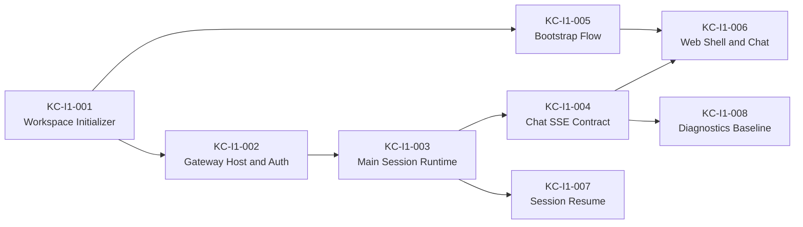

# KodaClaw 迭代 1 Capability Slices

这份文档把“迭代 1：Core Assistant Alpha”拆成可以直接进入实现的能力切片。目标不是一次性把所有东西做完，而是形成一组可独立开发、可独立验证、最终能拼成首个可用闭环的切片。

## 迭代 1 总目标

用户第一次启动 KodaClaw 时，可以完成 bootstrap，进入主聊天界面，和 Koda 进行一轮真实对话；关闭再打开后，会话与基础状态可以恢复。

## 建议顺序

## KC-I1-001 Workspace Initializer

### Problem

KodaClaw 作为本地产品，必须先有 `~/.kodaclaw` 的目录协议和初始化流程；否则后续主会话、记忆、bootstrap、自动化都没有稳定落点。

### User Outcome

用户首次启动时，KodaClaw 会自动准备好自己的本地家目录，而不是要求用户手动创建文件和配置。

### Scope

- 创建 `~/.kodaclaw` 顶层目录
- 创建 `config/`、`identity/`、`workspace/`、`sessions/`、`logs/`、`cache/`
- 初始化 `AGENTS.md`、`IDENTITY.md`、`SOUL.md`、`BOOTSTRAP.md`
- 生成 `device.json`
- 写入 `workspaceVersion`

### Non-goals

- 不做完整 memory 写入策略
- 不做插件、渠道、自动化定义编译
- 不做 UI

### Modules

- `KodaClaw.Workspace`
- `KodaClaw.Contracts`

### Contracts

- `~/.kodaclaw` 目录结构
- 默认文件模板
- `device.json` schema

### Verification

- `L0`：模块可构建
- `L1`：路径解析、重复初始化、版本检测
- `L2`：真实临时目录初始化测试
- `L3`：golden file / golden tree snapshot
- `L5`：人工检查生成结果

### Exit Criteria

- 重复执行初始化不会破坏已有内容
- 默认目录和核心文件完整生成
- 能明确区分首次启动与已初始化状态

## KC-I1-002 Gateway Host and Auth

### Problem

KodaClaw 需要一个独立于 UI 的本地 Gateway 作为统一入口；否则后续 chat、session、审批、插件、自动化都会直接耦到 UI 或 runtime。

### User Outcome

用户启动产品时，KodaClaw 会有一个本地守护进程在背后运行，Web UI 和未来桌面壳都接它。

### Scope

- 本地 ASP.NET Core Gateway 最小宿主
- 仅监听 loopback
- 基础 token auth
- `/api/system/health`
- `/api/system/bootstrap-state`

### Non-goals

- 不做完整 chat API
- 不做 settings 管理页
- 不做 desktop shell 集成

### Modules

- `KodaClaw.Gateway`
- `KodaClaw.ControlPlane`
- `KodaClaw.Workspace`

### Contracts

- Gateway token 读取/生成方式
- `health` response contract
- `bootstrap-state` response contract

### Verification

- `L0`：Gateway 可启动
- `L1`：token middleware、配置解析
- `L2`：loopback HTTP integration tests
- `L3`：response contract golden tests
- `L5`：本机启动与 curl 验证

### Exit Criteria

- Gateway 能稳定启动并响应健康检查
- 未授权请求被拒绝
- UI 能用统一方式发现 bootstrap 状态

## KC-I1-003 Main Session Runtime

### Problem

没有 `main` session 的运行时编排，就无法把现有 SDK 变成 KodaClaw 的产品会话。

### User Outcome

主聊天窗口里的每次对话，都会由独立的主会话 session 承载，并加载 KodaClaw 的主会话上下文。

### Scope

- 定义 `SessionKind.main`
- 创建主会话 Agent 工厂
- 基于 Workspace 加载主会话最小上下文
- 绑定 JsonAgentStore
- 主会话基础生命周期管理

### Non-goals

- 不做渠道 session
- 不做自动化 session
- 不做复杂模型路由

### Modules

- `KodaClaw.Runtime`
- `KodaClaw.Workspace`
- `KodaClaw.Gateway`

### Contracts

- `SessionKind`
- `main` session 上下文加载规则
- session metadata 最小 schema

### Verification

- `L0`：模块可构建
- `L1`：session policy、context load rule
- `L2`：main session 创建与 store 落地
- `L3`：session metadata / event shape
- `L5`：真实主会话对话 smoke

### Exit Criteria

- 主会话能创建并正常跑一轮
- 主会话有独立 store
- 上下文加载规则可被测试验证

## KC-I1-004 Chat SSE Contract

### Problem

KodaClaw 的 UI 需要稳定消费流式输出和最小可观察事件；如果先写一套临时 SSE，后面会反复返工。

### User Outcome

用户在聊天时，能看到实时返回，而不是等整段结束后一次性出现。

### Scope

- `POST /api/chat/stream`
- chat request / response contract
- text chunk event
- done event
- error event
- 最小 timeline metadata

### Non-goals

- 不做审批事件流
- 不做 tool timeline 富事件
- 不做多 session 视图

### Modules

- `KodaClaw.Gateway`
- `KodaClaw.Runtime`
- `KodaClaw.Contracts`

### Contracts

- chat request DTO
- SSE event schema
- error schema

### Verification

- `L0`：构建通过
- `L1`：DTO / mapper
- `L2`：Gateway + Runtime integration
- `L3`：SSE sequence contract / replay test
- `L4`：Web 页面消费 stream

### Exit Criteria

- 能连续流出文本
- 结束事件明确
- 异常时有稳定错误形状

## KC-I1-005 Bootstrap Flow

### Problem

如果没有 bootstrap 流程，KodaClaw 只是一个空壳，没有“知道自己是谁”和“知道服务谁”的初始建立过程。

### User Outcome

用户第一次打开 KodaClaw 时，能通过一轮自然对话完成 Koda 身份与用户画像的基础设定。

### Scope

- 识别是否首次启动
- bootstrap session / bootstrap mode
- 把 bootstrap 结果写入 `IDENTITY.md` / `USER.md`
- 首次完成后归档或删除 `BOOTSTRAP.md`

### Non-goals

- 不做完整长期记忆归档
- 不做复杂 onboarding 多步骤 UI

### Modules

- `KodaClaw.Workspace`
- `KodaClaw.Runtime`
- `KodaClaw.Gateway`

### Contracts

- bootstrap state
- bootstrap completion contract
- `IDENTITY.md` / `USER.md` 写入格式

### Verification

- `L1`：首次状态判定、写入规则
- `L2`：bootstrap completion 集成测试
- `L3`：文件输出 golden tests
- `L4`：从首次启动到完成 onboarding 的端到端流程
- `L5`：人工体验检查

### Exit Criteria

- 能可靠判断“首次启动”
- 完成 bootstrap 后能落盘
- 下次启动不再进入 bootstrap

## KC-I1-006 Web Shell and Chat

### Problem

如果没有一个最小可用 UI，KodaClaw 的迭代 1 无法形成真正可用的产品闭环。

### User Outcome

用户可以打开一个 Web 控制台，看到聊天输入框、消息流和基础状态。

### Scope

- `kodaclaw-web` 基础壳布局
- 启动后检查 Gateway
- bootstrap / main chat 两种初始路由
- 主聊天页
- 流式输出渲染

### Non-goals

- 不做 Inbox
- 不做 Plugins / Models / Channels 页面
- 不做复杂视觉设计

### Modules

- `kodaclaw-web`
- `KodaClaw.Gateway`

### Contracts

- bootstrap-state API consumption
- chat stream consumption

### Verification

- `L0`：前端构建与 typecheck
- `L1`：组件测试
- `L3`：API adapter contract
- `L4`：Playwright 主流程
- `L5`：人工 smoke

### Exit Criteria

- 能进入聊天页
- 能发消息并看到流式结果
- bootstrap 状态和主聊天状态切换正确

## KC-I1-007 Session Resume

### Problem

如果关闭后不能恢复，KodaClaw 仍然只是短生命周期 demo，不是持续性产品。

### User Outcome

用户关闭再打开产品后，能继续主会话，而不是每次都从空白状态开始。

### Scope

- session metadata 持久化
- 恢复主会话 Agent
- 复用主会话 store
- 恢复最近线程基础状态

### Non-goals

- 不做多会话列表
- 不做 agent pool 淘汰策略优化

### Modules

- `KodaClaw.Runtime`
- `KodaClaw.Gateway`
- `KodaClaw.Storage`

### Contracts

- session metadata schema
- recent session lookup contract

### Verification

- `L1`：恢复决策逻辑
- `L2`：create -> close -> resume 集成测试
- `L3`：session metadata golden tests
- `L5`：本地重启 smoke

### Exit Criteria

- 重启后可恢复主会话
- 不会重复创建脏 session
- 恢复失败时有明确 fallback

## KC-I1-008 Diagnostics Baseline

### Problem

如果从第一版开始没有最小 diagnostics，后面一旦接入插件、渠道、自动化，就很难排错。

### User Outcome

即使在第一版，用户和开发者也能知道当前系统是“启动失败”“鉴权失败”“流式失败”还是“session 恢复失败”。

### Scope

- Gateway 基础日志上下文
- chat request correlation id
- 最小 diagnostics endpoint 或日志查询入口
- 主会话关键生命周期事件

### Non-goals

- 不做完整 diagnostics UI
- 不做全量 timeline 检索

### Modules

- `KodaClaw.Gateway`
- `KodaClaw.Runtime`
- `KodaClaw.ControlPlane`

### Contracts

- diagnostics event shape（最小版）
- correlation id 约定

### Verification

- `L1`：event mapper / correlation logic
- `L2`：日志与 endpoint 集成验证
- `L3`：diagnostics response contract
- `L5`：故障手工定位演练

### Exit Criteria

- 主流程出现问题时可定位到模块层级
- 至少有统一 correlation id
- 对 bootstrap、chat、resume 三类核心流程有基础记录

## 并行建议

建议拆成三条并行开发线：

- 线 A：`Workspace + Bootstrap`
  - `KC-I1-001`
  - `KC-I1-005`
- 线 B：`Gateway + Runtime`
  - `KC-I1-002`
  - `KC-I1-003`
  - `KC-I1-004`
  - `KC-I1-007`
  - `KC-I1-008`
- 线 C：`Web`
  - `KC-I1-006`

## 迭代 1 的最终完成标准

当下面 6 件事都成立时，迭代 1 才算真正完成：

1. 第一次启动能创建 `~/.kodaclaw`
2. 能完成 bootstrap 并写入关键文件
3. 能进入主聊天页并流式对话
4. 主会话能恢复
5. 最小 diagnostics 可用
6. 上述流程至少完成 `L0-L4` 自动验证和一次 `L5` dogfood
