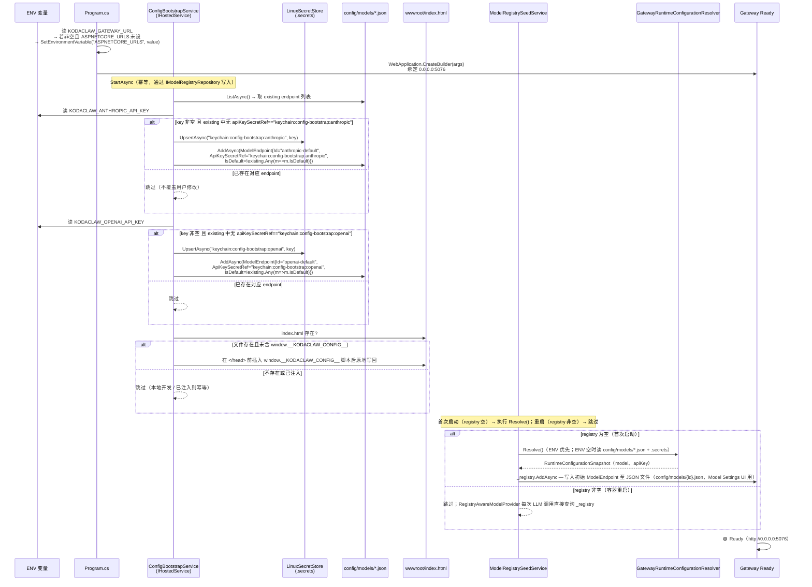
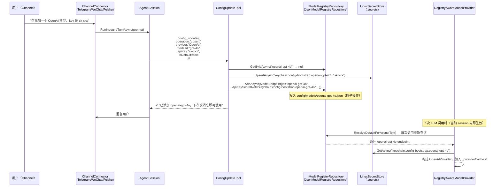

# KC-DOCKER FREEZE — KodaClaw Docker 化与热更配置系统

> 冻结日期：2026-04-10
> 状态：FROZEN
> 类型：大改（跨多个迭代，影响 Deployment / Gateway / Runtime / Web）
> 对应迭代：KC-DOCKER-001 → 002 → 003 → 004 → 005 → 006

---

## 背景与动机

KodaClaw 当前是 local-first 个人 OS，仅支持 macOS Desktop（Electron + loopback Gateway）。随着 Channel 生态（Telegram / 微信 / 飞书）成熟，越来越多的用户希望将 KodaClaw 部署在云服务器或 NAS 上 7×24 运行。

Docker 化需要解决三个核心问题：
1. **配置持久化**：ENV 只在启动时读取，容器重启后配置丢失；需要将初始配置持久化到 workspace——支持两条路径：① 启动时提供 `KODACLAW_ANTHROPIC_API_KEY` ENV（自动化/CI 场景）；② 首次访问浏览器通过 Setup Wizard 填写（普通用户主路径，无需改任何配置文件）
2. **非 loopback 绑定**：Gateway 默认只监听 loopback，Docker 部署需要 `0.0.0.0`
3. **Agent 自改配置**：Docker 用户主要通过 Channel 交互，需要 Agent 能通过对话修改自身配置（加模型、换 key 等）

---

## 现有基础设施盘点

### 已有，不需要重建

**Secret 存储**（`KodaClaw.Workspace/Secrets/`）
- `ISecretStore`（`KodaClaw.Contracts`）✅ 接口已有
- `PlatformSecretStore` ✅ 多 provider：`env`（只读）/ `memory` / `keychain`
- `LinuxSecretStore` ✅ 双后端：优先 `secret-tool`（libsecret）；无 GNOME 环境自动 fallback 到 `{workspace}/config/.secrets`（chmod 600 明文 JSON）
- 平台自动选择：`PlatformSecretStore.CreateForCurrentPlatform()` ✅

> **结论**：Docker/Linux 下 `LinuxSecretStore` 的 file fallback 对个人部署够用，**不引入 AES 加密层**。

**配置加载**（`KodaClaw.Gateway/Bootstrap/`）
- `GatewayConfigurationBootstrap` ✅ 加载 `.env` / `appsettings.json`，`ReloadOnChange = true`
- `RuntimeConfigurationBootstrap` ✅ 读取 ENV（`ANTHROPIC_API_KEY` 等）+ 扫描 `{workspace}/config/models/*.json`
- `GatewayRuntimeConfigurationResolver`（实现 `IRuntimeConfigurationResolver`）✅ session 启动时调用 `Resolve()` 重新解析

**模型配置格式**（workspace 现有结构，每 endpoint 一个文件）
```
{workspace}/config/models/
  anthropic-default.json
  openai-gpt-4o.json
  ...
```
每个文件 JSON schema（与 `ModelEndpoint` 序列化格式完全一致）：
```json
{
  "provider": "Anthropic",
  "modelId": "claude-sonnet-4-20250514",
  "isDefault": true,
  "enabled": true,
  "apiKeySecretRef": "keychain:config-bootstrap:anthropic",
  "baseUrl": null
}
```
> `apiKeySecretRef` 格式：`{provider}:{scope}:{key}`（冒号分隔，3段），由 `SecretRef.TryParse` 解析（`value.Split(':', 3)`），`LinuxSecretStore` 从 `.secrets` 文件读取实际 key 值。

**CORS**（`GatewayApp.Infrastructure.cs`）
- `KODACLAW_CORS_ALLOWED_ORIGINS` ENV ✅ 已可配置；`IsLoopbackCorsOrigin` 默认允许 loopback
- Docker 下设 `KODACLAW_CORS_ALLOWED_ORIGINS=*` 即可放行所有 origin

**健康检查**（`GatewayApp.SystemEndpoints.cs`）
- `GET /api/system/health` ✅ 已有（需鉴权）
- 缺：`GET /healthz`（无需鉴权，Docker 标准）

### 实际缺口

| 缺口 | 说明 | 对应迭代 |
|------|------|---------|
| **配置 onboarding** | 无持久化路径：ENV key 重启丢失，且普通用户不会改 `.env`；需要 ① ENV 自动持久化（CI/自动化）② Setup Wizard 浏览器引导（主路径） | KC-DOCKER-001 + KC-DOCKER-006 |
| **`KODACLAW_GATEWAY_URL` 绑定** | 未接入 `ASPNETCORE_URLS`，容器内仍监听 loopback | KC-DOCKER-002 |
| **`/healthz` 端点** | Docker 标准健康检查端点（无鉴权） | KC-DOCKER-002 |
| **静态文件内嵌** | `apps/kodaclaw-web` build 产物未打包进 Gateway | KC-DOCKER-002 |
| **`config_update` 工具** | Agent 通过对话修改模型配置 | KC-DOCKER-003 |
| **Dockerfile + compose** | 构建和编排文件 | KC-DOCKER-004 |
| **Web UI Docker 模式** | `config.ts` 读取 `window.__KODACLAW_CONFIG__` 注入配置，`isDockerMode()` 导出，Sidebar DOCKER_MODE 布局调整 | KC-DOCKER-005 |

---

## 核心设计决策（全部已定，不留待定项）

### 1. 单用户 per container
一个用户 = 一个 Docker volume = 一个容器实例。多角色通过 docker-compose 起多实例。

### 2. Secret 存储：沿用 LinuxSecretStore file fallback
容器内无 GNOME Keyring，`LinuxSecretStore` 自动 fallback 到 `{workspace}/config/.secrets`（chmod 600）。不引入额外 AES 加密层。

### 3. 配置写入共享层（ConfigBootstrapWriter）

两条 onboarding 路径共用同一个写入类 `ConfigBootstrapWriter`，避免逻辑重复：

| 路径 | 调用方 | 触发时机 |
|------|--------|---------|
| **ENV 路径**（自动化/CI） | `ConfigBootstrapService`（IHostedService） | 容器启动时，读取 `KODACLAW_ANTHROPIC_API_KEY` / `KODACLAW_OPENAI_API_KEY` |
| **Setup Wizard 路径**（主路径） | `POST /setup/complete` handler | 用户首次访问浏览器，填写表单提交 |

`ConfigBootstrapWriter.WriteIfAbsentAsync(anthropicKey?, openaiKey?)` 核心逻辑（两条路径完全一致）：

```
existing = await _registry.ListAsync()

若 anthropicKey 非空 且 existing 中无 apiKeySecretRef == "keychain:config-bootstrap:anthropic"：
  → ISecretStore.UpsertAsync(SecretRef("keychain", "config-bootstrap", "anthropic"), anthropicKey)
  → _registry.AddAsync(new ModelEndpoint {
        Id = "anthropic-default", DisplayName = "Anthropic (Bootstrap)",
        Provider = Anthropic, ModelId = "claude-sonnet-4-20250514",
        ApiKeySecretRef = "keychain:config-bootstrap:anthropic",
        Enabled = true, Capabilities = Text,
        IsDefault = !existing.Any(m => m.IsDefault),
        CreatedAt = now, UpdatedAt = now
    })

若 openaiKey 非空 且 existing 中无 apiKeySecretRef == "keychain:config-bootstrap:openai"：
  → ISecretStore.UpsertAsync(...) + _registry.AddAsync(ModelEndpoint{Id="openai-default", ...})

已有对应 apiKeySecretRef → 跳过（不覆盖用户通过 Settings 的修改）
key 为空 → 跳过对应 provider，不报错
```

`ConfigBootstrapService.StartAsync` 仅读 ENV 然后委托：`await _writer.WriteIfAbsentAsync(env_anthropic, env_openai)`。两条路径均幂等，重复调用安全。API key 写入 `.secrets`，registry 只存 `apiKeySecretRef`，不暴露明文。

### 4. Gateway 绑定地址

在 `GatewayApp.Build` 最早处（`WebApplication.CreateBuilder` 之前）：

```csharp
var gatewayUrl = Environment.GetEnvironmentVariable("KODACLAW_GATEWAY_URL");
if (!string.IsNullOrWhiteSpace(gatewayUrl)
    && string.IsNullOrWhiteSpace(Environment.GetEnvironmentVariable("ASPNETCORE_URLS")))
{
    Environment.SetEnvironmentVariable("ASPNETCORE_URLS", gatewayUrl);
}
```

Docker 用户设 `KODACLAW_GATEWAY_URL=http://0.0.0.0:5076`，本地不设则维持原来的 loopback 行为。

### 5. Docker 用户交互模式
- **主界面**：Channels（Telegram / 微信 / 飞书）
- **配置面板**：Web UI `http://<server>:5076`（Settings Dashboard）
- Electron：保持现有 AttachOnly 模式不变

### 6. 配置权限分级

```
Setup Wizard / Agent-writable（首次配置或对话修改）：
  {workspace}/config/models/*.json   — API key 初始写入（ConfigBootstrapWriter）
  {workspace}/config/.secrets        — 实际 key 值（ISecretStore.UpsertAsync）

Agent-writable（config_update 工具，对话中热更新）：
  {workspace}/config/models/*.json   — 模型 endpoint 增删改
  {workspace}/workspace/mcp.json     — MCP server（已有 workspace_protocol_update）

UI-only（Settings 页面）：
  {workspace}/config/.secrets        — 直接操作 secrets（使用 SecretMigrationReport）
  {workspace}/config/gateway.json    — Gateway auth token

ENV-only（仅启动时生效，均为可选）：
  KODACLAW_ANTHROPIC_API_KEY         — 自动化/CI 场景替代 Setup Wizard
  KODACLAW_OPENAI_API_KEY            — 同上
  KODACLAW_GATEWAY_URL               — 端口/地址绑定（不做热更）
```

### 7. config_update 工具参数设计（Agent 友好）

参数：
- `operation`：`"upsert"` | `"remove"`
- `endpointId`：string（upsert 时若未提供则自动生成：`{provider}-{modelId}` 全小写，非字母数字字符替换为 `-`，连续 `-` 合并为一个，首尾 `-` 去除，最长 64 字符；例：`OpenAI`+`gpt-4o` → `openai-gpt-4o`）
- `provider`：`"Anthropic"` | `"OpenAI"` | `"OpenAICompatible"` | `"AnthropicCompatible"`
- `modelId`：string
- `apiKey`：string（可选；若提供，tool 自动调 `ISecretStore.UpsertAsync` 存入 `.secrets`，endpoint 写 `apiKeySecretRef: "keychain:config-bootstrap:{endpointId}"` 而非明文）
- `baseUrl`：string（可选，兼容 API 用）
- `isDefault`：bool（可选，默认 false）

实现：**均通过 `IModelRegistryRepository` 写入**，不直接操作文件系统：

```
upsert 操作：
  existing = await _registry.GetByIdAsync(endpointId)
  若 existing is null：
    → ISecretStore.UpsertAsync(secretRef, apiKey)（若 apiKey 非空）
    → _registry.AddAsync(new ModelEndpoint {
          Id = endpointId, DisplayName = "{Provider} ({modelId})",
          Provider = provider, ModelId = modelId, BaseUrl = baseUrl,
          ApiKeySecretRef = "keychain:config-bootstrap:{endpointId}",（若 apiKey 提供）
          Enabled = true, Capabilities = ModelCapabilitySet.Text,
          IsDefault = isDefault, CreatedAt = now, UpdatedAt = now
      })
  若 existing 非 null（更新已有 endpoint）：
    → ISecretStore.UpsertAsync(secretRef, apiKey)（若 apiKey 非空）
    → _registry.UpdateAsync(existing with { ModelId = modelId, BaseUrl = baseUrl,
          ApiKeySecretRef = ..., UpdatedAt = now })
  若 isDefault == true：
    → _registry.SetDefaultAsync(endpointId)  // 原子联动，清除其他 isDefault

remove 操作：
  existing = await _registry.GetByIdAsync(endpointId)
  若 existing is null → 返回错误 "endpoint '{endpointId}' 不存在"
  若 existing.IsDefault && (await _registry.ListAsync()).Count(m => m.IsDefault) == 1
    → 返回错误 "请先将其他模型设为默认，再删除此项"
  → _registry.DeleteAsync(endpointId)
```

`isDefault` 联动：委托给 `IModelRegistryRepository.SetDefaultAsync(endpointId)`（原子操作，自动清除其他 endpoint 的 IsDefault）。

**写入即生效**：`RegistryAwareModelProvider` 在每次 LLM 调用时重新查询 registry，`config_update` 完成后当前 session 的下一次 LLM 调用即可使用新配置，无需重启容器或开新 session。

### 8. 单容器方案（静态文件内嵌）

Gateway 在 `wwwroot/` serve `apps/kodaclaw-web` 的 build 产物。

`index.html` 配置注入：**启动时预写入**（在 `ConfigBootstrapService.StartAsync` 末尾执行）：检查 `wwwroot/index.html` 是否存在；若存在，读取文件，在 `</head>` 前插入以下脚本后原地写回：

```html
<script>window.__KODACLAW_CONFIG__={"gatewayUrl":"/","dockerMode":true};</script>
```

`gatewayUrl` 固定为 `"/"`（同域部署，无 CORS），`dockerMode` 读取 `KODACLAW_DOCKER_MODE` ENV（默认 false；Docker compose 文件中设为 `"true"`）。本地开发无 `wwwroot/index.html`，跳过，不报错。**幂等性**：写入前检查文件内容是否已含 `window.__KODACLAW_CONFIG__`，若已存在则跳过（容器 stop/start 不重复注入）。

> **为何选择启动预写入而非 per-request 中间件**：`MapFallbackToFile` 会对所有 SPA 深路径（如 `/channels`、`/settings`）返回 `wwwroot/index.html`，per-request 中间件只拦截 `/` 和 `/index.html`，导致用户直接打开或硬刷新深路径时 `window.__KODACLAW_CONFIG__` 缺失（`dockerMode` 降级，Sidebar 布局错误）。启动时预写入一次，`UseStaticFiles()` 和 `MapFallbackToFile` 对所有路径返回同一份已注入文件，问题消除。

前端集成点：`apps/kodaclaw-web/src/lib/config.ts` 的 `initializeRuntimeConfig()` 在读取 Electron bridge（`window.kodaClawDesktop`）之前先检查 `window.__KODACLAW_CONFIG__`，若存在则合并 `gatewayUrl`（空字符串时 `resolveGatewayPath` 自动生成相对路径，同域无 CORS）和 `dockerMode`（注入到 `DesktopRuntimeConfig`，供 `isDockerMode()` 返回）。非 Docker 本地开发时 `window.__KODACLAW_CONFIG__` 不存在，`getGatewayUrl()` 返回 `VITE_KODACLAW_GATEWAY_URL`（`.env.local`）或空字符串（loopback fallback）。

### 9. 热更新时效

`config_update` 通过 `IModelRegistryRepository` 写入 JSON 文件后，**当前 session 的下一次 LLM 调用即生效**。`RegistryAwareModelProvider.ResolveAsync()` 在每次 LLM 请求时重新调用 `_registry.ResolveDefaultForAsync()`，无缓存，因此配置变更无需重启容器或开新 session，对话中下一轮回复即可切换到新模型/新 API key。

无需重启容器的场景：
- 添加新模型 endpoint（`operation: upsert`）
- 更换 API key（`operation: upsert` 覆盖已有 endpoint）
- 切换默认模型（`isDefault: true`）
- 删除 endpoint（`operation: remove`）

需要重启容器的场景（ENV-only，不走 registry）：
- 端口绑定（`KODACLAW_GATEWAY_URL`）

### 10. DOCKER_MODE Sidebar 行为

`dockerMode: true` 时：Chat desk 入口移至 Sidebar 底部并添加提示文字"通过 Channel 与我交流"，Channels / Automations / Settings 置顶。逻辑收敛在 `Sidebar.tsx`，调用 `isDockerMode()`（`apps/kodaclaw-web/src/lib/config.ts` 导出），不直接读 `window.__KODACLAW_CONFIG__`。

---

## 流程图

### 1. 容器启动序列



### 2. `config_update` 热更新流程



---

## 配置分层架构

```
Layer 1: 启动环境变量（Bootstrap 阶段，一次性读取）
  KODACLAW_ANTHROPIC_API_KEY=sk-ant-...   # 首次启动后可移除（持久化到 .secrets）
  KODACLAW_OPENAI_API_KEY=sk-...          # 同上
  KODACLAW_GATEWAY_URL=http://0.0.0.0:5076
  KODACLAW_WORKSPACE_ROOT=/data
  KODACLAW_CORS_ALLOWED_ORIGINS=*
  KODACLAW_DOCKER_MODE=true
          ↓ ConfigBootstrapService（幂等，首次写入后 ENV 可移除）
Layer 2: Workspace 持久化文件（热更新）
  /data/config/
    models/
      anthropic-default.json     ← ConfigBootstrapService 生成
      openai-default.json        ← 同上（若提供 OPENAI key）
      *.json                     ← config_update 工具写入
    .secrets                     ← LinuxSecretStore（chmod 600，存实际 key）
    gateway.json                 ← Gateway auth token
          ↓ config_update 工具可修改 models/*.json（key 存 .secrets）
Layer 3: Workspace 协议文件（已有，不变）
  /data/workspace/
    IDENTITY.md / SOUL.md / USER.md / MEMORY.md / HEARTBEAT.md / mcp.json
```

---

## 热更新边界

| 配置项 | 热更时效 | 机制 |
|--------|---------|------|
| 模型 endpoint / API key | **当前 session 下一次 LLM 调用** | `RegistryAwareModelProvider.ResolveAsync()` 每次调用重新查询 `IModelRegistryRepository` |
| MCP server（`mcp.json`） | 下次 session 启动 | 已有 McpHub 机制 |
| Workspace 文件（IDENTITY 等） | 下次 session 启动 | 已有 workspace protocol |
| Gateway auth token（`gateway.json`） | 重启生效 | `GatewayAuthTokenAccessor` 有缓存锁，不改 |
| 端口绑定（`KODACLAW_GATEWAY_URL`） | 重启容器 | ENV-only |

---

## Volume 策略

```yaml
volumes:
  kodaclaw-data:    # 挂载到 /data（workspace 根目录）
                    # 含：config/（models/*.json + .secrets + gateway.json）
                    #      workspace/（IDENTITY/SOUL/USER/MEMORY/HEARTBEAT/mcp.json）
                    #      memory/ sessions/ logs/
```

bind mount 模式（高级用户）：
```bash
docker run -v ~/my-kodaclaw:/data kodaclaw:latest
```

---

## 范围（IN SCOPE）

- `ConfigBootstrapWriter`（共享写入类）+ `ConfigBootstrapService`（ENV 路径，IHostedService）：两条 onboarding 路径共用同一写入逻辑
- `KODACLAW_GATEWAY_URL` → `ASPNETCORE_URLS` 映射
- `GET /healthz` 端点（无鉴权）
- `app.UseStaticFiles()` + `wwwroot/`（`apps/kodaclaw-web` build 产物）+ `index.html` config 启动时预写入（`ConfigBootstrapService.StartAsync` 末尾）
- `config_update` Agent 工具（Agent 友好参数，key 自动存 `.secrets`）
- 多阶段 Dockerfile（`node:22-alpine` + `mcr.microsoft.com/dotnet/sdk:10.0` + `mcr.microsoft.com/dotnet/aspnet:10.0`）
- `docker-compose.yml` + `.env.example` + Makefile targets
- `install.sh`（Linux/macOS 一键安装脚本）+ `install.ps1`（Windows PowerShell 等效脚本）
- Web UI：`config.ts` `initializeRuntimeConfig()` 读取 `window.__KODACLAW_CONFIG__` + `isDockerMode()` 导出 + Sidebar DOCKER_MODE 调整
- Setup Wizard（**主要 onboarding 路径**）：`GET /setup`（未配置时自动跳转）+ `POST /setup/complete`（调 `ConfigBootstrapWriter.WriteIfAbsentAsync`）+ 简单内联 HTML（不依赖 React SPA）

## 范围（OUT OF SCOPE）

- AES 加密 Secret 文件
- 多租户
- 外部 Secret Manager（Vault / K8s Secret）
- Electron 改造（Windows 普通用户的主路径是 Electron 桌面版 + Channel，不是 Docker；开机自启/托盘常驻属于 Electron 迭代范围）
- K8s / Helm Chart
- TLS 终止（用户自行挂 nginx/caddy reverse proxy）
- 自动更新机制

---

## 分阶段计划

| 迭代 | 内容 | 依赖 |
|------|------|------|
| KC-DOCKER-001 | `ConfigBootstrapWriter`（共享写入类）+ `ConfigBootstrapService`（ENV 路径，IHostedService）；`ModelRegistrySeedService` 零 key 守卫 | 无 |
| KC-DOCKER-002 | Gateway 适配：URL 绑定 + `/healthz` + 静态文件内嵌 + `index.html` 启动预注入 | 无（可与 001 并行） |
| KC-DOCKER-003 | `config_update` Agent 工具（通过 `IModelRegistryRepository`，写入即生效） | 001 |
| KC-DOCKER-004 | Dockerfile + docker-compose.yml（API key 注释为可选）+ Makefile + `install.sh`（无 key 提示）+ `install.ps1` | 001 + 002 + 003 |
| KC-DOCKER-005 | Web UI 适配（`config.ts` `window.__KODACLAW_CONFIG__` 集成 + `isDockerMode()` + Sidebar DOCKER_MODE 布局）+ 测试补齐（≥11 个新测试） | 004 |
| KC-DOCKER-006 | Setup Wizard（**主要 onboarding 路径**）：零 ENV 启动 → 浏览器引导 → `POST /setup/complete` 调 `ConfigBootstrapWriter.WriteIfAbsentAsync` | 001 + 002 |
| KC-DOCKER-007 | 容器环境状态持久化（HOME/XDG 路径收敛）：将 HOME 和 XDG 路径重定向至 volume，使工具凭证、社区插件、自装二进制重启后得以保留 | 004 |
| KC-DOCKER-008 | Docker 持久化感知：system prompt 注入持久化说明 + `fs_write` 软警告（写入非 volume 路径时追加提示） | 007 |

---

## 验收标准

1a. **Setup Wizard 路径（主）**：首次 `docker-compose up`（不提供任何 API key ENV）→ 浏览器访问 `http://server:5076` → 自动跳转 `/setup` → 填写 API key → 提交 → 跳转 `/` → 正常使用；重启容器后 API key 仍有效（已持久化）
1b. **ENV 路径（CI/自动化）**：首次 `docker-compose up`（提供 `KODACLAW_ANTHROPIC_API_KEY`）→ 生成 `config/models/anthropic-default.json` 和 `config/.secrets` → 移除 ENV 重启容器 → API key 仍有效
2. 浏览器访问 `http://localhost:5076` → 显示 Web UI，Channels / Automations / Settings 入口置顶
3. `GET /healthz` 返回 `200 {"status":"ok"}`，无需 Authorization header
4. Telegram 说"帮我加一个 OpenAI 模型，key 是 sk-xxx" → Agent 调用 `config_update` → `config/models/openai-xxx.json` 生成，key 存入 `.secrets` → 重启容器后仍有效
5. `config_update` 尝试删除唯一的 default endpoint → 返回错误提示，不删除
6. `dotnet test KodaClaw.sln -m:1` 全绿（含 ConfigBootstrapService 幂等性 L2、config_update 白名单 L1、`/healthz` L2 共 ≥8 个新测试）
7. L5 Dogfood：Telegram 收发消息正常，Automations 正常触发，Settings 页面可正常修改模型配置
8. 再次访问 `/setup`（已配置状态）→ 自动跳转 `/`（不再显示引导页）
9. **KC-DOCKER-007**：`docker-compose down && docker-compose up` 后，`~/.kodaclaw-community/credentials.json` 等工具凭证文件仍存在（路径重定向至 `/data/home/`）；`web-tools` 等 Agent 自装二进制（`/data/home/.local/bin/`）重启后可直接调用，无需重新安装
10. **KC-DOCKER-008A**：Docker 模式下 Agent 主动将产出文件写到 `~/projects/` 或 `workspace/outputs/`，不写 `/tmp/` 或 `/app/` 相对路径
11. **KC-DOCKER-008B**：Agent 调用 `fs_write` 写入 `/data/` 以外路径时，tool result 中附带 warning 提示，Agent 可自主决定是否重写到持久化路径

---

## 技术约束

- `ConfigBootstrapWriter`、`ConfigBootstrapService`、`POST /setup/complete`、`config_update` **均通过 `IModelRegistryRepository` 写入**，不直接操作 `config/models/` 文件系统；序列化格式（camelCase + JsonStringEnumConverter）由 `JsonStoreBase` 统一保证
- `SecretRef` 格式：`{provider}:{scope}:{key}`（冒号分隔，3 段），`SecretRef.TryParse` 用 `Split(':', 3)` 解析；`apiKeySecretRef` 值例：`"keychain:config-bootstrap:anthropic"`
- `ConfigBootstrapService` 注册顺序：在 `AddHostedService<ModelRegistrySeedService>()` 之前（`GatewayApp.Composition.cs`）
- **`ModelRegistrySeedService` 零 key 守卫**：`StartAsync` 中 `Resolve()` 后，若 `snapshot.AnthropicApiKey` 和 `snapshot.OpenAIApiKey` 均为 null/empty，则直接 return，不写入任何 endpoint；否则零 ENV 启动时 Seed 会写入带 `ApiKeyEnvironmentVariable` 的空引用 endpoint，导致 registry 非空，Setup Wizard 检测失效，用户无法通过浏览器引导配置
- `isDefault` 联动：通过 `IModelRegistryRepository.SetDefaultAsync(endpointId)` 原子操作完成，不需要逐文件扫描
- Docker 基础镜像：`mcr.microsoft.com/dotnet/aspnet:10.0`
- Node 构建镜像：`node:22-alpine`
- Web 前端：`apps/kodaclaw-web`（`npm run build`，产物在 `apps/kodaclaw-web/dist/`）
- 容器以非 root 用户运行：`RUN mkdir -p /data && adduser --uid 1000 --disabled-password app && chown -R app /data /app`，最后 `VOLUME ["/data"]`（顺序不可颠倒）；**必须同时 chown `/app`**，否则 `ConfigBootstrapService` 以 uid 1000 运行时无法写 `wwwroot/index.html`（该文件在 COPY 阶段由 root 创建）
- runtime stage 须安装 `curl`：`RUN apt-get update && apt-get install -y --no-install-recommends curl && rm -rf /var/lib/apt/lists/*`（`mcr.microsoft.com/dotnet/aspnet:10.0` 基于 Debian slim，默认不含 `curl`）
- Dockerfile 的 `HEALTHCHECK`：`CMD curl -f http://localhost:5076/healthz || exit 1`，`--interval=30s --timeout=5s --retries=3`
- `endpointId` slugification：全小写，非字母数字字符替换为 `-`，连续 `-` 合并，首尾 `-` 去除，最长 64 字符
- Setup Wizard 检测条件：`IModelRegistryRepository.ListAsync()` 返回空列表则视为"未配置"，`/setup` 可访问；否则 `/setup` 302 到 `/`

### KC-DOCKER-007 技术约束

**问题本质**：容器有多个"状态域"，但 KC-DOCKER-004 只保护了 workspace 协议文件。工具凭证（`~/.kodaclaw-community/`）、社区插件配置（`~/.config/xxx/`）、Agent 自装二进制（`~/.local/bin/`）散落在容器文件系统，重启后丢失。

**路径分层设计**：

```
/data/                          ← volume 挂载根（单 volume 覆盖全部）
  workspace/                    ← KODACLAW_WORKSPACE_ROOT（KodaClaw 协议文件）
    IDENTITY.md / SOUL.md / ...
    config/models/*.json
    config/.secrets
  home/                         ← HOME（工具环境，与 workspace 语义隔离）
    .config/                    ← XDG_CONFIG_HOME（工具配置，含社区插件凭证）
    .cache/                     ← XDG_CACHE_HOME（工具缓存，可丢失但影响体验）
    .local/
      bin/                      ← Agent 自装二进制（web-tools 等）
      share/                    ← XDG_DATA_HOME
    .aspnet/DataProtection-Keys/ ← ASP.NET 加密 keys（显式固定路径）
```

**Dockerfile ENV 变更**（runtime stage，在现有 `ASPNETCORE_ENVIRONMENT` 之后追加）：

```dockerfile
ENV HOME=/data/home
ENV XDG_CONFIG_HOME=/data/home/.config
ENV XDG_CACHE_HOME=/data/home/.cache
ENV XDG_DATA_HOME=/data/home/.local/share
ENV PATH="/data/home/.local/bin:$PATH"
# 固定 Data Protection keys 路径，避免 HOME 变更导致已有加密数据失效
ENV ASPNETCORE_DataProtection__KeysDirectory=/data/home/.aspnet/DataProtection-Keys
```

**docker-compose.yml 变更**：
- `KODACLAW_WORKSPACE_ROOT` 从 `/data` 改为 `/data/workspace`
- volume 仍挂载到 `/data`（父目录，同时覆盖 home/ 和 workspace/）
- 不新增 volume，单 volume 方案

**Dockerfile 目录初始化**（`adduser` 之后、`VOLUME` 之前）：

```dockerfile
RUN mkdir -p /data/workspace /data/home/.local/bin \
    && chown -R app:app /data /app
```

**git 配置**：`HOME=/data/home` 后 `~/.gitconfig` 指向 `/data/home/.gitconfig`（在 volume 上），容器内无 git 用户身份，`MemoryConsolidationService` 的 `git commit` 会报 "Author identity unknown" 错误。解法：在 Dockerfile runtime stage（`COPY` 指令之后、`USER app` 之前）加：

```dockerfile
RUN git config --global user.email "agent@kodaclaw.local" \
    && git config --global user.name "KodaClaw Agent"
```

此时 `HOME` 还未被 `ENV HOME=/data/home` 覆盖（`ENV` 指令在 image 构建完成后运行时才生效），`git config --global` 写入的是 image build 阶段 root 的 HOME（`/root/.gitconfig`）。但运行时 `HOME=/data/home`，git 会读 `/data/home/.gitconfig` 而非 `/root/.gitconfig`，所以这个 RUN 实际上**不会生效**。

正确做法：改用 `GIT_AUTHOR_NAME` / `GIT_AUTHOR_EMAIL` / `GIT_COMMITTER_NAME` / `GIT_COMMITTER_EMAIL` 环境变量（优先级高于 `.gitconfig`），在 Dockerfile 的 `ENV` 块中与 HOME/XDG 一同声明：

```dockerfile
ENV GIT_AUTHOR_NAME="KodaClaw Agent"
ENV GIT_AUTHOR_EMAIL="agent@kodaclaw.local"
ENV GIT_COMMITTER_NAME="KodaClaw Agent"
ENV GIT_COMMITTER_EMAIL="agent@kodaclaw.local"
```

---

### KC-DOCKER-008 技术约束

**问题**：Agent 不感知容器持久化边界，可能将代码产出、报告等重要文件写入 `/tmp/`、`/app/`（WORKDIR）等非 volume 路径，容器重启后丢失。`HOME=/data/home` 已覆盖 `~/` 下的路径，但用户明确指定的绝对路径和相对路径仍有漏洞。

**KC-DOCKER-008A：System Prompt 注入**

检测方式：读取 `Environment.GetEnvironmentVariable("KODACLAW_DOCKER_MODE")`，与现有 `ConfigBootstrapService` 保持一致，无需新增服务接口。

注入位置：`MainSessionService.BuildSystemPromptAsync()`（已有 `builder.AddBody()` 模式，参考 workspace readiness 注入）；`ChannelSessionService` 和 `AutomationSessionService` 同步注入。

注入内容（紧凑，避免占用过多 context budget）：

```
## 文件持久化（Docker 部署）
当前运行在 Docker 容器中，重启后只有以下路径保留：
- ~/（即 /data/home/）— 工具、配置、代码
- workspace/（即 /data/workspace/）— 身份、记忆、规则

保存工作产出优先使用 ~/projects/ 或 workspace/outputs/。
/tmp/ 和相对路径（解析到 /app/）重启后会消失，不要放重要内容。
```

**KC-DOCKER-008B：`fs_write` 软警告**

`FsWriteTool` 在父 SDK 中是 `sealed class`，不可继承。KodaClaw.Runtime 创建 `PersistenceAwareFsWriteTool`，完整复制 `FsWriteTool` 执行逻辑（`context.Sandbox.WriteFileAsync` + `ToolContextFilePool`），在成功返回前追加持久化警告。

注册方式：`ServiceCollectionExtensions.cs` 中覆盖注册 `fs_write`，替换 SDK 内置版本：
```csharp
toolRegistry.Register("fs_write", sp => new PersistenceAwareFsWriteTool(
    Environment.GetEnvironmentVariable("KODACLAW_DOCKER_MODE") == "true"
));
```

路径判断规则：
- dockerMode 未启用 → 直接返回原始结果，无变化
- dockerMode 启用 && 路径以 `/data/` 开头 → 直接返回原始结果
- dockerMode 启用 && 路径不以 `/data/` 开头 → 在 result 的 JSON 对象中追加 `"persistenceWarning": "此路径不在持久化 volume 内（/data/），容器重启后将丢失。建议写入 ~/projects/ 或 workspace/outputs/"`

路径解析：`args.Path` 如果是相对路径，用 `Path.GetFullPath(args.Path)` 解析后再判断（相对路径基于 sandbox WorkDir `/app`，一定在 /data/ 之外）。

不强制重定向，不阻断写入——仅提示，Agent 自主决策。

**风险说明**：
- **升级兼容性**：已有 `KODACLAW_WORKSPACE_ROOT=/data` 的用户，workspace 文件在 `/data/` 根目录；改为 `/data/workspace` 后路径变更，需在 `WorkspaceService` 初始化时检测旧路径并迁移（或在文档中说明 volume 迁移步骤）。**KC-DOCKER-007 范围内不做自动迁移**——KC-DOCKER 系列尚未正式发布，当前为全新部署，无历史用户需要兼容。
- **ASP.NET Data Protection Keys**：通过 `ASPNETCORE_DataProtection__KeysDirectory` 显式固定路径解决，不依赖 HOME 推导。
- **缓存膨胀**：`XDG_CACHE_HOME` 持久化后长期积累，文档中提示用户可手动清理 `/data/home/.cache/`。
- **多实例**：single-user per container 原则不变，不支持多容器共享同一 volume。

---

## 关键文件参考

| 文件 | 说明 |
|------|------|
| `src/KodaClaw.Gateway/Program.cs` | `GatewayApp.Build` 入口，在此最早处加 URL 映射 |
| `src/KodaClaw.Gateway/Bootstrap/RuntimeConfigurationBootstrap.cs` | ENV 读取逻辑（`KODACLAW_ANTHROPIC_API_KEY` 等）；`ModelRegistrySeedService` 使用，`DynamicModelProvider` 的回退路径 |
| `src/KodaClaw.Gateway/Bootstrap/GatewayConfigurationBootstrap.cs` | `ReloadOnChange = true` 已设置 |
| `src/KodaClaw.Workspace/Secrets/LinuxSecretStore.cs` | Docker Secret 存储（file fallback，`.secrets`） |
| `src/KodaClaw.Workspace/Secrets/PlatformSecretStore.cs` | DI 中已注册为 `ISecretStore`（`AddKodaClawWorkspace` → `TryAddSingleton<ISecretStore, PlatformSecretStore>()`）；`ConfigBootstrapService` 直接注入 `ISecretStore`，无需使用静态工厂方法 |
| `src/KodaClaw.Contracts/Models/IModelRegistryRepository.cs` | `ListAsync / GetByIdAsync / AddAsync / UpdateAsync / DeleteAsync / SetDefaultAsync / ResolveDefaultForAsync` — `ConfigBootstrapService` 和 `config_update` 的写入入口 |
| `src/KodaClaw.Storage.Json/Repositories/JsonModelRegistryRepository.cs` | `IModelRegistryRepository` 的 JSON 实现；路径 `{workspace}/config/models/{id}.json`；`JsonStoreBase`（camelCase + 原子写）；`SetDefaultAsync` 原子联动 |
| `src/KodaClaw.Runtime/Providers/RegistryAwareModelProvider.cs` | 主 `IModelProvider`；`ResolveAsync()` 每次 LLM 请求重查 registry（无端点选择缓存）；`_providerCache` 按 `{endpointId}:{apiKey}` 复用 HttpClient |
| `src/KodaClaw.Gateway/Composition/GatewayApp.Composition.cs` | DI 注册，调整 `ConfigBootstrapService` 注册位置（在 `ModelRegistrySeedService` 之前） |
| `src/KodaClaw.Gateway/Endpoints/GatewayApp.SystemEndpoints.cs` | 参考现有 health 端点，新增 `/healthz` |
| `src/KodaClaw.Gateway/Infrastructure/GatewayApp.Infrastructure.cs` | `ConfigureGatewayMiddleware` 中加 `app.UseStaticFiles()`；`MapGatewayEndpoints` 末尾加 `app.MapFallbackToFile("index.html")`；Setup Wizard 重定向中间件也在此注册（KC-DOCKER-006） |
| `apps/kodaclaw-web/src/lib/config.ts` | `initializeRuntimeConfig()` 集成 `window.__KODACLAW_CONFIG__`，`getGatewayUrl()` / `isDockerMode()` 导出 |
| `apps/kodaclaw-web/src/shell/Sidebar.tsx` | `DOCKER_MODE` Sidebar 布局调整 |
