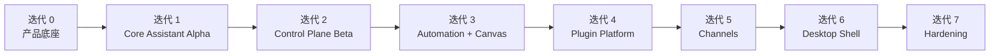

# KodaClaw 迭代规划

本规划按“先建立产品骨架，再逐步补齐 PoorClaw 完整形态”的原则制定。每个迭代都要求形成可运行、可验证的阶段成果，而不是只堆代码。

## 总体顺序

## 迭代 0：产品底座

### 目标

把 KodaClaw 作为独立产品立起来，形成独立目录、独立文档、独立模块边界。

### 交付物

- `products/KodaClaw/` 目录
- 架构、Workspace、插件、渠道、迭代规划文档
- `src/` 与 `apps/` 模块骨架
- 独立的开发约束与产品命名空间方案

### 退出标准

- 新产品目录与文档完整
- 与现有 example 没有耦合实现
- 团队可以据此开始并行开发模块

## 迭代 1：Core Assistant Alpha

### 目标

做出 KodaClaw 的最小可用闭环：主会话 + Workspace + Gateway + 基础 UI。

### 范围

- `KodaClaw.Gateway` 最小 API
- `KodaClaw.Runtime` 最小 Agent 会话编排
- `KodaClaw.Workspace` 初始化器
- `kodaclaw-web` 最小控制台
- 首次启动 bootstrap 流程
- 主对话 + SSE + session 恢复

### 交付物

- 主聊天页面
- `~/.kodaclaw` 初始化
- `AGENTS.md` / `IDENTITY.md` / `SOUL.md` / `USER.md` / `BOOTSTRAP.md`
- 主会话能恢复

### 退出标准

- 用户第一次启动可以完成 onboarding
- 第二次启动可以继续使用同一人格与记忆基础
- 不依赖命令行即可完成主对话

## 迭代 2：Control Plane Beta

### 目标

把产品从“能聊天”提升到“可管理、可审计、可审批”。

### 范围

- Inbox
- approvals
- sessions 面板
- diagnostics timeline
- model registry 基础版
- settings 页

### 交付物

- 审批列表
- session 列表与状态页
- 工具与事件时间线
- 模型 endpoint 管理页面

### 退出标准

- 用户能看见 agent 做了什么
- 高风险动作可以暂停并等待确认
- 模型配置可通过 UI 管理

## 迭代 3：Automation + Canvas

### 目标

让 KodaClaw 从“被动应答器”进化为“可控主动 Agent”。

### 范围

- `HEARTBEAT.md` 解析与 automation definition
- durable automation store
- 后台执行与 retry
- Inbox 结果投递
- Canvas runtime
- Canvas 页面与 artifact 绑定

### 交付物

- 自动化列表页
- 运行历史
- Canvas 页面入口
- 至少 2 个示例 automation

### 退出标准

- 自动化任务可以运行、恢复、失败重试
- 结果不只出现在聊天里，而能进入 Inbox 或 Canvas

## 迭代 4：Plugin Platform

### 目标

建立 KodaClaw 的长期扩展骨架。

### 范围

- plugin manifest
- 本地插件发现与安装
- 插件启停、状态、日志
- MCP tool 注入
- 基础权限提示
- 插件设置页占位

### 交付物

- plugin manager 页面
- 至少 1 个内置示例插件
- 插件权限与日志查看

### 退出标准

- 不改核心代码即可新增一组工具能力
- 插件故障不会拖垮宿主

## 迭代 5：Channels

### 目标

让 KodaClaw 具备外部消息面接入能力。

### 范围

- Telegram connector
- generic webhook connector
- thread binding
- channel policy
- 回复审批与主动发信策略
- channel sessions 页面

### 交付物

- Telegram 绑定流程
- 外部消息 -> 内部 session 映射
- 私聊 / 群聊策略差异

### 退出标准

- 外部渠道消息可以被 Koda 处理
- 不会污染主会话长期记忆
- 对外回复路径有明确审批与日志

## 迭代 6：Desktop Shell

### 目标

把 Web 产品升级成真正的桌面产品。

### 范围

- Electron 桌面壳
- tray
- 系统通知
- 全局快捷键
- 开机启动
- Gateway 生命周期控制

### 交付物

- macOS/Windows 至少一个平台的桌面壳
- 托盘菜单与主窗口
- 通知到 Inbox / Chat 跳转

### 退出标准

- 用户可以把 KodaClaw 当成本地常驻应用来使用
- 桌面壳只是外壳，不破坏 Gateway 的独立性

## 迭代 7：Hardening

### 目标

补齐完整产品所需的安全性、稳定性与运维性。

### 范围

- OS Keychain 集成
- device identity 完整化
- crash recovery
- backup / export
- plugin trust model
- update mechanism
- 更严格的 sandbox 与 policy 提示

### 交付物

- secrets 安全存储
- 导入导出能力
- 插件信任与健康模型
- 稳定性监控

### 退出标准

- KodaClaw 可长期驻留使用
- 用户能恢复环境与迁移配置
- 产品具备可发布的稳定度

## 每阶段建议参与模块

| 迭代 | 核心模块 |
| --- | --- |
| 0 | docs, src skeleton, apps skeleton |
| 1 | Gateway, Runtime, Workspace, Web |
| 2 | ControlPlane, Storage, Web |
| 3 | Automation, Canvas, Workspace, Web |
| 4 | PluginHost, Gateway, Web |
| 5 | ChannelHub, PluginHost, Runtime, Web |
| 6 | Desktop, Gateway, Web |
| 7 | Storage, Security, PluginHost, Gateway |

## 关键依赖关系

- Channels 依赖 PluginHost 和 Control Plane
- Desktop 依赖 Gateway API 稳定
- Automation 依赖 Workspace 与 Runtime 稳定
- Plugin Platform 依赖 Model / Runtime / Storage 边界明确

## 风险点

1. 过早做桌面壳会稀释核心产品能力开发
2. 过早做复杂渠道会让 session policy 失控
3. 不先做 Workspace 协议会导致所有人格/记忆规则继续埋在 prompt 里
4. 不先做 Control Plane 会导致后续自动化与插件不可见、不可管

## 推荐开发策略

- 先完成一个可运行的 Web 版产品
- 把所有产品状态都先纳入 Gateway
- 通过迭代 1-4 建立“脑”和“骨架”
- 在结构稳定后再补足“手脚”和“皮肤”
