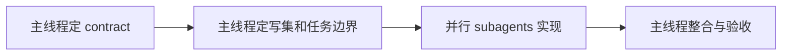

# KodaClaw 并行实现策略

可以，而且在 KodaClaw 这种多模块产品里，后续应该主动使用 subagent 并行实现；但前提是任务边界已经清楚，写集已经分离，contract 已经先定。

## 1. 并行实现的前提

只有同时满足下面 4 个条件，某一组任务才适合启动 subagent 并行：

1. 任务的 contract 已经写清楚
2. 任务有独立验证方式
3. 任务主要写集不冲突
4. 不依赖尚未落定的架构决策

如果不满足这些条件，就不要并行硬拆，否则最后会把集成成本转嫁到主线程。

## 2. 并行原则

### 2.1 Main agent 负责“收口层”

主线程始终负责：

- contract 定稿
- ADR 决策
- 跨模块边界整合
- 最终集成验证
- 风险判断与优先级调整

### 2.2 Subagent 负责“有边界的模块实现”

subagent 适合负责：

- 单一模块内实现
- 有明确写集的页面/接口/fixture
- 测试补齐
- 文档对齐

### 2.3 合同先行，实现在后

对于每一波并行，顺序应该是：

## 3. 建议的 subagent 角色

后续实现时，建议常用这几类 worker：

- `workspace-worker`：负责 `KodaClaw.Workspace`、fixture、golden files
- `gateway-worker`：负责 `KodaClaw.Gateway` API 与 auth
- `runtime-worker`：负责 `KodaClaw.Runtime`、session policy、resume
- `web-worker`：负责 `kodaclaw-web` 页面与 API adapter
- `plugin-worker`：负责 `KodaClaw.PluginHost`
- `channel-worker`：负责 `KodaClaw.ChannelHub`
- `qa-worker`：负责 contract tests、fixtures、Playwright、dogfood checklist

## 4. 迭代 1 的并行波次

### Wave 0：不并行，先定骨架

这波建议主线程自己做：

- `KC-0001` solution / props
- `KC-0002` contracts 基础枚举
- `KC-0003` tests 骨架
- `KC-0103` Gateway 最小宿主 contract

原因：这些是后续并行的地基，过早分出去会让每个 worker 各自猜边界。

### Wave 1：可以启动 3-4 个 subagent

前提：`KC-0001`、`KC-0002`、`KC-0003`、`KC-0103` 已稳定。

建议并行：

- Worker A：`KC-0101` + `KC-0102`
  - 写集：`KodaClaw.Workspace`、`tests/Fixtures`、golden files
- Worker B：`KC-0104`
  - 写集：`KodaClaw.Gateway`
- Worker C：`KC-0105`
  - 写集：`KodaClaw.Runtime`
- 主线程：补 chat/bootstrap/session contract 与 ADR

### Wave 2：继续并行

前提：`KC-0101`、`KC-0104`、`KC-0105` 已落定。

当前状态（2026-03-18）：

- `KC-0107` 已完成并验收
- `KC-0106` 已完成并验收
- `KC-0108` 已完成并验收
- `KC-0109` 已完成并验收
- `KC-0110` 已完成并验收
- `KC-0111` 已完成并验收
- `KC-0112` 已完成并验收
- 迭代 1 已收口，`KC-0201` 已完成并验收
- `KC-0202` 已完成并验收
- `KC-0203` 已完成并验收
- `KC-0204` 已完成并验收
- `KC-0205` 已完成并验收
- `KC-0206` 已完成并验收
- `KC-0207` 已完成并验收
- `KC-0208` 已完成并验收
- `KC-0209` 已完成并验收
- `KC-0210` 已完成并验收
- `KC-0211` 已完成并验收
- `KC-0212` 已完成并验收
- `KC-0213` 已完成并验收
- 迭代 2 已收口，Iteration 3 第一波（`KC-0301` / `KC-0303` / `KC-0304`）与第二波（`KC-0302` / `KC-0305` / `KC-0306`）均已完成并验收，当前 `Next`：`KC-0307` / `KC-0308` / `KC-0309` / `KC-0310`

建议并行：

- Worker A：`KC-0107` Bootstrap runtime `Completed`
- Worker B：`KC-0106` Chat SSE contract `Completed`
- Worker C：`KC-0108` Web chat shell `Completed`
- Worker D：`KC-0111` Diagnostics baseline `Completed`
- 主线程：盯集成边界与测试策略

### Wave 3：收口波次

前提：上面任务已落地。

建议并行：

- Worker A：`KC-0109` Bootstrap Web flow `Completed`
- Worker B：`KC-0110` Session resume `Completed`
- Worker C：`KC-0112` E2E/验收包 `Completed`
- Worker D：`KC-0111` Diagnostics baseline `Completed`
- 主线程：完成迭代 1 收口，并切到迭代 2 contracts / storage 基线

## 5. 迭代 2 及以后如何并行

### 迭代 2

可并行拆成：

- `ControlPlane`：`KC-0201`、`KC-0202`、`KC-0209`
- `Gateway API`：`KC-0204`、`KC-0205`、`KC-0206`、`KC-0207`
- `Runtime`：`KC-0203`
- `Web`：`KC-0210`、`KC-0211`、`KC-0212`
- `QA`：`KC-0213`

上一完成波次（后端基线，已集成并验收）：

- Worker A：`KC-0203` `Completed`
  - 写集：`KodaClaw.Runtime`、`tests/KodaClaw.IntegrationTests/Runtime`
- Worker B：`KC-0207` `Completed`
  - 写集：`KodaClaw.Gateway`、`tests/KodaClaw.UnitTests/ControlPlane`、`tests/KodaClaw.ContractTests/Diagnostics`、`tests/KodaClaw.IntegrationTests/Gateway`
- Worker C：`KC-0206` `Completed`
  - 写集：`KodaClaw.Contracts`、`KodaClaw.Gateway`、`tests/KodaClaw.IntegrationTests/Gateway`
- Worker D：`KC-0205` `Completed`
  - 写集：`KodaClaw.Contracts`、`KodaClaw.Gateway`、`KodaClaw.Runtime`、`tests/KodaClaw.ContractTests/Approvals`、`tests/KodaClaw.IntegrationTests/Gateway`
- 主线程：已完成 approval API / model registry contract 定稿、runtime/gateway/model-hub 集成、solution-level 验证与文档同步

本轮完成波次（Web surfaces，已集成并验收）：

- Worker A：`KC-0210` `Completed`
  - 写集：`apps/kodaclaw-web/src/components/InboxApprovalDesk.tsx`、对应 component/Playwright tests
- Worker B：`KC-0211` `Completed`
  - 写集：`apps/kodaclaw-web/src/components/SessionsDiagnosticsDesk.tsx`、对应 component/Playwright tests
- Worker C：`KC-0212` `Completed`
  - 写集：`apps/kodaclaw-web/src/components/ModelsSettingsDesk.tsx`、对应 component/Playwright tests
- 主线程：完成 shared web shell 整合、`/api/settings` Gateway API + integration test、顺序跑 web/.NET 全量验证、同步文档状态

下一推荐波次：

本轮完成波次（Iteration 2 acceptance，已集成并验收）：

- Worker A：`KC-0213` backend smoke acceptance `Completed`
  - 写集：`tests/KodaClaw.IntegrationTests/Smoke/Iteration2AcceptanceIntegrationTests.cs`
- Worker B：`KC-0213` web integrated acceptance `Completed`
  - 写集：`apps/kodaclaw-web/tests/kc0213-control-plane-acceptance.spec.ts`
- Worker C：`KC-0213` acceptance pack doc `Completed`
  - 写集：`docs/ITERATION_2_ACCEPTANCE_PACK.md`、`tests/README.md`
- 主线程：完成定向 + 全量回归、同步实现状态、关闭本波子代理

本轮完成波次（Iteration 3 automation wave 1，已集成并验收）：

- Worker A：`KC-0301` `Completed`
  - 写集：`src/KodaClaw.Contracts`、`src/KodaClaw.Automation`、`tests/KodaClaw.UnitTests/Automation`
  - 交付：automation shared contracts、`SqliteAutomationDefinitionRepository` / `SqliteAutomationRunRepository`、run repository tests
- Worker B：`KC-0303` `Completed`
  - 写集：`src/KodaClaw.Workspace`、`tests/KodaClaw.ContractTests/Workspace`
  - 交付：`HeartbeatAutomationCompiler`、默认 `HEARTBEAT.md` 示例、parser contract tests
- Worker C：`KC-0304` `Completed`
  - 写集：`src/KodaClaw.Runtime`、`tests/KodaClaw.IntegrationTests/Runtime`
  - 交付：`IAutomationSessionService`、automation session context loader、runtime integration tests
- 主线程：完成共享 contract 对齐、Gateway `AddKodaClawAutomation()` 接线、automation contract tests、solution-level 回归，并关闭本波子代理

本轮完成波次（Iteration 3 automation wave 2，已集成并验收）：

- Worker A：`KC-0302` + `KC-0305` `Completed`
  - 写集：`src/KodaClaw.Automation`、`tests/KodaClaw.IntegrationTests/Automation`
  - 交付：`AutomationSchedulerOptions`、`IAutomationClock` / fake clock、`IAutomationScheduler`、default-disabled hosted scheduler、stale recovery、Inbox result delivery
- Worker B：`KC-0306` `Completed`
  - 写集：`src/KodaClaw.Contracts`、`src/KodaClaw.Storage`、`tests/KodaClaw.UnitTests/Storage`
  - 交付：Canvas shared contracts、`SqliteCanvasArtifactRepository`、workspace-relative path validation、canvas repo unit tests
- 主线程：补中央包版本、收敛 scheduler 合同语义、修复 test cleanup 稳定性、跑定向 + solution 回归、同步 IMPLEMENTATION/README/ADR 文档并关闭本波子代理

本轮完成波次（Iteration 3 wave 3，已集成并验收）：

- Worker A：`KC-0307` `Completed`
  - 写集：`src/KodaClaw.Gateway`、`tests/KodaClaw.ContractTests`、`tests/KodaClaw.IntegrationTests/Gateway`
  - 交付：Automation / Canvas Gateway APIs、canvas filesystem serving、contract/integration coverage
- Worker B：`KC-0308` `Completed`
  - 写集：`apps/kodaclaw-web/src/components/AutomationsDesk.tsx`、对应 component/Playwright tests
  - 交付：Automations desk 列表/过滤/详情/recent runs/toggle/refresh
- Worker C：`KC-0309` `Completed`
  - 写集：`apps/kodaclaw-web/src/components/CanvasDesk.tsx`、对应 component/Playwright tests
  - 交付：Canvas desk artifact list/default entry/iframe preview/metadata/fallback
- Worker D：`KC-0310` `Completed`
  - 写集：`tests/KodaClaw.IntegrationTests/Smoke`、`docs/ITERATION_3_ACCEPTANCE_PACK.md`
  - 交付：Iteration 3 integrated smoke acceptance、acceptance pack 文档、全链路验收命令矩阵
- 主线程：完成 `App.tsx` 六桌面整合、Iteration 3 smoke acceptance、全量 .NET + frontend 回归、文档与状态同步，并关闭本波子代理

下一推荐波次：

- Iteration 4 先冻结 plugin/channel/desktop 的 contract、ADR 与写集，再决定新的并行 worker 组合

### 迭代 3

可并行拆成：

- `Automation core`：`KC-0301`、`KC-0302`、`KC-0305`
- `Workspace/Parser`：`KC-0303`
- `Runtime`：`KC-0304`
- `Canvas`：`KC-0306`、`KC-0307`
- `Web`：`KC-0308`、`KC-0309`
- `QA`：`KC-0310`

### 迭代 4-5

插件和渠道阶段尤其适合并行，但必须先冻结：

- manifest / connector contract
- permission model
- normalized event schema
- session policy

冻结后再把 host、runtime、web、qa 分给不同 worker。

### 迭代 4（已冻结，可启动并行）

Iteration 4 Wave 0 已由主线程完成：

- `/Users/vanzheng/projects/ai-agent/kode-sdk-csharp/products/KodaClaw/docs/ITERATION_4_FREEZE.md` `Completed`
- `/Users/vanzheng/projects/ai-agent/kode-sdk-csharp/products/KodaClaw/docs/adr/ADR-0008-plugin-platform-v1.md` `Accepted`

冻结结果：

- Iteration 4 v1 真正跑通的只有 `tool` 插件
- `channel` / `memory` / `ui` 仅做 manifest 识别与 Web 展示
- 首期 transport 只强制 `stdio`
- 插件 trust 复用 `ApprovalKind.PluginAuthorization` + `InboxItemKind.PluginRequest`
- Runtime 只注入 `Trusted + Enabled + Running` 的 `mcp__<pluginId>__<toolName>`

推荐并行波次：

- Wave 1（foundation，已完成并验收）
  - Worker A：`KC-0401` + `KC-0404` `Completed`
    - 写集：`src/KodaClaw.PluginHost/Manifest`、`src/KodaClaw.PluginHost/Permissions`、`tests/KodaClaw.ContractTests/Plugins`
    - 交付：manifest v1 schema/validator、permission normalization、risk summary、contract tests
  - Worker B：`KC-0402` `Completed`
    - 写集：`src/KodaClaw.PluginHost/Registry`、`tests/KodaClaw.UnitTests/PluginHost`
    - 交付：workspace-backed SQLite plugin registry、filtering queries、repo tests
  - 主线程：已完成 shared plugin contracts / test project references、定向 contract + unit tests、`dotnet test /Users/vanzheng/projects/ai-agent/kode-sdk-csharp/products/KodaClaw/KodaClaw.sln -m:1` 全量回归，并关闭本波子代理

- Wave 2（host runtime，已完成并验收）
  - Worker A：`KC-0403` `Completed`
    - 写集：`src/KodaClaw.PluginHost/Hosting`、`tests/KodaClaw.IntegrationTests/PluginHost/PluginLifecycleHostIntegrationTests.cs`
    - 交付：`PluginLifecycleHost`、`AddKodaClawPluginHost()`、stdio host、start/stop/restart、fixture plugin integration
  - Worker B：`KC-0406` `Completed`
    - 写集：`src/KodaClaw.PluginHost/Diagnostics`、`tests/KodaClaw.UnitTests/PluginHost/SqlitePluginLogRepositoryTests.cs`、`tests/KodaClaw.IntegrationTests/PluginHost/PluginHealthIntegrationTests.cs`
    - 交付：workspace-backed `plugin_logs`、health state、restart budget、degraded transitions、diagnostics evidence
  - 主线程：已完成 state machine / fixture wiring / test project references 收口，并通过 `dotnet test /Users/vanzheng/projects/ai-agent/kode-sdk-csharp/products/KodaClaw/KodaClaw.sln -m:1`

下一推荐波次：

- Wave 3 与 Wave 4 已收口，Iteration 4 plugin platform 已完成并验收
- 下一波已明确转入 Iteration 5；新的 channels 范围已经冻结，后续按 Wave 1 -> Wave 4 顺序决定并行组合

- Wave 3（gateway/runtime/web，已完成并验收）
  - Worker A：`KC-0405` `Completed`
    - 写集：`src/KodaClaw.Runtime`、`tests/KodaClaw.IntegrationTests/Runtime/PluginToolInjectionIntegrationTests.cs`
    - 交付：fresh main session effective tool list 生成、plugin tool injection、runtime integration tests
  - Worker B：`KC-0407` `Completed`
    - 写集：`apps/kodaclaw-web/src/components/PluginsDesk.tsx`、`apps/kodaclaw-web/src/__tests__/plugins-desk.spec.tsx`、`apps/kodaclaw-web/tests/kc0407-plugins.spec.ts`
    - 交付：plugin manager desk、component coverage、Playwright flow
  - 主线程：已完成 `/api/plugins/*` Gateway 面、Plugin API contract/integration tests、Web + Runtime 最终整合，并通过 `npm run typecheck`、`npm run build`、`npm test`、`npx playwright test tests/kc0407-plugins.spec.ts` 与 `dotnet test /Users/vanzheng/projects/ai-agent/kode-sdk-csharp/products/KodaClaw/KodaClaw.sln -m:1`；本波子代理已关闭

- Wave 4（acceptance）
  - Worker A：`KC-0408` `Completed`
    - 写集：`tests/Fixtures/Plugins`、`tests/KodaClaw.IntegrationTests/Smoke/Iteration4AcceptanceIntegrationTests.cs`、`docs/ITERATION_4_ACCEPTANCE_PACK.md`
    - 交付：bundled fixture plugin、Iteration 4 acceptance pack
  - 主线程：已完成 plugin fixture server build、定向 contract/integration acceptance、`npm run test:e2e`、`dotnet test /Users/vanzheng/projects/ai-agent/kode-sdk-csharp/products/KodaClaw/KodaClaw.sln -m:1` 与文档同步；Iteration 4 本波已关闭

### 迭代 5（已冻结并已完成）

Iteration 5 Wave 0 已由主线程完成：

- `/Users/vanzheng/projects/ai-agent/kode-sdk-csharp/products/KodaClaw/docs/ITERATION_5_FREEZE.md` `Completed`
- `/Users/vanzheng/projects/ai-agent/kode-sdk-csharp/products/KodaClaw/docs/adr/ADR-0009-channels-v1.md` `Accepted`

冻结结果：

- Iteration 5 v1 只要求两条 connector 路径进入首轮验收：`telegram` 与 `generic-webhook`
- channels 长期仍然是 plugin-capable domain，但首批 connector 由 `KodaClaw.ChannelHub` 直接托管，不要求先走 PluginHost runtime
- 外部 thread 只能进入 `SessionKind.ChannelDirectMessage` 或 `SessionKind.ChannelGroup`，不允许复用 `main`
- `ChannelDirectMessage` 不默认读取 `MEMORY.md`，`ChannelGroup` 不读取 `USER.md` 与主记忆
- outbound 统一受 `DeliveryRule` 约束，并复用 `ApprovalKind.ChannelDelivery` + `InboxItemKind.ChannelUpdate`

推荐并行波次：

- Wave 1（foundation）
  - 前提：主线程先落 shared channel contracts 与 repository schema
  - Worker A：`KC-0501` + `KC-0502`
    - 写集：`src/KodaClaw.Contracts`、`src/KodaClaw.ChannelHub`、`tests/KodaClaw.UnitTests/ChannelHub`
    - 交付：connector abstraction、normalized event contracts、thread binding repository、repo/unit tests
  - Worker B：`KC-0503`
    - 写集：`src/KodaClaw.ChannelHub/Policy`、`tests/KodaClaw.UnitTests/ChannelHub`
    - 交付：DM / group policy engine、memory boundary tests、mute / reply constraint logic
  - Worker C：`KC-0504`
    - 写集：`src/KodaClaw.ControlPlane`、`src/KodaClaw.Gateway`、`tests/KodaClaw.IntegrationTests/Gateway`
    - 交付：delivery rule -> approval / inbox linkage、最小 gateway action surface、integration coverage
  - 主线程：冻结 DTO 命名、收口 SQLite schema、跑 foundation 回归、同步状态文档

Wave 1 当前进度：

- 主线程：`KC-0501` + `KC-0502` `Completed`
  - 交付：shared channel contracts、`SqliteChannelHubDatabase`、`SqliteChannelAccountRepository`、`SqliteThreadBindingRepository`、`AddKodaClawChannelHub()`
  - 验证：`dotnet build /Users/vanzheng/projects/ai-agent/kode-sdk-csharp/products/KodaClaw/src/KodaClaw.ChannelHub/KodaClaw.ChannelHub.csproj`、`dotnet test /Users/vanzheng/projects/ai-agent/kode-sdk-csharp/products/KodaClaw/tests/KodaClaw.ContractTests/KodaClaw.ContractTests.csproj --filter ChannelContractsTests`、`dotnet test /Users/vanzheng/projects/ai-agent/kode-sdk-csharp/products/KodaClaw/tests/KodaClaw.UnitTests/KodaClaw.UnitTests.csproj --filter "SqliteChannelAccountRepositoryTests|SqliteThreadBindingRepositoryTests"`、`dotnet test /Users/vanzheng/projects/ai-agent/kode-sdk-csharp/products/KodaClaw/KodaClaw.sln -m:1`
- Worker B：`KC-0503` `Completed`
  - 写集：`src/KodaClaw.ChannelHub/ChannelPolicy*`、`src/KodaClaw.ChannelHub/Policy*`、`tests/KodaClaw.UnitTests/ChannelHub/ChannelPolicy*`
  - 交付：DM / group policy defaults、memory boundary、mute / direct-reply 判定与 unit tests
- 主线程：`KC-0504` `Completed`
  - 写集：`src/KodaClaw.ChannelHub/ChannelDelivery*`、`tests/KodaClaw.IntegrationTests/ChannelHub/ChannelDeliveryGovernanceIntegrationTests.cs`
  - 交付：`AutoSend` / `DraftApproval` / `RequireApproval` 的最小 delivery governance、approval / inbox reuse、integration coverage

Wave 1 收口结果：

- `KC-0501` / `KC-0502` / `KC-0503` / `KC-0504` 已全部完成并通过 `dotnet test /Users/vanzheng/projects/ai-agent/kode-sdk-csharp/products/KodaClaw/KodaClaw.sln -m:1`
- 当前无活跃 subagent
- 下一波切到 Wave 2：`KC-0505` / `KC-0506` / `KC-0509`

- Wave 2（connectors + diagnostics）
  - Worker A：`KC-0505`
    - 写集：`src/KodaClaw.ChannelHub/Connectors/Telegram`、`tests/KodaClaw.IntegrationTests/ChannelHub`
    - 交付：Telegram long-poll connector、text-first inbound / outbound、fixture-based integration tests
  - Worker B：`KC-0506`
    - 写集：`src/KodaClaw.ChannelHub/Connectors/Webhook`、`tests/KodaClaw.IntegrationTests/Gateway`
    - 交付：generic webhook inbound endpoint、account-bound validation、integration tests
  - Worker C：`KC-0509`
    - 写集：`src/KodaClaw.ChannelHub/Audit`、`src/KodaClaw.Gateway`、`tests/KodaClaw.ContractTests`、`tests/KodaClaw.IntegrationTests/Gateway`
    - 交付：channel audit repository、thread audit API、diagnostics correlation evidence
  - 主线程：做 connector 接口收口、Gateway wiring、定向回归

Wave 2 当前进度：

- Worker A：`KC-0505` `Completed`
  - 写集：`src/KodaClaw.ChannelHub/Connectors/Telegram`、`tests/KodaClaw.IntegrationTests/ChannelHub`
  - 交付：`TelegramConnector`、bot-token / credential-reference 解析、long-poll text-first inbound normalization、最小 outbound `sendMessage`、fixture-based integration tests
- Worker B：`KC-0506` `Completed`
  - 写集：`src/KodaClaw.ChannelHub/Connectors/Webhook`、`tests/KodaClaw.IntegrationTests/ChannelHub`
  - 交付：`GenericWebhookConnector`、secret / credential reference 解析、payload normalization、connector integration tests
- Worker C：`KC-0509` `Completed`
  - 写集：`src/KodaClaw.ChannelHub/Audit`、`tests/KodaClaw.UnitTests/ChannelHub`
  - 交付：`SqliteChannelAuditRepository`、`ChannelAuditQueryService`、audit repository unit tests
- 主线程：`KC-0506` + `KC-0509` 收口 `Completed`
  - 写集：`src/KodaClaw.Gateway`、`src/KodaClaw.ChannelHub/ServiceCollectionExtensions.cs`、`tests/KodaClaw.ContractTests/Channels`、`tests/KodaClaw.IntegrationTests/Gateway`
  - 交付：`/api/channels/accounts`、`/api/channels/threads`、`/api/channels/threads/{bindingId}/audit`、`/api/channels/webhook/{accountId}/events`、`ChannelEventIngestionService`、webhook diagnostics correlation evidence、solution-level regression
- 主线程：`KC-0505` 验收 `Completed`
  - 写集：`src/KodaClaw.ChannelHub/ServiceCollectionExtensions.cs`、`src/KodaClaw.Gateway/Program.cs`
  - 交付：Telegram connector DI wiring、`/api/channels/connectors` Telegram 能力标记、`dotnet build` + Telegram integration slice + solution-level regression

Wave 2 收口结果（当前）：

- `KC-0505` / `KC-0506` / `KC-0509` 已全部完成并通过 `dotnet test /Users/vanzheng/projects/ai-agent/kode-sdk-csharp/products/KodaClaw/KodaClaw.sln -m:1`
- Wave 2 workers 已在验收后关闭
- 下一波进入 Wave 3 runtime + web：`KC-0507` / `KC-0508`

- Wave 3（runtime + web）
  - Worker A：`KC-0507`
    - 写集：`src/KodaClaw.Runtime`、`tests/KodaClaw.IntegrationTests/Runtime`
    - 交付：channel session service / runtime composition、binding reuse、session isolation tests
  - Worker B：`KC-0508`
    - 写集：`apps/kodaclaw-web/src/components/ChannelsDesk.tsx`、`apps/kodaclaw-web/src/__tests__/channels-desk.spec.tsx`、`apps/kodaclaw-web/tests/kc0508-channels.spec.ts`
    - 交付：Channels desk、component coverage、Playwright flow
  - 主线程：完成 shared web shell integration、API client 收口、全量 web/.NET 回归

Wave 3 当前进度：

- 主线程：`KC-0507` `Completed`
  - 写集：`src/KodaClaw.Runtime`、`src/KodaClaw.Gateway/Program.cs`、`tests/KodaClaw.IntegrationTests/Runtime`、`tests/KodaClaw.IntegrationTests/Gateway`
  - 交付：`IChannelSessionService`、`ChannelSessionService`、DM/group 保守上下文加载、binding reuse / resume fallback、Gateway session-kind 推断、runtime/gateway integration coverage
- Worker B：`KC-0508` `Completed`
  - 写集：`apps/kodaclaw-web/src/components/ChannelsDesk.tsx`、`apps/kodaclaw-web/src/types/contracts.ts`、`apps/kodaclaw-web/src/lib/api.ts`、对应 component/Playwright tests
  - 交付：Channels desk、channel DTO/api helper、component coverage、Playwright flow
- 主线程：Wave 3 收口 `Completed`
  - 写集：`apps/kodaclaw-web/src/App.tsx`
  - 交付：main workbench `channels` tab 接入、`npm run build` / `npm run test` / `npm run test:e2e` 全绿、`dotnet test /Users/vanzheng/projects/ai-agent/kode-sdk-csharp/products/KodaClaw/KodaClaw.sln -m:1` 全绿

Wave 3 收口结果（当前）：

- `KC-0507` / `KC-0508` 已全部完成并通过最新 `dotnet test /Users/vanzheng/projects/ai-agent/kode-sdk-csharp/products/KodaClaw/KodaClaw.sln -m:1`
- Channels web worker 已在验收后关闭
- 后续已由 Wave 4 acceptance 完成最终收口：`KC-0510` / `KC-0511`

- Wave 4（acceptance）
  - Worker A：`KC-0510` `Completed`
    - 写集：`tests/KodaClaw.IntegrationTests/Smoke/Iteration5DirectMessageAcceptanceIntegrationTests.cs`
    - 交付：Telegram DM acceptance、binding reuse、DM prompt boundary、approval approve -> outbound evidence
  - Worker B：`KC-0511` `Completed`
    - 写集：`tests/KodaClaw.IntegrationTests/Smoke/Iteration5GroupSafetyAcceptanceIntegrationTests.cs`、`docs/ITERATION_5_ACCEPTANCE_PACK.md`
    - 交付：group safety acceptance、acceptance pack 文档、reject/no-send safety evidence
  - 主线程：Wave 4 收口 `Completed`
    - 写集：`src/KodaClaw.ChannelHub/ChannelDeliveryApprovalService.cs`、`src/KodaClaw.ChannelHub/ChannelDeliveryApprovalDispatchResult.cs`、`src/KodaClaw.ChannelHub/ServiceCollectionExtensions.cs`、`src/KodaClaw.Gateway/Program.cs`、`tests/KodaClaw.IntegrationTests/ChannelHub/ChannelDeliveryApprovalIntegrationTests.cs`
    - 交付：channel approval decision -> outbound dispatch 闭环、定向 + 全量 solution / frontend 回归、状态同步、关闭全部 worker

Wave 4 收口结果（当前）：

- `KC-0510` / `KC-0511` 已全部完成，并通过 `dotnet test /Users/vanzheng/projects/ai-agent/kode-sdk-csharp/products/KodaClaw/tests/KodaClaw.IntegrationTests/KodaClaw.IntegrationTests.csproj --filter "ChannelDeliveryApprovalIntegrationTests|Iteration5DirectMessageAcceptanceIntegrationTests|Iteration5GroupSafetyAcceptanceIntegrationTests"`、`dotnet test /Users/vanzheng/projects/ai-agent/kode-sdk-csharp/products/KodaClaw/KodaClaw.sln -m:1`、`npm run build`、`npm run test`、`npm run test:e2e`
- Iteration 5 acceptance pack `/Users/vanzheng/projects/ai-agent/kode-sdk-csharp/products/KodaClaw/docs/ITERATION_5_ACCEPTANCE_PACK.md` 已补齐并与状态文档同步
- 全部 Wave 4 workers 已关闭；当前无活跃 subagent
- 下一阶段不再继续拆分实现；随后已完成 Iteration 6 Desktop Shell 的 Wave 0 规划冻结

### 迭代 6（已冻结并已完成）

Iteration 6 Wave 0 已由主线程完成：

- `/Users/vanzheng/projects/ai-agent/kode-sdk-csharp/products/KodaClaw/docs/ITERATION_6_FREEZE.md` `Completed`
- `/Users/vanzheng/projects/ai-agent/kode-sdk-csharp/products/KodaClaw/docs/adr/ADR-0010-desktop-shell-v1.md` `Accepted`

冻结结果：

- 首个桌面壳固定为 `Electron + TypeScript`
- `kodaclaw-desktop` 必须复用现有 `kodaclaw-web`，而不是新起一套桌面专属 UI
- desktop 保持 shell 角色，只负责窗口、系统集成、Gateway 生命周期与运行时 bridge
- Gateway 继续是产品中枢；desktop 首期支持 `AttachOnly` / `ManagedChild`
- renderer 必须支持 desktop preload 注入的 runtime config，而不是只读 Vite 编译时变量
- 通知继续复用现有 `Inbox` / `Approvals` / `Settings` / quiet hours
- 首个强验收平台优先是 macOS

推荐并行波次：

- Wave 1（shell foundation）
  - Worker A：`KC-0601`
    - 写集：`apps/kodaclaw-desktop`
    - 交付：Electron 工程骨架、BrowserWindow、preload、dev/build/packaging smoke 脚本
  - Worker B：`KC-0603`
    - 写集：`apps/kodaclaw-desktop`、`apps/kodaclaw-web/src/lib`、`apps/kodaclaw-web/src/App.tsx`
    - 交付：runtime config bridge、desktop auth bridge、launch target 基础 contract
  - 主线程：冻结 bridge types、整合 renderer dev/prod 加载、跑 foundation 回归

- Wave 2（gateway bridge + shell lifecycle）
  - Worker A：`KC-0602`
    - 写集：`apps/kodaclaw-desktop`
    - 交付：Gateway attach/start、健康等待、restart action
  - Worker B：`KC-0604`
    - 写集：`apps/kodaclaw-desktop`
    - 交付：tray / menu bar、窗口 hide/show、快捷键
  - 主线程：完成 desktop shell integration、bridge 行为收口、基础 manual smoke

- Wave 3（desktop operator surfaces）
  - Worker A：`KC-0605`
    - 写集：`apps/kodaclaw-desktop`、必要时 `apps/kodaclaw-web`
    - 交付：通知轮询 / 去重 / quiet-hours 复用
  - Worker B：`KC-0606`
    - 写集：`apps/kodaclaw-desktop`、`apps/kodaclaw-web`
    - 交付：launch target / deep-link 到 chat / inbox / canvas / channels
  - 主线程：整合 web launch target 适配、桌面端整体验证

- Wave 4（acceptance）
  - Worker A：`KC-0607`
    - 写集：`apps/kodaclaw-desktop`、脚本/CI 辅助文件
    - 交付：至少一个平台的 packaging smoke
  - Worker B：`KC-0608`
    - 写集：`docs/ITERATION_6_ACCEPTANCE_PACK.md`、必要的 acceptance harness
    - 交付：桌面 dogfood / acceptance pack
  - 主线程：执行全量回归、同步文档、关闭 worker

Wave 1 当前进度：

- 主线程：`KC-0601` `Completed`
  - 写集：`apps/kodaclaw-desktop`
  - 交付：Electron main/preload skeleton、`BrowserWindow` dev/prod/placeholder 加载策略、`openTarget` IPC 转发、hide-on-close 单窗口基线、`npm run dev` / `npm run build` / `npm run package:smoke`
- 主线程：`KC-0603` `Completed`
  - 写集：`apps/kodaclaw-desktop`、`apps/kodaclaw-web/src/lib`、`apps/kodaclaw-web/src/App.tsx`、对应 component tests
  - 交付：`window.kodaClawDesktop` runtime config contract、dynamic Gateway token sourcing、desktop launch-target subscription、desktop initial-target desk 切换与 `desktop-config` / `app-shell` coverage
- 主线程：`KC-0607` `Completed`（提前收口）
  - 写集：`apps/kodaclaw-desktop/package.json`
  - 交付：macOS-first `electron-builder --dir` packaging smoke、关闭自动签名探测后的稳定打包命令

Wave 1 收口结果：

- `KC-0601` / `KC-0603` 已全部完成，并通过 `cd /Users/vanzheng/projects/ai-agent/kode-sdk-csharp/products/KodaClaw/apps/kodaclaw-desktop && npm run typecheck && npm run build && npm run package:smoke`
- web desktop bridge 已通过 `cd /Users/vanzheng/projects/ai-agent/kode-sdk-csharp/products/KodaClaw/apps/kodaclaw-web && npm run build && npm run test && npm run test:e2e`
- solution-level regression 已通过 `dotnet test /Users/vanzheng/projects/ai-agent/kode-sdk-csharp/products/KodaClaw/KodaClaw.sln -m:1`
- 当前无活跃 subagent
- 下一波进入 Wave 2：`KC-0602` / `KC-0604`；由于两者当前都主要写 `apps/kodaclaw-desktop`，推荐先由主线程串行收口，再视写集拆分情况决定是否重新启用 subagent

Wave 2 当前进度：

- 主线程：`KC-0602` `Completed`
  - 写集：`apps/kodaclaw-desktop/src/main.ts`、`apps/kodaclaw-desktop/src/preload.ts`
  - 交付：`AttachOnly` / `ManagedChild` Gateway lifecycle bridge、managed child `dotnet run` 启动、健康等待、restart、退出协调、runtime config 改由主进程通过 IPC 提供
- 主线程：`KC-0604` `Completed`
  - 写集：`apps/kodaclaw-desktop/src/main.ts`、`apps/kodaclaw-desktop/package.json`
  - 交付：tray/menu、show/hide 恢复、`Open Chat` / `Open Inbox` / `Open Canvas` / `Open Channels`、`Restart Gateway`、`Quit`、全局快捷键、`smoke:managed-gateway` 验证命令

Wave 2 收口结果：

- `KC-0602` / `KC-0604` 已全部完成，并通过 `cd /Users/vanzheng/projects/ai-agent/kode-sdk-csharp/products/KodaClaw/apps/kodaclaw-desktop && npm run smoke:managed-gateway && npm run package:smoke`
- web 与 solution regression 继续保持全绿：`cd /Users/vanzheng/projects/ai-agent/kode-sdk-csharp/products/KodaClaw/apps/kodaclaw-web && npm run build && npm run test && npm run test:e2e`、`dotnet test /Users/vanzheng/projects/ai-agent/kode-sdk-csharp/products/KodaClaw/KodaClaw.sln -m:1`
- 当前无活跃 subagent
- 下一波进入 Wave 3：`KC-0605` / `KC-0606`；这两项仍会同时改动 Electron main process，除非先把通知与 deep-link 逻辑拆入独立模块，否则不建议为了并行而强拆 worker

Wave 3 当前进度：

- 主线程：`KC-0605` `Completed`
  - 写集：`apps/kodaclaw-desktop/src/main.ts`、`apps/kodaclaw-desktop/src/notification-policy.ts`、`apps/kodaclaw-desktop/src/run-wave3-smoke.ts`
  - 交付：`/api/settings` + `/api/approvals` + `/api/inbox` 轮询、quiet-hours 抑制、approval/inbox 去重、notification click -> launch target、fixture-based `smoke:wave3`
- 主线程：`KC-0606` `Completed`
  - 写集：`apps/kodaclaw-desktop/src/main.ts`、`apps/kodaclaw-desktop/src/launch-targets.ts`、`apps/kodaclaw-desktop/src/desktop-shell-types.ts`
  - 交付：startup args `--kodaclaw-route=` / `--kodaclaw-target=`、`kodaclaw://...` protocol payload 解析、single-instance 二次启动转发、route -> desk/entityId mapping

Wave 3 收口结果：

- `KC-0605` / `KC-0606` 已全部完成，并通过 `cd /Users/vanzheng/projects/ai-agent/kode-sdk-csharp/products/KodaClaw/apps/kodaclaw-desktop && npm run test && npm run smoke:wave3 && npm run smoke:managed-gateway && npm run package:smoke`
- web targeted regression 继续保持全绿：`cd /Users/vanzheng/projects/ai-agent/kode-sdk-csharp/products/KodaClaw/apps/kodaclaw-web && npm run test -- --run src/__tests__/desktop-config.spec.ts src/__tests__/app-shell.spec.tsx`
- full web + solution regression 继续保持全绿：`cd /Users/vanzheng/projects/ai-agent/kode-sdk-csharp/products/KodaClaw/apps/kodaclaw-web && npm run build && npm run test && npm run test:e2e`、`dotnet test /Users/vanzheng/projects/ai-agent/kode-sdk-csharp/products/KodaClaw/KodaClaw.sln -m:1`
- 当前无活跃 subagent
- 下一波进入 Wave 4 acceptance；`KC-0607` 已提前完成，所以当前只剩 `KC-0608` acceptance pack/documentation 收口，不建议再启动并行 worker

Wave 4 当前进度：

- 主线程：`KC-0608` `Completed`
  - 写集：`docs/ITERATION_6_ACCEPTANCE_PACK.md`、`docs/IMPLEMENTATION_STATUS.md`、`docs/IMPLEMENTATION_BACKLOG.md`、`docs/PARALLEL_EXECUTION_PLAN.md`、`README.md`
  - 交付：Iteration 6 acceptance pack、桌面 dogfood drill、回归命令矩阵、最终退出标准与状态同步

Wave 4 收口结果：

- `KC-0607` / `KC-0608` 已全部完成，并通过 `/Users/vanzheng/projects/ai-agent/kode-sdk-csharp/products/KodaClaw/docs/ITERATION_6_ACCEPTANCE_PACK.md`
- full desktop/web/.NET regression 继续全绿：`cd /Users/vanzheng/projects/ai-agent/kode-sdk-csharp/products/KodaClaw/apps/kodaclaw-desktop && npm run test && npm run smoke:wave3 && npm run smoke:managed-gateway && npm run package:smoke`、`cd /Users/vanzheng/projects/ai-agent/kode-sdk-csharp/products/KodaClaw/apps/kodaclaw-web && npm run build && npm run test && npm run test:e2e`、`dotnet test /Users/vanzheng/projects/ai-agent/kode-sdk-csharp/products/KodaClaw/KodaClaw.sln -m:1`
- 全部 Iteration 6 workers 已关闭；当前无活跃 subagent
- Iteration 6 Desktop Shell v1 已完整收口

### 迭代 7（已冻结，可启动并行）

Iteration 7 Wave 0 已由主线程完成：

- `/Users/vanzheng/projects/ai-agent/kode-sdk-csharp/products/KodaClaw/docs/ITERATION_7_FREEZE.md` `Completed`
- `/Users/vanzheng/projects/ai-agent/kode-sdk-csharp/products/KodaClaw/docs/adr/ADR-0011-hardening-v1.md` `Accepted`

冻结结果：

- secrets 采用 `Keychain-first`，配置面只保存 `SecretRef` 与脱敏 metadata
- export/import 默认排除 raw secrets，并通过 preflight + repair checklist 处理恢复风险
- crash recovery 采用 inspectable repair，而不是隐式自动重放
- plugin trust 扩展到 `Untrusted` / `Trusted` / `Signed` 占位模型
- update mechanism 首期只做 version-check + guided handoff，不做 silent auto-update
- sandbox 风险、update 状态、diagnostic bundle 继续复用现有 Gateway / Control Plane / Desktop / Web 面

推荐并行波次：

- Wave 1（security foundation）
  - 前提：主线程先落 shared `SecretRef` / `ISecretStore` / repair-report contract
  - Worker A：`KC-0701` `Completed`
    - 写集：`src/KodaClaw.Contracts`、`src/KodaClaw.Gateway`、`src/KodaClaw.ModelHub`、测试 secret-store fixtures
    - 交付：Keychain abstraction、macOS-first provider、test doubles、Gateway token secret-ref resolution、基础验证
  - Worker B：`KC-0703` `Completed`
    - 写集：`src/KodaClaw.Contracts`、`src/KodaClaw.Workspace`、`tests/KodaClaw.ContractTests/Workspace`
    - 交付：扩展 `DeviceIdentity`、legacy `device.json` metadata backfill、`WorkspaceSnapshot` 设备元信息投影、workspace contract coverage
  - 主线程：shared contracts 已收口，`KC-0701` / `KC-0703` 均已通过 targeted + solution-level 验证

- Wave 2（secret migration + recovery core）
  - 前提：Wave 1 的 shared contracts 已稳定
  - Worker A：`KC-0702` `Completed`
    - 写集：`src/KodaClaw.ModelHub`、`src/KodaClaw.ChannelHub`、`src/KodaClaw.PluginHost`、`src/KodaClaw.Gateway`
    - 交付：secret-ref migration、migration report、legacy compatibility guardrails
    - 当前进度：模型迁移第一阶段、ChannelHub `SecretRef`-first credential resolution、PluginHost `environmentReferences` / `headerReferences` runtime secret resolution，以及最终 migration report evidence endpoint / workspace artifact 都已落地并验收完成
  - Worker B：`KC-0704` `Completed`
    - 写集：`src/KodaClaw.Contracts`、`src/KodaClaw.Gateway`、`src/KodaClaw.ControlPlane`、`src/KodaClaw.ChannelHub`、`src/KodaClaw.PluginHost`、`src/KodaClaw.Automation`、`apps/kodaclaw-web`
    - 交付：backup/export/import artifact、manifest、restore preflight、pristine-workspace restore、repair report evidence
    - 当前进度：`WorkspaceBackupService`、backup/export/import contracts、Gateway `/api/system/backup-export` / `/api/system/backup-import/preflight` / `/api/system/backup-import`、脱敏 control-plane export、`config/import-repair-report.json` 以及 backup contract/integration tests 均已落地并验收
  - Worker C：`KC-0705` `Completed`
    - 实际写集：`src/KodaClaw.Contracts`、`src/KodaClaw.Gateway`、`tests/KodaClaw.ContractTests`、`tests/KodaClaw.IntegrationTests`、`apps/kodaclaw-web`
    - 交付：`WorkspaceRepairService`、`StartupRepairHostedService`、Gateway `/api/system/startup-repair-report`、`config/startup-repair-report.json`、`startup-repair-latest` inbox alert、统一 crash residue evidence
    - 当前进度：stale approvals / channel delivery residue、queued/running automation runs、stale plugin runtime state 与 unsupported approval-wait main session 均已接入统一 startup repair，并完成 contract/integration validation
  - 主线程：整合 import + repair + migration 的共享状态与文档

- Wave 3（operator hardening surfaces）
  - Worker A：`KC-0706` `Completed`
    - 实际写集：`src/KodaClaw.Contracts`、`src/KodaClaw.PluginHost`、`src/KodaClaw.Gateway`、`apps/kodaclaw-web`、`tests/KodaClaw.UnitTests`、`tests/KodaClaw.IntegrationTests`、`tests/Fixtures/Plugins`
    - 交付：`Signed` placeholder、`PluginTrustEvidence` / `PluginTrustEvaluator`、SQLite `trust_evidence_json`、`plugin.signature.json` sidecar 校验、Web trust evidence / digest / signer risk 面
    - 当前进度：discover / install / detail / trust / start 链路均已自动刷新 trust evidence，verified sidecar 会把 trust 提升为 `Signed`，unsigned 插件保留 `Trusted`
  - Worker B：`KC-0707` `Completed`
    - 实际写集：`Directory.Build.props`、`src/KodaClaw.Contracts`、`src/KodaClaw.Gateway`、`apps/kodaclaw-desktop`、`apps/kodaclaw-web`、`tests/KodaClaw.ContractTests`、`tests/KodaClaw.IntegrationTests`、`tests/Fixtures/Updates`
    - 交付：manual-first version-check scaffold、release channel awareness、`config/update-state.json` 证据、desktop runtime version bridge、`Update Watch` operator surface、fixture-based update smoke
    - 当前进度：Gateway / Desktop / Web 已共享 `UpdateReleaseChannel` 与版本快照，`/api/system/update-state` / `/api/system/update-check` 已落地，桌面壳会把 release notes / download handoff 到外部浏览器
  - Worker C：`KC-0708` `Completed`
    - 实际写集：`src/KodaClaw.Contracts`、`src/KodaClaw.Gateway`、`apps/kodaclaw-web`、`tests/KodaClaw.ContractTests`、`tests/KodaClaw.IntegrationTests`
    - 交付：`SandboxRiskOverviewResponse` / `SandboxRiskOverviewService`、`GET /api/settings/sandbox-risk`、`ModelsSettingsDesk` 中的 `Sandbox & Risk Briefing`、`SandboxRiskContractsTests`、`SandboxRiskApiIntegrationTests` 与 `kc0212-models-settings` Playwright 覆盖
  - Worker D：`KC-0709` `Completed`
    - 实际写集：`src/KodaClaw.Contracts`、`src/KodaClaw.Gateway`、`apps/kodaclaw-web`、`tests/KodaClaw.ContractTests`、`tests/KodaClaw.IntegrationTests`
    - 交付：diagnostic bundle export、`manifest.json` / `redaction-summary.json` schema、desktop runtime context bridge、`SessionsDiagnosticsDesk` 导出入口
    - 当前进度：Gateway 已落地 `POST /api/diagnostics/bundle-export` 与默认 zip 归档；bundle 默认包含 settings snapshot、diagnostics recent/timeline、session `meta.json`、repair/update evidence、log summary，并默认排除 raw secrets、`messages.json` / `tool-calls.json` 与 raw logs
  - 主线程：已完成 `KC-0706` + `KC-0707` + `KC-0708` + `KC-0709` + `KC-0710` 的文档与全量回归同步；当前所有 Iteration 7 workers 均已关闭

- Wave 4（acceptance）
  - Worker A：`KC-0710` `Completed`
    - 实际写集：`docs/ITERATION_7_ACCEPTANCE_PACK.md`、`tests/KodaClaw.IntegrationTests/Smoke/Iteration7AcceptanceIntegrationTests.cs`
    - 交付：迁移、恢复、导出导入、风险提示、更新检查、诊断导出的最终验收
    - 当前进度：acceptance pack 已固化最终矩阵；综合 smoke 已串起 secret migration、startup repair、sandbox risk、update watch、diagnostic bundle 与 backup export/import preflight
  - 主线程：已完成全量回归、同步文档，并确认无活跃 subagent/worker 残留

当前建议：

- Wave 1 security foundation 已完成：`KC-0701` 已通过 `dotnet test /Users/vanzheng/projects/ai-agent/kode-sdk-csharp/products/KodaClaw/tests/KodaClaw.ContractTests/KodaClaw.ContractTests.csproj --filter SecretStoreContractTests`、`dotnet test /Users/vanzheng/projects/ai-agent/kode-sdk-csharp/products/KodaClaw/tests/KodaClaw.IntegrationTests/KodaClaw.IntegrationTests.csproj --filter GatewayAuthIntegrationTests` 与 `dotnet test /Users/vanzheng/projects/ai-agent/kode-sdk-csharp/products/KodaClaw/KodaClaw.sln -m:1`
- `KC-0703` 已由主线程完成，并通过 `dotnet test /Users/vanzheng/projects/ai-agent/kode-sdk-csharp/products/KodaClaw/tests/KodaClaw.ContractTests/KodaClaw.ContractTests.csproj --filter WorkspaceServiceContractTests` 与 `dotnet test /Users/vanzheng/projects/ai-agent/kode-sdk-csharp/products/KodaClaw/KodaClaw.sln -m:1`
- `KC-0702` 已完成 models + ChannelHub + PluginHost secret migration 与 migration report evidence，并通过 `dotnet test /Users/vanzheng/projects/ai-agent/kode-sdk-csharp/products/KodaClaw/tests/KodaClaw.ContractTests/KodaClaw.ContractTests.csproj --filter SecretMigrationReportContractTests`、`dotnet test /Users/vanzheng/projects/ai-agent/kode-sdk-csharp/products/KodaClaw/tests/KodaClaw.IntegrationTests/KodaClaw.IntegrationTests.csproj --filter SecretMigrationReportIntegrationTests`、`dotnet test /Users/vanzheng/projects/ai-agent/kode-sdk-csharp/products/KodaClaw/KodaClaw.sln -m:1` 与 `cd /Users/vanzheng/projects/ai-agent/kode-sdk-csharp/products/KodaClaw/apps/kodaclaw-web && npm run build && npm run test`
- Wave 2 recovery core、Wave 3 operator hardening surfaces 与 Wave 4 acceptance 已全部收口并完成文档/验证同步；`KC-0706` ~ `KC-0710` 已全部 `Completed`
- 当前结论：Iteration 7 Hardening v1 已完整闭环，最终 acceptance 已由 `/Users/vanzheng/projects/ai-agent/kode-sdk-csharp/products/KodaClaw/docs/ITERATION_7_ACCEPTANCE_PACK.md` 固化
- 收口后补充的 release-closure hardening patch 也已完成：backup / diagnostic 导出路径现收敛到 workspace 内，backup import 会先检视 zip manifest/entry 安全性与归档大小上限再解压，Update Watch 外链已收敛到绝对 `http/https`，secret migration 集成测试也已切到隔离 config / unique env 注入；对应文档与串行回归证据均已同步。
- 如后续需要重新并行，应先冻结下一轮迭代边界，再决定是否把新 smoke harness、dogfood drill 或 operator surface 拆给 worker

## 6. 不适合并行的任务类型

以下任务不建议一开始就丢给 subagent：

- 新的系统级 ADR
- 目录/solution 级重构
- 跨模块 contract 首次定稿
- 任何“还不知道边界在哪里”的任务
- 最后集成与 dogfood 收口

这些更适合主线程本地完成。

## 7. 单任务可独立验证的标准

一个任务要适合交给 subagent，必须能回答：

- 该任务结束后，运行什么命令或流程可以证明它完成了
- 哪些文件是它的主要写集
- 它依赖的 contract 是否稳定
- 它失败了会影响哪些集成点

如果答不清，就先不要派出去。

## 8. 推荐的并行上限

初期建议：

- 同时 3 个 worker 最稳
- 4 个 worker 仍可控
- 超过 5 个 worker，主线程会把大量时间浪费在集成和协调上

对 KodaClaw 这种产品，真正的瓶颈通常不是“人手不够”，而是“边界没冻住”。

## 9. 推荐的执行方式

当我们正式进入实现时，建议每一波都按这个节奏：

1. 主线程确定本波任务集合
2. 主线程明确每个任务的写集
3. 主线程给出统一 contract / ADR / API shape
4. 启动 3-4 个 subagent 并行实现
5. 主线程不重复实现这些内容，而负责整合与验收
6. 完成后统一跑 L0-L4，再做一轮 L5 dogfood

## 10. 结论

是的，任务拆完之后非常适合启动 subagent 并行实现；而且 KodaClaw 这种项目如果不并行，开发速度会偏慢。

但正确顺序应该是：

`先拆任务 -> 冻结 contract -> 划写集 -> 再并行实现`

而不是：

`先开很多 worker -> 再回头统一边界`
