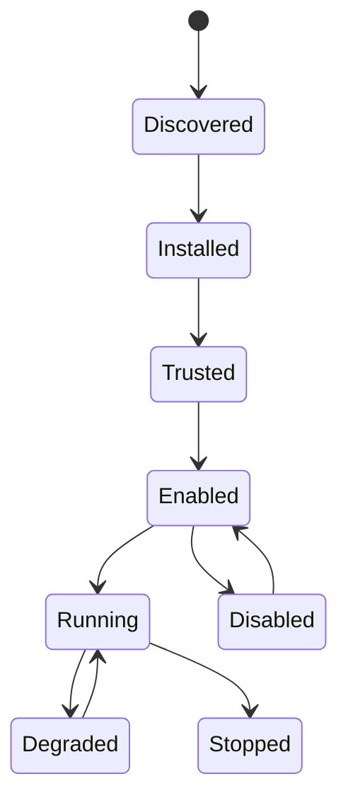

# KodaClaw 插件规范

## 1. 设计目标

KodaClaw 的插件系统要满足四个要求：

1. 能在不改核心代码的情况下扩展工具、渠道、UI 与自动化能力
2. 能复用现有 SDK 的 MCP 能力
3. 能对插件进行权限声明、授权、启停、故障隔离
4. 能为后续插件市场或私有插件分发留出空间

## 2. 总体策略：MCP-first

KodaClaw 初期不采用 CLR 进程内插件，而采用 `MCP-first` 插件策略：

- 每个插件本质上是一个可被宿主发现和管理的 MCP 提供者
- 宿主通过 stdio、HTTP、websocket 或 webhook 与插件交互
- 插件工具统一以 namespaced 形式暴露给 Runtime

这样做的原因：

- 更贴合现有 SDK 能力
- 边界清晰，隔离相对容易
- 更容易做权限、健康检查、重启和日志管理

## 3. 插件分类

KodaClaw 插件至少分为四类：

- `tool`：提供工具能力
- `channel`：提供外部消息接入能力
- `memory`：提供记忆或知识接入能力
- `ui`：提供 Canvas 面板或设置面板

一个插件可以同时属于多个类型。

## 4. 插件目录布局

推荐布局：

```text
~/.kodaclaw/workspace/plugins/<pluginId>/
  plugin.json
  assets/
  ui/
  logs/
```

若是产品内安装的插件，也可放到：

```text
~/.kodaclaw/config/plugins/<pluginId>/
```

具体选型由安装器决定，但运行时需要统一映射成插件注册记录。

## 5. Manifest 草案

示例：

```json
{
  "id": "telegram-bridge",
  "name": "Telegram Bridge",
  "version": "0.1.0",
  "types": ["channel", "tool"],
  "runtime": {
    "transport": "stdio",
    "command": "python3",
    "args": ["main.py"],
    "environmentReferences": {
      "TELEGRAM_BOT_TOKEN": "keychain:plugins:telegram-bot"
    }
  },
  "permissions": {
    "network": true,
    "filesystem": ["workspace/channels/telegram"],
    "notifications": true,
    "background": true,
    "secrets": ["telegram.botToken"]
  },
  "capabilities": {
    "tools": ["send_message", "list_updates"],
    "channels": ["telegram"],
    "uiPanels": ["telegram-settings"]
  }
}
```

建议字段：

- `id`
- `name`
- `version`
- `types`
- `runtime`
- `permissions`
- `capabilities`
- `display`
- `healthcheck`
- `configSchema`

其中 `runtime` 在 Iteration 7 Wave 2 之后支持两类并存输入：

- `environment` / `headers`：保留现有 literal 配置，主要用于兼容旧插件或 fixture
- `environmentReferences` / `headerReferences`：推荐的新入口，值可写 `SecretRef`，也允许迁移期的 `env:` / `inline:` / `value:` 兼容引用；宿主只在运行时解析，不把 resolved secret 回写到 manifest、SQLite 或插件目录

## 6. 插件生命周期



生命周期定义：

- `Discovered`：被宿主发现
- `Installed`：文件已落地、manifest 通过基本校验
- `Trusted`：用户已授权该插件可被启动
- `Enabled`：用户启用，但未必已运行
- `Running`：插件进程或 endpoint 可用
- `Degraded`：健康检查失败，但未彻底移除
- `Disabled`：用户手动停用
- `Stopped`：运行被停止

## 7. 权限模型

插件需要显式声明权限。建议权限类别：

- `filesystem`
- `network`
- `notifications`
- `background`
- `channels`
- `uiPanels`
- `secrets`

宿主的责任：

- 首次安装时展示权限说明
- 对高风险权限要求额外确认
- 对 secrets 采用 keychain 注入，而不是写入插件文件夹
- 优先通过 `runtime.environmentReferences` / `runtime.headerReferences` 解析插件 secrets，并将 resolved 值只保留在进程启动时的内存配置中
- 在 UI 中持续展示插件拥有的权限

## 8. 与 Runtime 的关系

插件工具不会直接注入 SDK，而是先经过 PluginHost：

1. PluginHost 发现并启动插件
2. 若插件提供 MCP endpoint，则注册到 MCP 管理器
3. Runtime 启动 session 时，由 Gateway 根据策略把可用插件工具加入工具视图
4. tool timeline 中保留插件来源信息

## 9. UI 扩展点

插件除了工具，还可以向 Canvas / 控制台注入 UI：

- 设置页
- 状态页
- 嵌入式面板
- 认证流程页

但 UI 扩展必须满足：

- 运行在受限的容器或 iframe 环境
- 只能通过受控 bridge 与 Gateway 通信
- 不直接拿到全局 token

## 10. 安装来源

初期只支持两类：

- 本地目录安装
- Bundled plugins

后期再考虑：

- 远程仓库安装
- 签名校验
- 版本回滚

## 11. 失败与恢复策略

KodaClaw 不应因为一个插件崩掉而拖垮整个宿主。建议：

- 每个插件有独立日志
- 有健康检查与自动重启上限
- 失败记录写入 Inbox / Diagnostics
- 重复失败时自动标记为 `Degraded`

## 12. 首期范围

首期插件系统只需要做到：

- 本地插件发现
- manifest 校验
- 启停与状态显示
- MCP tool 接入
- 基础权限提示
- 插件日志查看

Iteration 4 v1 范围进一步冻结为：

- 只有 `tool` 插件要求跑通完整 host -> runtime -> web -> acceptance 链路
- `channel` / `memory` / `ui` 类型在本期只要求 manifest 可识别、registry / Web 可展示
- 首期验收只强制 `stdio` transport；HTTP 相关 transport 留作后续扩展
- 安装来源只包含 bundled plugins 与本地目录安装

暂不要求：

- 远程市场
- 签名链路
- 热升级回滚
- 复杂 UI 扩展沙箱

## 13. 结论

对 KodaClaw 而言，插件系统不只是“加工具”，而是产品级扩展总线。先把它统一为 MCP-first，能够以最小成本获得最好的扩展边界。
