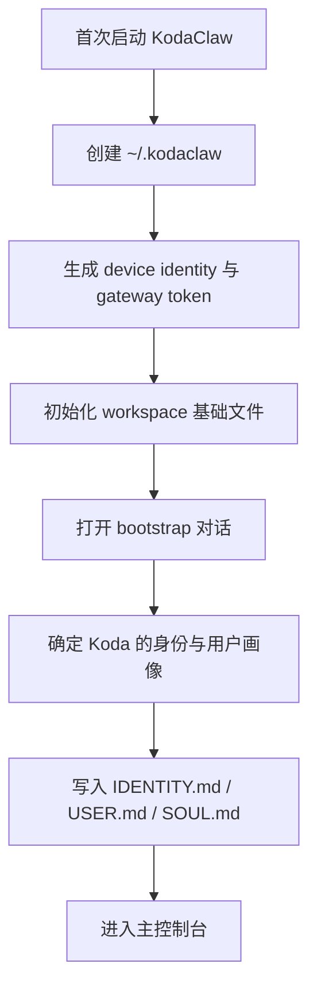

# KodaClaw 产品方案

## 1. 产品定义

KodaClaw 不是一个“聊天应用”，而是一个运行在用户本机上的个人 Agent 操作系统。它的目标不是只回答问题，而是长期驻留、跨会话持续、可接入外部世界、可主动推进任务。

KodaClaw 的完整产品形态包括：

- 主对话界面：用户和 Koda 的主线程
- 本地 Gateway：统一管理会话、审批、插件、渠道、自动化
- Workspace：人格、记忆、知识、任务与环境约定的持久化家目录
- Inbox：所有需要用户确认、查看、处理的事项入口
- Canvas：用于承载 Agent 生成 UI、报告、任务板、临时工作面的本地画布
- Plugin Platform：可安装、启停、授权、扩展工具与渠道能力
- Channel Hub：Telegram / QQ / WhatsApp 等外部消息面入口
- Model Hub：多提供方模型目录、自定义 endpoint、默认模型与 fallback 策略
- Automation Engine：heartbeat、cron、后台巡检、主动提醒与任务投递
- Desktop Shell：托盘、通知、快捷键、开机启动、窗口壳

## 2. 产品目标

### 2.1 一级目标

1. 复刻 PoorClaw 的完整产品结构，而不是只复刻其中一个聊天窗口
2. 最大程度复用现有 SDK 在 runtime、event stream、store、sandbox、MCP 上的能力
3. 将“人格”“记忆”“规则”“主动性”从纯 prompt 迁移为可编辑的产品层协议
4. 建立一个能长期演进的产品架构，而不是 example 级应用

### 2.2 二级目标

- 单机可部署、可调试、可审计
- 用户可以明确区分主会话、渠道会话和自动化会话
- 所有外部动作都能被审批或追踪
- 插件与渠道能力能够持续扩展，而不需要频繁改核心代码

## 3. 目标用户

### 3.1 核心用户

- 深度使用 LLM 的技术用户
- 有多工具、多模型、多渠道协作需求的用户
- 希望 Agent 具备“连续性”和“主动性”的重度用户

### 3.2 次级用户

- 需要个人工作助手的知识工作者
- 希望通过 Telegram / QQ / WhatsApp 等入口使用 Agent 的用户
- 需要在本地环境中运行 Agent、避免 SaaS 锁定的团队

## 4. 核心对象模型

KodaClaw 的产品对象不是“消息”这么简单，而是以下几类一等对象：

- `Workspace`：Agent 的长期家目录与协议容器
- `Session`：一次运行上下文，按入口分为主会话、渠道会话、自动化会话
- `Thread`：用户与 Agent 或外部渠道之间的一条对话流
- `InboxItem`：需要用户处理或查看的事项
- `Approval`：高风险动作的审批单
- `Plugin`：扩展能力单元
- `ChannelAccount`：外部渠道账号与会话映射
- `Automation`：定时或条件触发的后台任务
- `CanvasArtifact`：供用户查看或交互的本地 UI 资产
- `ModelEndpoint`：具体模型服务入口

## 5. 用户可感知的核心能力

### 5.1 主对话与会话连续性

用户可以像使用桌面助手一样与 Koda 对话，但对话不只是文本历史：

- 会恢复到上次状态
- 会继承 Workspace 记忆
- 会显示工具执行与审批状态
- 会把关键结果转成 Inbox、Task 或 Canvas

### 5.2 Inbox 与审批

KodaClaw 需要一个独立于聊天的 Inbox，用于接住所有“需要用户知道”的东西：

- 发消息 / 发邮件 / 对外回复前的审批
- 自动化运行结果
- 插件安装和授权请求
- 渠道绑定与登录结果
- 失败重试与异常告警

### 5.3 Workspace 与长期记忆

KodaClaw 的人格和连续性来自 Workspace，而不是仅来自系统提示：

- `IDENTITY.md` 定义 Koda 的名字与外在身份
- `SOUL.md` 定义行为准则与长期风格
- `USER.md` 定义用户画像与偏好
- `MEMORY.md` 存放长期记忆
- `memory/YYYY-MM-DD.md` 存放近期会话连续性
- `HEARTBEAT.md` 定义后台主动检查任务

### 5.4 Model Hub

KodaClaw 不是单模型产品，而是带有控制面的多模型系统：

- 支持多个 provider
- 支持 OpenAI / Anthropic compatible endpoints
- 支持自定义 endpoint
- 支持 primary / fallback 路由
- 支持对不同任务绑定不同默认模型策略

### 5.5 Plugins

插件是 KodaClaw 的长期扩展方式。插件能带来：

- 新工具
- 新渠道
- 新 Canvas 面板
- 新自动化来源
- 新记忆或知识接入方式

### 5.6 Channels

外部渠道不是“通知发送器”，而是独立会话入口：

- Telegram 私聊
- Telegram 群组
- QQ / WhatsApp / WeCom / DingTalk（后续插件化）
- 通用 Webhook 入口

KodaClaw 必须区分这些入口的隐私边界与记忆加载策略。

### 5.7 Automation

KodaClaw 必须具备可控的主动性：

- 按计划运行任务
- 读取 `HEARTBEAT.md` 与用户定义的自动化
- 把结果写入 Inbox
- 在需要时触发通知
- 不在用户不知情的情况下直接对外执行高风险动作

### 5.8 Canvas

Canvas 是 KodaClaw 和普通聊天应用的重要差异点。Canvas 用来承载：

- 报告
- 仪表盘
- 项目看板
- 任务清单
- 结构化数据展示
- 插件 UI 面板

## 6. 首次启动用户流程

首次启动的重点不是“立刻接入所有能力”，而是完成以下三件事：

1. 让 Koda 知道自己是谁
2. 让 Koda 知道它在为谁服务
3. 让 Koda 获得一个安全、可持续的本地工作空间

## 7. 日常使用场景

### 7.1 主会话

用户打开主控制台，和 Koda 讨论计划、项目、代码、信息收集、写作、提醒等日常工作。

### 7.2 被动接入渠道消息

用户的 Telegram / QQ 等渠道进来一条消息后，Channel Hub 创建或恢复对应 session，Koda 在隔离上下文中处理消息，并在需要时给出建议回复或请求审批。

### 7.3 主动任务

Koda 根据 heartbeat 或 automation 触发任务，例如：

- 每天早上汇总关注信息
- 巡检某个项目目录变化
- 对某个群组消息做低频摘要
- 检查特定渠道是否有待处理事项

### 7.4 插件驱动场景

用户安装一个插件后，Koda 新增一类工具、一个新渠道或一个新 Canvas 面板，并由 Plugin Host 控制其权限和生命周期。

## 8. 非目标

以下内容不属于 KodaClaw 的首要目标：

- 多租户 SaaS 平台
- 云端统一控制台
- 团队协作审批系统
- 复杂企业权限系统
- 重度手机端优先体验

KodaClaw 的第一性目标是单机、单用户、长期可用的 Agent 产品。

## 9. 成功标准

KodaClaw 至少要在以下层面达到“完整产品”标准：

- 不依赖命令行即可完成主要使用流程
- 主对话、Inbox、Plugins、Channels、Automations、Models 都有明确产品入口
- 会话、记忆、自动化和插件状态都可恢复
- 用户可以清楚看到 Agent 做了什么、为什么暂停、下一步要不要确认
- 外部渠道和主会话之间不会发生隐私边界污染

## 10. 当前结论

现有 SDK 足以支撑 KodaClaw 的 runtime 内核，但 KodaClaw 的产品价值主要来自产品壳层：

- Gateway
- Workspace 协议
- Control Plane
- 插件与渠道体系
- 自动化与 Canvas
- 桌面外壳

因此，KodaClaw 应被当作一个全新的产品工程来实现，而不是在 example 上“继续加功能”。
