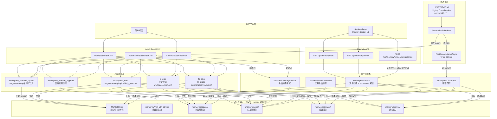
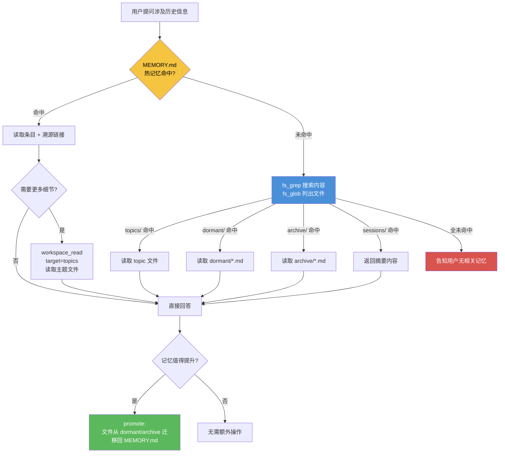
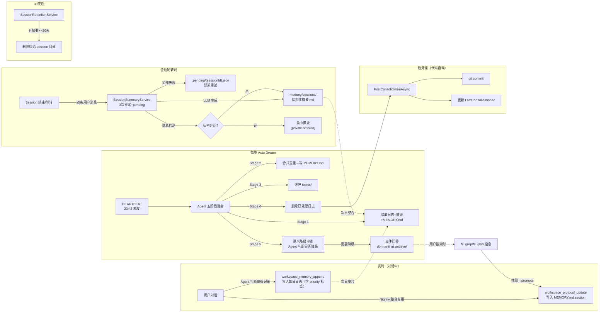
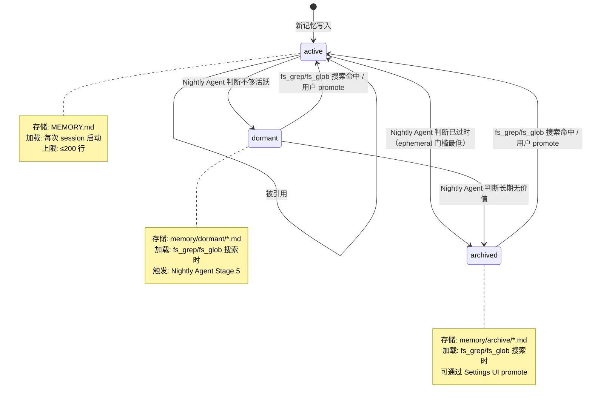
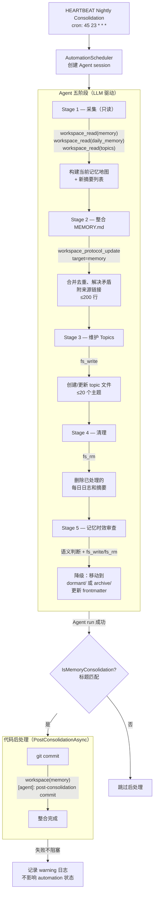

# KodaClaw 记忆系统设计方案

> 版本：2.0
> 日期：2026-03-26
> 状态：已实施
>
> **⚠️ v2.0 重大变更（2026-03-26）**：移除 SQLite `memory_entries` 元数据层，改为纯文件方案。
> 本文档中所有 "SQLite memory_entries"、"memory_search"、"IMemoryMetadataRepository" 引用
> 反映的是 v1.x 设计，已被以下替代：
> - 检索：`fs_grep` 内容搜索 + `fs_glob` 目录发现
> - Gateway API：`IMemoryFileService` 文件扫描（替代 SQLite 查询）
> - 降级：Nightly Agent 语义判断（替代数字优先级时间阈值公式）
> - 后处理：仅 git commit（移除 SQLite 同步和 topics 同步）
> 详见末尾"附录 A — v2.0 设计决策记录"

---

## 一、背景与目标

### 1.1 核心问题

用户一年后想回忆 6 个月前聊过的内容，怎么做？

现有问题：
- 自动记忆会不断积累，变成一堆矛盾、过时、重复的垃圾
- 只有关键事件被记录，大量对话细节丢失
- 没有检索机制，无法追溯历史

### 1.2 目标

设计一套符合人脑认知模式的记忆系统：
- **渐进式回忆**：从概括到细节，层层深入
- **遗忘机制**：不用就淡化，但不是删除
- **自动维护**：Auto Dream 定期整理、压缩、分级

---

## 二、整体架构

### 2.0 系统全景

下图展示记忆系统中所有模块的协作关系——从用户对话到持久化存储，以及 Agent 工具、自动化调度、后处理钩子之间的数据流向。



各层职责一览：

```
用户交互层     对话 / Settings UI
     │
Agent Session  MainSession / ChannelSession / AutomationSession
     │
Agent 工具     workspace_memory_append / workspace_protocol_update / workspace_read / fs_grep / fs_glob
     │
记忆存储       MEMORY.md ← 热 │ dormant/ ← 温 │ archive/ ← 冷
（纯文件）     │ sessions/ ← 摘要 │ topics/ ← 主题 │ frontmatter 元数据
     │
自动化         HEARTBEAT cron → AutomationScheduler → PostConsolidation（仅 git commit）
     │
运行时服务     摘要生成 / 文件扫描(MemoryFileService) / 过期清理 / Git 版本跟踪
```

### 2.1 三层记忆结构

```
┌─────────────────────────────────────────────────────┐
│                    热记忆                            │
│            workspace/MEMORY.md                      │
│                                                     │
│    精简索引，只保留最近活跃的重要内容                 │
│    上限 150-200 行，超过就降级                       │
│    每条记忆带溯源链接                                │
└─────────────────────────────────────────────────────┘
    │ 不够
    ▼
┌─────────────────────────────────────────────────────┐
│                    温记忆                            │
│         workspace/memory/dormant/                   │
│                                                     │
│    近期不活跃但重要的记忆                             │
│    从热记忆降级下来的                                 │
│    用户问到时可以"想起来"                            │
└─────────────────────────────────────────────────────┘
    │ 还不够
    ▼
┌─────────────────────────────────────────────────────┐
│                    冷记忆                            │
│         workspace/memory/archive/                   │
│                                                     │
│    很久没用的归档记忆                                │
│    需要主动搜索才能找到                              │
│    保留但基本不加载                                  │
└─────────────────────────────────────────────────────┘
```

### 2.2 渐进式回忆流程

1. 用户问："半年前 SOUL 商店方案怎么回事？"
2. AI 查热记忆（MEMORY.md），找到条目
3. 如果需要细节，顺着溯源链接找到会话摘要
4. 如果热记忆未命中，用 `fs_grep` 搜索内容 / `fs_glob` 列出目录文件
5. 如果在 dormant/archive 找到，可通过 promote 迁移回 MEMORY.md

### 2.3 记忆检索流程

Agent 在对话中需要回忆历史信息时，按以下路径逐层检索：



检索路径优先级与对应的代码实现：

```
优先级    数据源                  工具 / API                      延迟    加载方式
───────  ─────────────────────  ──────────────────────────────  ──────  ──────────
  1      MEMORY.md（热）         session 启动时自动注入 prompt   ~0ms    自动
  2      topics/（主题索引）      workspace_read target=topics   ~1ms    按需
  3      dormant/*.md（温）       fs_grep 搜索 / fs_glob 列出    ~50ms   按需
  4      archive/*.md（冷）       fs_grep 搜索 / fs_glob 列出    ~50ms   按需
  5      sessions/（会话摘要）    fs_grep 搜索 / fs_glob 列出    ~50ms   按需
```

---

## 三、会话生命周期

### 3.0 端到端数据流

一条记忆从产生到最终归档的完整旅程：



### 3.1 流程

```
┌─────────────────────────────────────────────────────┐
│                    原始会话                          │
│            sessions/{session-id}/                   │
│                                                     │
│    完整对话记录，保留一段时间                         │
└─────────────────────────────────────────────────────┘
    │ 会话结束时
    ▼
┌─────────────────────────────────────────────────────┐
│                    会话摘要                          │
│       workspace/memory/sessions/{date}-{id}.md      │
│                                                     │
│    结构化摘要，提取关键信息                           │
│    决定是否值得保留、是否写入记忆                     │
└─────────────────────────────────────────────────────┘
    │ 一段时间后（30 天）
    ▼
┌─────────────────────────────────────────────────────┐
│                    原始会话删除                       │
│                                                     │
│    只保留摘要，原始对话清理掉                         │
│    节省空间，但关键信息不丢失                         │
└─────────────────────────────────────────────────────┘
```

### 3.2 会话价值判断

**值得保留的会话**：
- 用户主动说"记住这个"、"记下来"
- 做出了明确决策
- 用户纠正了 AI 的错误
- 讨论了个人相关的重要话题（工作、人际关系、价值观）
- 提到了可能未来引用的信息（项目方案、技术选型、联系方式）

**不值得保留的会话**：
- 自动化任务（新闻速报、收件箱盘点）
- 简单的信息查询（"今天天气"、"帮我写个正则"）
- 纯粹的调试过程，没有结论
- 用户明确说"不用记"

**判断方式（双轨制）**：
1. 显式标记：用户明确说记/不记，优先级最高
2. 隐式判断：AI 根据规则判断

---

## 四、数据结构

### 4.1 会话摘要格式

文件路径：`workspace/memory/sessions/{YYYY-MM-DD}-{session-type}-{short-id}.md`

```markdown
# 会话摘要

## 基本信息
- 会话ID: main-20260324150032
- 日期: 2026-03-24
- 时长: 约 45 分钟
- 类型: main / channel / automation

## 主题
- SOUL 商店产品方案讨论
- Agent 协议兴趣

## 关键词
SOUL商店, Agent社交网络, local-first, Agent Card

## 重要决策
- 决定采用三阶段设计：被动观察期 → 主动确认期 → 深度理解期
- 技术架构选型：Local-first，分离通用框架和个性化数据

## 用户表达
- "AI 伙伴的终局是陪伴用户走完一生" —— 核心理念

## 待跟进
- [ ] 关注 ACP、A2A、MCP 协议发展
- [ ] SOUL 商店方案需要进一步细化商业模式

## 来源
- 原始会话: sessions/main-20260324150032（保留至 2026-04-24）
```

### 4.2 记忆条目格式

文件路径：`workspace/MEMORY.md`

```markdown
## 项目创意

### SOUL 商店方案
- 状态: active
- 重要性: lasting
- 创建时间: 2026-03-24
- 来源: workspace/memory/sessions/2026-03-24-main-abc123.md

核心理念：把 AI 人格做成可交易的半成品，会磨合会成长。
三阶段设计：被动观察期 → 主动确认期 → 深度理解期。

---

## 职业变动

### 广州新工作
- 状态: active
- 重要性: lasting
- 创建时间: 2026-03-24
- 来源: workspace/memory/sessions/2026-03-24-main-def456.md

**时间线演变**：
- 2026-03-24：通过阿文内推，下个月入职，旅游 B2B2B 业务
- 2026-04-10：入职时间推迟到 5 月中旬
- 2026-05-15：已入职，负责海外业务

**当前状态**：已入职广州新公司，负责海外业务
```

### 4.3 元数据字段说明

元数据存储在文件 frontmatter（`---` 分隔）或 MEMORY.md section 内联标注中：

| 字段 | 取值 | 存储位置 | 用途 |
|------|------|---------|------|
| 状态 | active / dormant / archived | frontmatter `status:` | 决定加载优先级 |
| 重要性 | permanent / lasting / standard / ephemeral | frontmatter `priority:` | 影响降级阈值（Agent 参考） |
| 创建时间 | 日期 | frontmatter `created:` | 知道记忆产生时间 |
| 标签 | 字符串数组 | frontmatter `tags:` | 主题分类 |
| 来源 | 文件路径 | section 内 `→` 链接 | 指向会话摘要，可追溯细节 |

### 4.4 重要性分级

| 等级 | 含义 | 降级参考（Nightly Agent 语义判断） |
|------|------|-----------------------------------|
| permanent | 核心记忆，永不遗忘 | 永不降级 |
| lasting | 重要记忆，长期保留 | 仅当明显过时或被推翻 |
| standard | 一般记忆（默认） | ~30 天无关联可降级 |
| ephemeral | 临时记忆 | ~7 天无价值即可归档 |

### 4.5 主题索引格式

文件路径：`workspace/memory/topics/{topic-name}.md`

```markdown
# SOUL 商店方案

## 概述
把 AI 人格做成可交易的半成品，会磨合会成长。

## 相关会话
- 2026-03-24：初始方案讨论，确定三阶段设计
- 2026-04-02：讨论商业模式，待细化
- 2026-04-15：补充技术架构细节

## 当前状态
方案设计中，待商业模式细化

## 关联记忆
- [SOUL 商店方案](../MEMORY.md#soul-商店方案)
- [workspace/memory/sessions/2026-03-24-main-abc123.md](sessions/2026-03-24-main-abc123.md)
- [workspace/memory/sessions/2026-04-02-main-def456.md](sessions/2026-04-02-main-def456.md)
```

---

## 五、遗忘机制（冷热分离）

### 5.0 状态机全图



`permanent` 记忆（核心身份/价值观）永驻 active，不参与降级流程。

降级由 Nightly Agent（Stage 5）基于语义判断执行，而非固定时间阈值。以下为参考指南：

```
permanent   ━━━━━━━━━━━━━━━━━━━━━━━━━━━━━━━━━━━━━━━━━ active（永不降级）

lasting     ━━━━━━━━━━━━ active ━━━━ 仅当明显过时/推翻 ━━━━▶ dormant

standard    ━━━━ active ━━━ ~30天无关联 ━━━▶ dormant ━━━ 持续无价值 ━━━▶ archived

ephemeral   ━━ active ━━ ~7天无价值 ━━▶ archived（门槛最低，积极清理）

所有降级由 Agent 语义判断，上述天数仅为参考，不是硬编码规则。
```

### 5.1 降级指南（Agent 语义判断参考）

| 重要性 | 降级参考 | Agent 判断依据 |
|--------|---------|---------------|
| permanent | 永不降级 | 核心身份、用户基本信息 |
| lasting | 仅当明显过时或被推翻 | 重要决策是否仍然有效 |
| standard | ~30 天无关联可降级 | 是否与近期对话、目标相关 |
| ephemeral | ~7 天无价值即可降级 | 临时信息是否还有参考价值 |

降级由 Nightly Agent Stage 5 基于语义理解执行，不依赖固定时间计算。

### 5.2 升级规则

当用户问到相关内容时：
1. Agent 通过 `fs_grep`（内容搜索）或 `fs_glob`（目录浏览）定位 dormant 和 archive 中的记忆
2. 如果找到相关记忆，可通过 Gateway API promote 回 active
3. 文件从 dormant/archive 迁移回 MEMORY.md

Settings UI 也提供手动 promote 按钮。

### 5.3 引用说明

v2.0 不再追踪引用计数或 LastAccessed。降级完全由 Nightly Agent 语义判断。
Agent 根据以下信号判断记忆活跃度：
- 用户在近期对话中是否提到相关话题
- 记忆内容是否与当前项目/目标相关
- 信息是否已过时或被更新的事实取代

---

## 六、Auto Dream 整合流程

### 6.0 管线全图

整合全部由 **Agent 五阶段**（LLM 驱动，通过 HEARTBEAT prompt 驱动）完成，代码后处理仅负责 git commit。



关键设计决策：

```
v2.0 为什么把降级也交给 Agent？

v1.x：Agent 负责整合 + 代码负责降级     v2.0：Agent 负责全部
─────────────────────────────────      ─────────────────────
代码用固定时间阈值降级                     Agent 用语义理解判断是否过时
需要 SQLite 追踪 LastAccessed             不需要额外数据库
同步漂移风险（文件 vs SQLite）             文件就是唯一 source of truth

→ 降级本质上是语义判断（"这条记忆还有用吗？"），不是计时器问题
→ 代码后处理简化为仅 git commit，复杂度大幅降低
→ 失败不阻塞原则不变
```

### 6.1 触发条件

满足以下任一条件时触发：
- 距离上次整合超过 24 小时 + 新增 5 个以上会话
- 用户手动触发："整理记忆"、"执行 Auto Dream"
- 定时任务：通过 HEARTBEAT.md 配置

### 6.2 整合流程（五阶段）

**Stage 1 — 采集（只读）**
- 读取今日日志 `memory/YYYY-MM-DD.md`
- 读取最近未处理的 session 摘要（≤10 个）
- 读取当前 MEMORY.md
- 构建当前记忆地图

**Stage 2 — 整合 MEMORY.md**
- 合并新事实到已有 sections
- 解决矛盾（保留演变过程）
- 删除重复和被取代的条目
- 附来源链接（→ sessions/{file}）
- 保持 MEMORY.md ≤200 行

**Stage 3 — 维护 Topics**
- 识别跨多个 session 重复出现的主题
- 创建/更新 `topics/{slug}.md` 文件
- 合并相近主题，控制总数 ≤20 个

**Stage 4 — 清理**
- 删除已处理的每日日志
- 删除 7 天以上的旧日志
- 标记已整合的 session 摘要

**Stage 5 — 记忆时效审查**
- 扫描 MEMORY.md 和 topics/ 所有条目
- 对每条记忆进行语义判断：是否仍与用户当前目标、近期对话相关
- `permanent` 永不降级，`ephemeral` 门槛最低（~7 天无价值即清理）
- 降级操作：移动文件到 dormant/ 或 archive/，更新 frontmatter `status` 字段
- 从 MEMORY.md 删除对应 section

### 6.3 失败回滚

- 整合前备份当前记忆文件到 `workspace/memory/backup/`
- 提供回滚机制，可恢复到上次整合前状态
- 整合日志记录操作详情

---

## 七、时效性处理

### 7.1 过期信息标记

```markdown
### 离职时间线
- 状态: archived（已过期）
- 重要性: standard
- 过期时间: 2026-04-18

4 月 17 日是深圳最后一天，之后入职广州。
（此信息已过期，仅作历史记录）
```

### 7.2 处理原则

- 过期信息不再作为"当前信息"使用
- 但作为历史事实保留，降级到 archived
- 过期信息不参与降级计时（已经降到底了）

---

## 八、被动触发提示

### 8.1 场景

用户问"最近工作怎么样"，但忘了半年前讨论过广州新工作的事。

### 8.2 处理逻辑

```
1. 正常回答用户问题
2. 同时检索相关记忆（包括 dormant 和 archived）
3. 如果找到相关但不活跃的记忆，主动提示
4. 提示方式：在回答末尾追加"顺便提一下，你之前还聊过 X，还想得起吗？"
```

### 8.3 注意事项

- 不要过度提示，只在真正相关时才提
- 提示内容简洁，不要打断主回答

---

## 九、隐私与敏感信息

### 9.1 处理原则

- 摘要生成时，识别并脱敏敏感信息（密码、私钥等）
- 用户可标记某条会话为"私密"，不生成详细摘要
- 私密会话的原始记录保留时间更短

### 9.2 标记方式

在会话摘要中：
```markdown
## 基本信息
- 会话ID: main-20260324150032
- 隐私级别: private（不生成详细摘要）
```

---

## 十、目录结构

```
workspace/
├── MEMORY.md                    # 热记忆索引（150-200 行）
├── USER.md                      # 用户画像（不变）
├── memory/
│   ├── sessions/                # 会话摘要
│   │   ├── 2026-03-24-main-abc123.md
│   │   ├── 2026-03-25-main-def456.md
│   │   └── ...
│   ├── topics/                  # 主题索引
│   │   ├── soul-store.md
│   │   ├── career-change.md
│   │   └── ...
│   ├── dormant/                 # 温记忆（降级的记忆条目）
│   │   └── ...
│   ├── archive/                 # 冷记忆（归档的记忆条目）
│   │   └── ...
│   └── backup/                  # 整合前备份
│       └── MEMORY-20260325.md
```

---

## 十一、实现优先级

### 第一阶段：基础能力

- 会话摘要生成（会话结束时）
- MEMORY.md 条目加溯源链接
- 手动触发 Auto Dream（简化版）

**目标**：解决"能找到历史"的问题

### 第二阶段：整合与串联

- 完整 Auto Dream 流程
- 主题索引自动生成
- 跨会话内容串联

**目标**：解决"信息碎片化"的问题

### 第三阶段：遗忘机制

- 冷热分离逻辑
- 降级/升级机制
- 原始会话定期清理

**目标**：解决"记忆过载"的问题

---

## 十二、示例数据

### 12.1 会话摘要示例

`workspace/memory/sessions/2026-03-24-main-abc123.md`：

```markdown
# 会话摘要

## 基本信息
- 会话ID: main-20260324150032
- 日期: 2026-03-24
- 时长: 约 45 分钟
- 类型: main

## 主题
- SOUL 商店产品方案讨论
- Agent 协议兴趣

## 关键词
SOUL商店, Agent社交网络, local-first, Agent Card, ACP, A2A, MCP

## 重要决策
- 决定采用三阶段设计：被动观察期 → 主动确认期 → 深度理解期
- 技术架构选型：Local-first，分离通用框架和个性化数据
- 核心理念确定：AI 伙伴的终局是陪伴用户走完一生

## 用户表达
- "AI 伙伴的终局是陪伴用户走完一生"
- "Agent 通过 Agent Card 发现彼此建立协作"

## 待跟进
- [ ] 关注 ACP、A2A、MCP 协议发展
- [ ] SOUL 商店方案需要进一步细化商业模式

## 来源
- 原始会话: sessions/main-20260324150032（保留至 2026-04-24）
```

### 12.2 记忆条目示例

`workspace/MEMORY.md` 片段：

```markdown
## 项目创意（2026-03-24）

### SOUL 商店方案
- 状态: active
- 重要性: lasting
- 创建时间: 2026-03-24
- 来源: memory/sessions/2026-03-24-main-abc123.md

核心理念：把 AI 人格做成可交易的半成品，会磨合会成长。
三阶段设计：被动观察期 → 主动确认期 → 深度理解期。
技术架构：Local-first，分离通用框架和个性化数据。

### Agent 协议兴趣
- 状态: active
- 重要性: standard
- 创建时间: 2026-03-24
- 来源: memory/sessions/2026-03-24-main-abc123.md

关注 ACP（IBM本地优先）、A2A（Google跨平台）、MCP（Anthropic上下文）协议。
提出 Agent 社交网络概念：Agent 通过 Agent Card 发现彼此建立协作。
```

### 12.3 主题索引示例

`workspace/memory/topics/soul-store.md`：

```markdown
# SOUL 商店方案

## 概述
把 AI 人格做成可交易的半成品，会磨合会成长。

## 核心理念
- AI 伙伴的终局是陪伴用户走完一生
- 三阶段磨合：被动观察期 → 主动确认期 → 深度理解期
- 技术架构：Local-first，分离通用框架和个性化数据

## 相关会话
- 2026-03-24：初始方案讨论，确定三阶段设计
- 2026-04-02：讨论商业模式，待细化

## 当前状态
方案设计中，待商业模式细化

## 待跟进
- [ ] 商业模式细化
- [ ] 原型设计

## 关联记忆
- [MEMORY.md - SOUL 商店方案](../MEMORY.md#soul-商店方案)
```

### 12.4 降级记忆示例

`workspace/memory/dormant/career-plan-2025.md`：

```markdown
# 2025 年职业规划

---
status: dormant
priority: 2
created: 2025-06-20
tags: [career, planning]
---

## 内容
（从 MEMORY.md 迁移过来的完整内容）

2025 年计划：
- Q1：完成当前项目
- Q2：考虑内部转岗
...
```

---

## 十三、设计决策记录

以下问题在 Iter 58-59 实现过程中已确定方案：

1. **摘要生成的时机** — 会话轮转时立即生成。`SessionSummaryService` 在 session rotate 前同步调用，从磁盘加载 messages → LLM 生成结构化摘要。失败不阻塞轮转，保证可用性优先。
2. **原始会话保留时长** — 30 天。`SessionRetentionService` 检查有摘要且 >30 天的 main-*/channel-* session 目录并删除，活跃 session 永远跳过。
3. **主题索引的粒度** — 由 Auto Dream（LLM）自行判断，硬约束 ≤20 个 topic 文件。不设定固定粒度规则，Agent 根据对话中反复出现的主题自然聚类。
4. **多 workspace 场景** — 当前不支持。所有代码假设单 workspace（`~/.kodaclaw`），跨 workspace 记忆不在近期路线图中。如未来需要，应在 `WorkspaceService` 层抽象多 root 路径，记忆检索时合并结果。

---

## 附录：参考资料

- Claude Code Auto Dream：https://claudefa.st/blog/guide/mechanics/auto-dream
- 人脑记忆机制：工作记忆、长期记忆、REM 睡眠

---

## 附录 A — v2.0 设计决策记录（2026-03-26）

### 决策：移除 SQLite memory_entries 元数据层

**背景**：v1.x 使用 SQLite `memory_entries` 表作为记忆元数据索引，需要维护 3 个同步点（Migration 服务、PostConsolidation 钩子、Protocol Update 追踪）。

**问题**：
1. **同步漂移风险**：文件是 source of truth，SQLite 是派生视图，两者可能不一致
2. **复杂度不匹配**：记忆量级（几百个 .md 文件）不需要数据库索引
3. **维护负担**：每个写入路径都需要同步更新 SQLite，增加 bug 面

**新方案**：
- **检索**：`fs_grep` 内容搜索 + `fs_glob` 目录发现（Agent 已有这两个工具）
- **Gateway API**：`IMemoryFileService` 扫描文件 + 解析 frontmatter（替代 SQLite 查询）
- **降级**：Nightly Agent 基于语义判断（替代数字优先级时间阈值公式）
- **后处理**：仅 git commit（移除 SQLite 同步）

**删除的组件**：
- `IMemoryMetadataRepository` / `SqliteMemoryMetadataRepository`
- `MemoryEntry` / `MemoryEntryQuery` contracts
- `MemoryMigrationService`
- `WorkspaceAppConfig.MemorySchemaVersion`
- `SqliteStorageDatabase` 中的 `memory_entries` DDL
- `workspace_read(target=memory_search)` target

**新增的组件**：
- `IMemoryFileService` / `MemoryFileService`（文件扫描）
- `MemoryFrontmatterParser`（frontmatter 解析）
- `MemoryFileEntry` / `MemoryFileStats`（轻量 DTO）
- `MemoryMarkdownParser`（从 MemoryMigrationService 提取的共享 helper）
- HEARTBEAT Stage 5（Agent 驱动的记忆时效审查）

**权衡**：
- 搜索性能从 ~5ms（SQLite 索引）降至 ~50ms（文件扫描），对于几百个文件完全可接受
- 失去结构化查询能力（WHERE status='dormant' ORDER BY priority），改为文件目录天然分层
- 消除了所有同步问题，文件就是唯一 source of truth

---

## 附录 B — v2.1 可靠性优化记录（2026-03-26）

### 1. workspace_memory_append 支持 priority 参数

日志条目格式从 `<!-- HH:mm -->` 升级为 `<!-- HH:mm | priority -->`，支持 `permanent/lasting/standard/ephemeral` 四级语义标签。Nightly Agent 在整合日志时可依据此标签做降级判断。

### 2. 会话摘要重试 + pending 机制

- `GenerateSummaryAsync` 增加 2 次重试（间隔 2s/5s），仅对非 `OperationCanceledException` 异常重试
- 3 次尝试全部失败后，将会话文本序列化到 `workspace/memory/sessions/.pending/{sessionId}.json`
- 下一个 main session 启动时，后台尝试重试 pending 文件（`TryRetryPendingSummariesAsync`）
- pending 文件超过 5 次尝试或 7 天过期后自动清理

### 3. 摘要截断策略优化

原来截断方式为取前 12,000 字符（`break`），丢失后半段对话中的重要决策。新策略：
- 全文 ≤ 12,000 字符：完整返回
- 全文 > 12,000 字符：前 2,000 字符 + `[...中间部分省略...]` + 后 10,000 字符

### 4. Nightly 健康检查

- `PostConsolidationAsync` 成功后更新 `WorkspaceAppConfig.LastConsolidationAt`
- `BuildSystemPromptAsync` 检查 `LastConsolidationAt`：如果 >48h 或从未执行，注入 Memory Notice 提示 Agent 使用 `fs_grep` 补充搜索
- MEMORY.md 行数 >200 时发出 `memory.index_oversized` 诊断事件

### 5. SKILL.md 引导策略

- `workspace_memory_append`：明确为日常对话的**唯一写入路径**
- `workspace_protocol_update(target=memory)`：标注为 **Nightly 整合专用**
- topics 限制放开：从"只读不写"改为"主要由 Nightly 维护，日常也可直接创建/更新"
- 新增 priority 使用指导（permanent/lasting/standard/ephemeral 使用场景）
