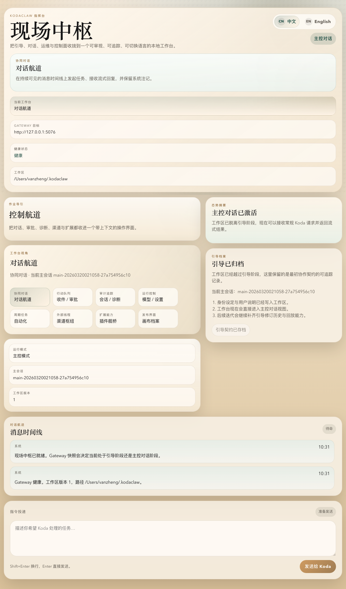
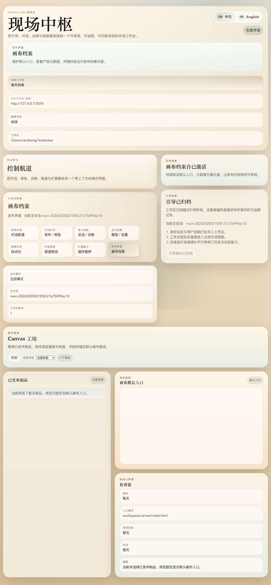
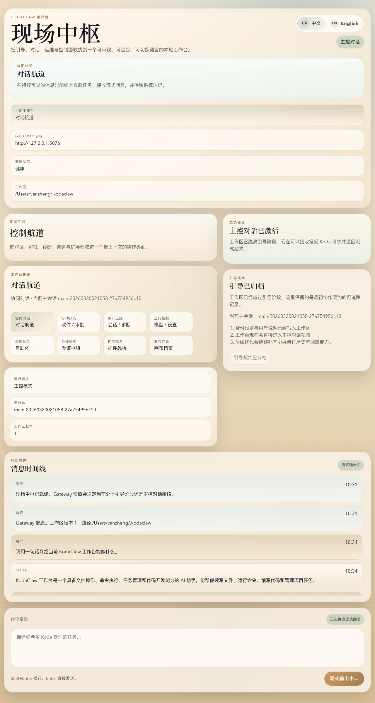
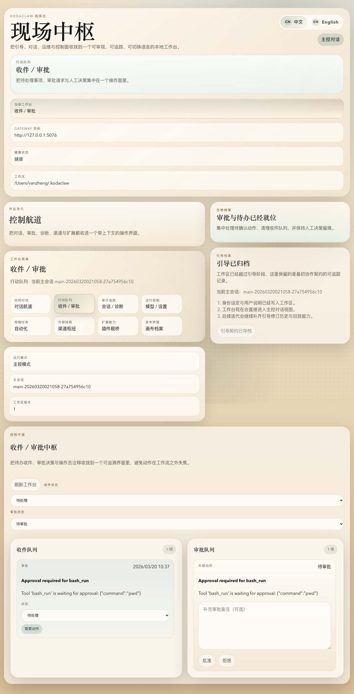
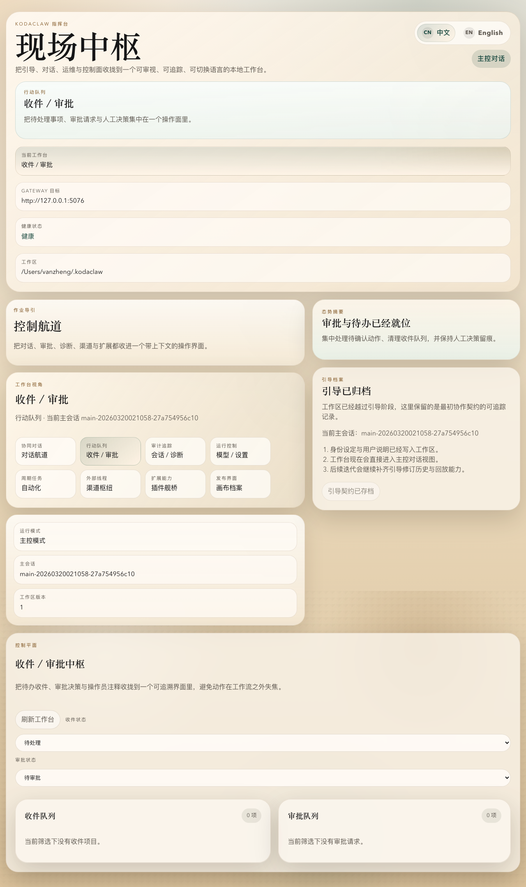
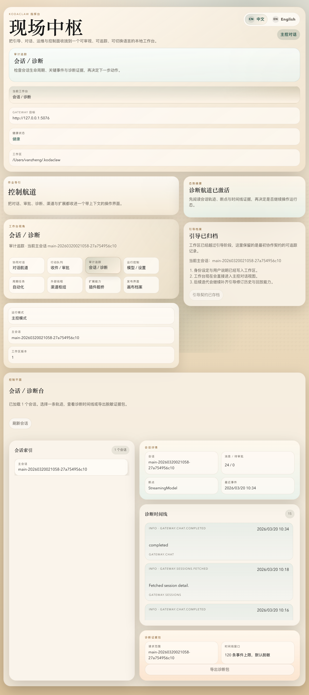
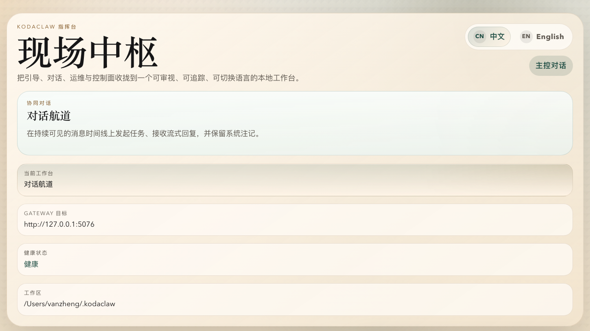
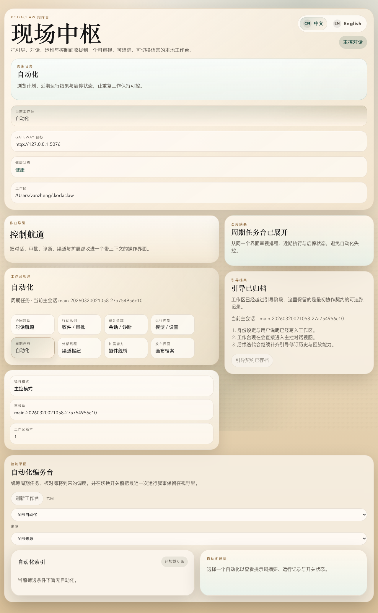
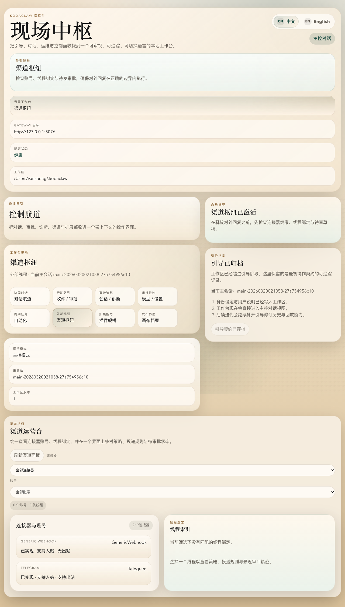
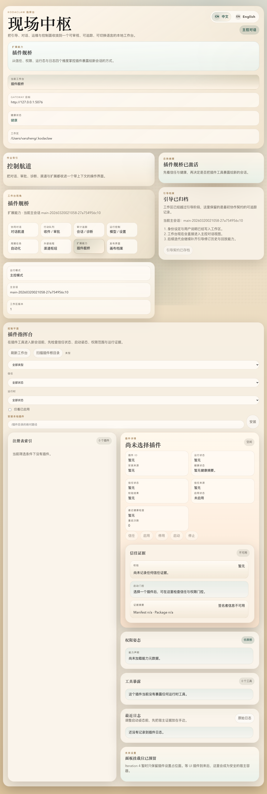

# Dogfood Report: KodaClaw local web + gateway

| Field | Value |
|-------|-------|
| **Date** | 2026-03-20 |
| **App URL** | `http://127.0.0.1:4173` (web) + `http://127.0.0.1:5076` (gateway) |
| **Session** | `kodaclaw-local` |
| **Scope** | PRODUCT 对齐 dogfood：主对话、收件/审批、会话/诊断、模型/设置、自动化、渠道、插件、Canvas |

## Summary

| Severity | Count |
|----------|-------|
| Critical | 0 |
| High | 2 |
| Medium | 2 |
| Low | 0 |
| **Total** | **4** |

## Issues

### ISSUE-001: Canvas 默认预览为空白，且 gateway 记录未授权 iframe 访问

| Field | Value |
|-------|-------|
| **Severity** | high |
| **Category** | functional |
| **URL** | `http://127.0.0.1:4173/` -> Canvas desk |
| **Repro Video** | N/A |

**Description**

切到 Canvas desk 后，右侧“所有者入口”区域为空白，未显示任何 workspace fallback 画布内容。与此同时，`/api/diagnostics/recent` 记录了 `gateway.auth.failed`，报错为未授权访问 `/api/canvas/fs/workspace/canvas/index.html`。预期是 Canvas 默认入口至少能稳定展示 fallback 画布，实际是 iframe 资源因为鉴权链路缺失而空白。

**Repro Steps**

1. 打开 KodaClaw web 控制台首页。
   

2. 点击顶部 desk 切换中的“发布界面 / 画布档案”。
   

3. **Observe:** 右侧“所有者入口”区域为空白，没有任何可用的 fallback Canvas 预览。
   

---

### ISSUE-002: 审批完成且 chat 已 completed 后，会话状态仍停留在 `StreamingModel`

| Field | Value |
|-------|-------|
| **Severity** | medium |
| **Category** | functional |
| **URL** | `http://127.0.0.1:4173/` -> Chat / Inbox / Sessions desks |
| **Repro Video** | N/A |

**Description**

通过主对话触发 `bash_run` 审批后，在 Inbox desk 批准审批，gateway diagnostics 已记录 `gateway.chat.completed`，且 `/api/sessions/{id}` 的 `pendingApprovalCount` 已回到 `0`。但同一个会话详情仍持续显示 `breakpointState = StreamingModel`。预期是 chat 完成后会话状态回到空闲/可继续交互的完成态，实际状态残留为流式执行中，容易误导控制面判断。

**Repro Steps**

1. 在主对话里输入“请调用 bash_run 工具执行 pwd，只返回结果，不要解释。”，生成待审批动作。
   

2. 切到“收件 / 审批”，确认出现新的待审批项。
   

3. 填写备注并点击“批准”，等待流程完成。
   

4. **Observe:** 即使 chat 流程已经完成，同一会话的状态仍停留在 `StreamingModel`，没有回到明确的完成/空闲态。
   

---

### ISSUE-003: 主对话入口被概览卡片和 dashboard 结构压到首屏以下，核心 workflow 不是“开屏即聊”

| Field | Value |
|-------|-------|
| **Severity** | medium |
| **Category** | ux |
| **URL** | `http://127.0.0.1:4173/` |
| **Repro Video** | N/A |

**Description**

PRODUCT 把“主对话界面：用户和 Koda 的主线程”定义成一等入口，但当前首页首屏被品牌 hero、控制航道概览、状态卡片和摘要块占据，真正的消息时间线和输入框被推到更下方。预期是进入应用后能立即看到可对话的主线程与输入器，实际则更像运维仪表板，弱化了主线程的产品中心性。

**Repro Steps**

1. 打开首页并停留在默认的“对话航道”。
   

2. **Observe:** 首屏主要是 hero、概览和摘要卡，消息时间线与输入器位于更下方，需要下滚后才能进入真正对话。
   

---

### ISSUE-004: Plugins / Channels / Automations / Canvas 虽有产品入口，但首轮配置缺少清晰的 in-app 创建/连接/安装动作

| Field | Value |
|-------|-------|
| **Severity** | high |
| **Category** | ux |
| **URL** | `http://127.0.0.1:4173/` |
| **Repro Video** | N/A |

**Description**

从 PRODUCT 的成功标准看，主对话、Inbox、Plugins、Channels、Automations、Models 都应该有明确产品入口，且“不依赖命令行即可完成主要使用流程”。当前这些 desk 虽然都能打开，但首轮可操作性不足：Channels 只看到 connector 概览，Automations 为空列表，Plugins 缺少清晰的安装入口，Canvas 只显示空预览和元信息。预期是新用户能在界面中直接开始连接渠道、安装插件、创建自动化或打开可用画布；实际更像只读控制面。

**Repro Steps**

1. 打开“周期任务 / 自动化”，观察首屏内容。
   

2. 打开“外部线程 / 渠道枢纽”，观察首屏内容。
   

3. 打开“扩展能力 / 插件舰桥”和“发布界面 / 画布档案”，观察首屏内容。
   

4. **Observe:** 各 desk 有展示但缺少清晰的首轮 CTA，无法在当前 UI 中自然完成创建/连接/安装流程。
   
